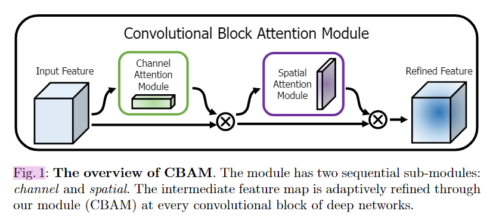
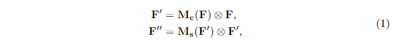
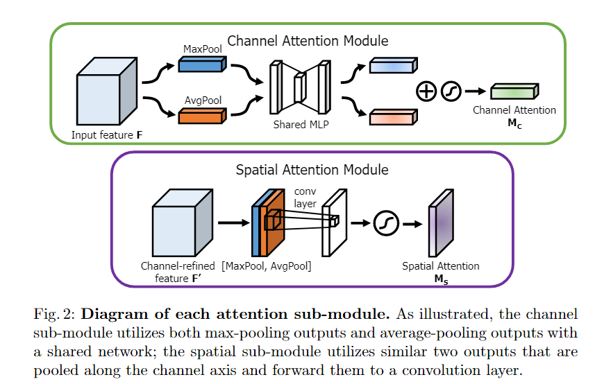
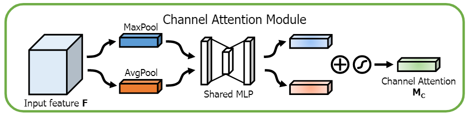
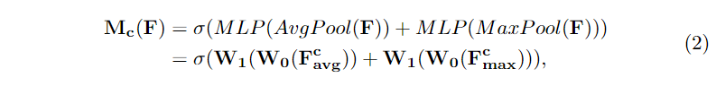
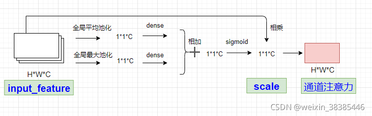
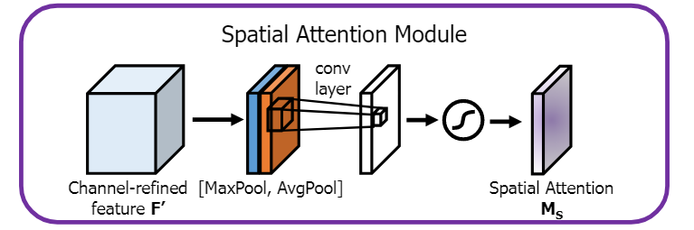
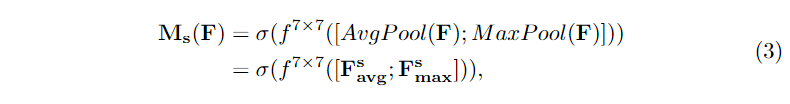
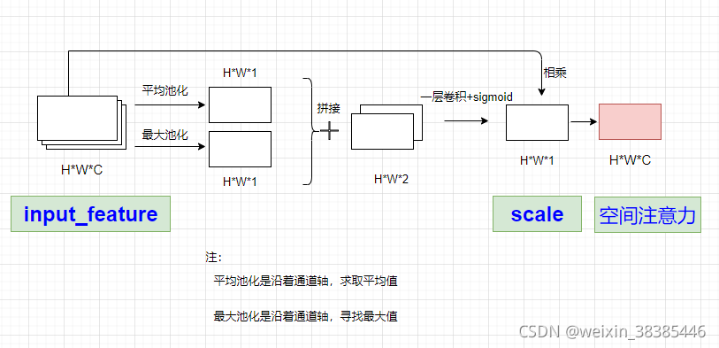
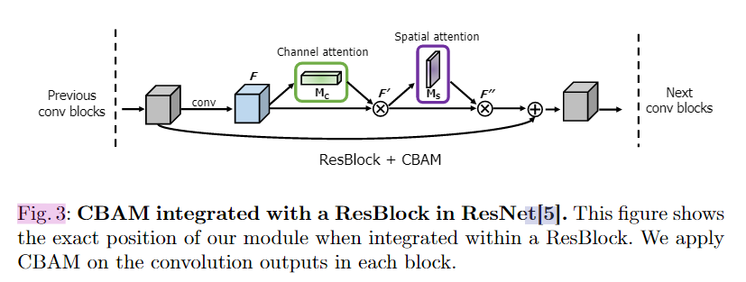

原文：《CBAM: Convolutional Block Attention Module》

## 摘要

我们提出了卷积块注意模块(convolutional Block Attention Module, CBAM)，这是一种简单而有效的前馈卷积神经网络注意模块。给定一个中间特征图，我们的模块沿着两个独立的维度、通道和空间顺序推断注意力图，然后将注意力图乘以输入特征图以进行自适应特征细化。由于CBAM是一个轻量级和通用的模块，它可以无缝地集成到任何CNN架构中，开销可以忽略不计，并且是端到端可训练的以及基本的CNN。我们通过ImageNet-1K、MS COCO检测和VOC 2007检测数据集上的大量实验来验证我们的CBAM。我们的实验表明，各种模型的分类和检测性能都有一致的改进，证明了CBAM的广泛适用性。代码和模型将公开。

## 介绍

除了这些因素，我们还研究了架构设计的另一个方面–注意力。注意的意义在以前的文献中已被广泛研究。注意力不仅告诉我们应该把重点放在哪里，它还能改善兴趣的表现。**我们的目标是通过使用注意机制来增加表征能力：专注于重要特征，抑制不必要的特征。**本文提出了一种新的网络模块，称为卷积块注意模块。由于卷积运算通过将跨通道和空间信息混合在一起来提取信息特征，因此我们采用我们的模块来强调沿通道和空间轴这两个主要维度的有意义的特征。为了实现这一点，我们顺序地应用了通道和空间注意模块(如图1所示)，以便每个分支可以分别学习在通道和空间轴上参加什么和在哪里参加。**因此，我们的模块通过学习强调或抑制哪些信息来有效地帮助网络中的信息流动。**

在ImageNet-1K数据集中，通过插入我们的小模块，我们从不同的基线网络获得了精度的提高，显示了CBAM的有效性。我们使用GRAD-CAM可视化训练的模型，并观察到CBAM增强网络比其基线网络更恰当地聚焦于目标对象。考虑到这一点，我们推测性能的提升来自于对无关杂波的准确关注和降噪。最后，我们在MS Coco和VOC 2007数据集上验证了目标检测的性能改进，展示了CBAM的广泛适用性。由于我们精心设计了轻量级的模块，因此在大多数情况下，参数和计算的开销可以忽略不计。
**本文贡献：**我们的主要贡献有三方面。

1. 我们提出了一种简单而有效的注意模块(CBAM)，可以广泛应用于提高CNN的表征能力。
2. 我们通过广泛的消融研究来验证我们的注意力模块的有效性。
3. 我们通过插入我们的轻量级模块，验证了在多个基准测试(ImageNet-1K、MS Coco和VOC 2007)上，各种网络的性能都得到了极大的提高。

<!--more-->

## 相关工作

### Network engineering

网络工程一直是视觉研究中最重要的课题之一，因为良好的网络设计保证了各种应用的显著性能提升。自从大规模CNN的成功实施以来，已经提出了广泛的架构。一种直观而简单的扩展方法是增加神经网络的深度。Szegdy等人引入使用多分支机构体系结构的深度启动网络，其中每个分支机构都经过仔细定制。虽然由于梯度传播的困难而导致深度的天真增加达到饱和，但是ResNet提出了一种简单的恒等式跳跃连接来简化深层网络的优化问题。基于ResNet体系结构，已经开发了各种模型，如WideResNet、初始ResNet和ResNeXt。WideResNet提出了一种具有更多卷积滤波器和更小深度的残差网络。金字塔网是WideResNet的严格推广，其中网络的宽度逐渐增加。ResNeXt建议使用分组卷积，并表明基数越大，分类精度越高。黄等人提出一种新的架构–DenseNet。它迭代地连接输入特征和输出特征，使每个卷积块能够接收来自所有先前块的原始信息。虽然目前的大多数网络工程方法主要针对深度、宽度和基数三个因素，但我们关注的是另一个方面，即注意力，这是人类视觉系统的奇特方面之一。

### 注意力机制

众所周知，注意力在人类感知中起着重要作用。人类视觉系统的一个重要特性是，一个人不会试图一次处理整个场景。取而代之的是，为了更好地捕捉视觉结构，人类利用一系列局部瞥见，并选择性地聚焦于显著的部分。
最近，已经有几种尝试来结合注意处理来提高CNN在大规模分类任务中的性能。Wang等人提出了一种使用编解码式注意力模块的剩余注意力网络。通过改进特征映射，网络不仅性能良好，而且对噪声输入具有很强的鲁棒性。我们没有直接计算3D注意图，而是将学习通道注意和空间注意的过程分别分解，3D特征地图的单独注意力生成过程具有更少的计算量和参数，因此可以用作现有基本CNN架构的即插即用模块。
更接近我们的工作，胡等人引入紧凑模块来利用渠道间关系。在他们的挤压和激发模块中，他们使用全局平均汇集特征来计算通道方面的注意力。然而，为了推断细微的通道注意，我们发现这些都是次优特征，并且我们建议也使用最大集合特征，空间注意力在决定将注意力集中在哪里方面发挥着重要作用。在我们的CBAM中，我们基于一个有效的体系结构同时利用空间和通道方面的注意，并经验验证了利用两者都优于只使用通道方面的注意。实验结果表明，该模型在MS-COCO和VOC检测任务中是有效的。特别是，我们只需将我们的模块放在VOC2007测试集中现有的单次发射探测器上，就可以获得最先进的性能。

## CBAM：卷积块注意模块

给定一个中间特征图$\mathbf{F}\in\mathbb{R}^{C×H×W}$作为输入，CBAM 顺序推断一维通道注意力图$\mathbf{M_c}\in\mathbb{R}^{C×1×1}$和二维空间注意力图$\mathbf{M_s}\in\mathbb{R}^{1×H×W}$，如图 1 所示。整体注意力过程可以概括为：

其中⊗表示逐元素乘法。在乘法过程中，注意力值被相应地广播（复制）：通道注意力值沿着空间维度广播，反之亦然。 $\mathbf{F''}$是最终的细化输出。 图 2 描述了每个注意力图的计算过程。 下面描述每个注意力模块的细节。

### 通道注意力

我们通过利用特征的通道间关系来生成通道注意力图。 由于特征图的每个通道都被视为特征检测器 [31]，因此通道注意力集中在给定输入图像的“什么”是有意义的。 为了有效地计算通道注意力，我们压缩了输入特征图的空间维度。 **为了聚合空间信息，目前普遍采用平均池化。** 周等人 [32]和Hu [28]等人建议使用它来有效地学习目标对象的范围。在他们的注意力模块中采用它来计算空间统计数据。 除了之前的工作之外，**我们认为最大池化收集了关于不同对象特征的另一条重要线索，以推断出更精细的通道注意。** 因此，我们同时使用平均池化和最大池化特征。 我们凭经验证实，利用这两个特征可以大大提高网络的表示能力，而不是单独使用每个特征（参见第 4.1 节），这表明我们设计选择的有效性。 我们在下面描述详细的操作。

我们首先通过使用平均池化和最大池化操作聚合特征图的空间信息，生成两个不同的空间上下文描述符：$\mathbf{F_{avg}^c}$和$\mathbf{F_{max}^c}$，分别表示平均池化特征和最大池化特征。 然后将两个描述符转发到共享网络以生成我们的通道注意力图$\mathbf{M_c}\in\mathbb{R}^{C×1×1}$。 共享网络由具有一个隐藏层的多层感知器（MLP）组成。 为了减少参数开销，隐藏激活大小设置为$\mathbb{R}^{C/r×1×1}$，其中$r$是缩减比率。 在将共享网络应用于每个描述符后，我们使用逐元素求和合并输出特征向量。 简而言之，通道注意力计算如下：

其中$\sigma$表示 sigmoid 函数，$\mathbf{W_0}\in\mathbb{R}^{C/r×C},\mathbf{W_1}\in\mathbb{R}^{C×C/r}$。请注意，MLP 权重$\mathbf{W_0}$和$\mathbf{W_1}$为两个输入共享，ReLU 激活函数后跟$\mathbf{W_0}$。
**补充：** 特征图$H\times W\times C$分别同时做全局平均池化$1\times 1\times C$和全局最大池化$1\times 1\times C$，同时输入全连接层，并进行相加$1\times 1\times C$，再输入激活函数层$sigmoid$，生成权重$1\times 1\times C$，最后将权重与特征图$H\times W\times C$相乘。

### 空间注意力

我们利用特征的空间间关系生成空间注意力图。 与通道注意力不同，空间注意力关注的“哪里”是一个信息部分，与通道注意力是互补的。 为了计算空间注意力，我们首先沿通道轴应用平均池化和最大池化操作，并将它们连接起来以生成有效的特征描述符。 沿着通道轴应用池化操作被证明可以有效地突出信息区域 [33]。 在连接的特征描述符上，我们应用卷积层来生成空间注意力图$\mathbf{M_s(F)}\in\mathbb{R}^{H×W}$，它对强调或抑制的位置进行编码。 我们在下面描述详细的操作。

我们通过使用两个池化操作聚合特征图的通道信息，生成两个 2D 图：$\mathbf{F_{avg}^s}\in\mathbb{R}^{1×H×W}$和$\mathbf{F_{max}^s}\in\mathbb{R}^{1×H×W}$。每个都表示通道中的平均池化特征和最大池化特征。 然后将它们连接起来并通过标准卷积层进行卷积，从而生成我们的 2D 空间注意力图。 简而言之，空间注意力计算如下：

其中$\sigma$表示 sigmoid 函数，$f^{7×7}$表示滤波器大小为 7 × 7 的卷积运算。
**补充：**对输入的特征图分别从通道维度进行求平均和求最大，合并得到一个通道数为2的卷积层，然后通过一个卷积，得到了一个通道数为1的spatial attention，最后将特征图和spatial attention相乘。

### 注意力模块的顺序

给定一张输入图像，通道和空间两个注意力模块计算互补注意力，分别关注“什么”和“哪里”。 考虑到这一点，两个模块可以并联或顺序放置。 我们发现顺序排列比平行排列给出更好的结果。 **对于顺序过程的安排，我们的实验结果表明，通道优先顺序略好于空间优先顺序。** 我们将在4.1节讨论网络工程的实验结果。

## 实验

为了彻底评估我们最后一个模块的有效性，我们首先进行广泛的消融实验。然后，我们验证了CBAM的性能优于所有基线，没有花哨之处，展示了CBAM在不同体系结构和不同任务中的普遍适用性。人们可以无缝地将CBAM集成到任何CNN架构中，并联合训练组合后的CBAM增强网络。图3显示了与ResNet[5]中的ResBlock集成的CBAM示意图。
