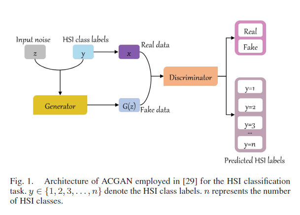
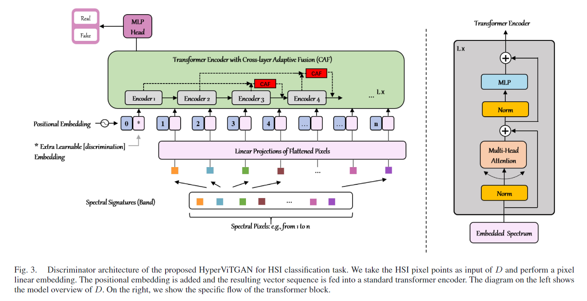
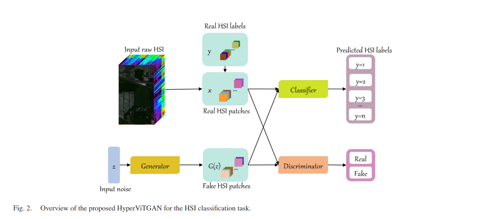
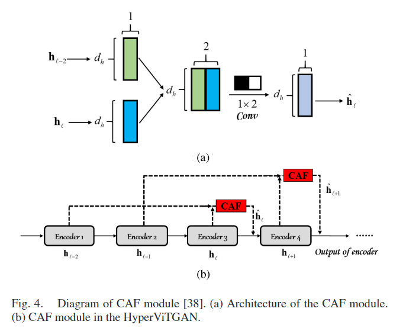
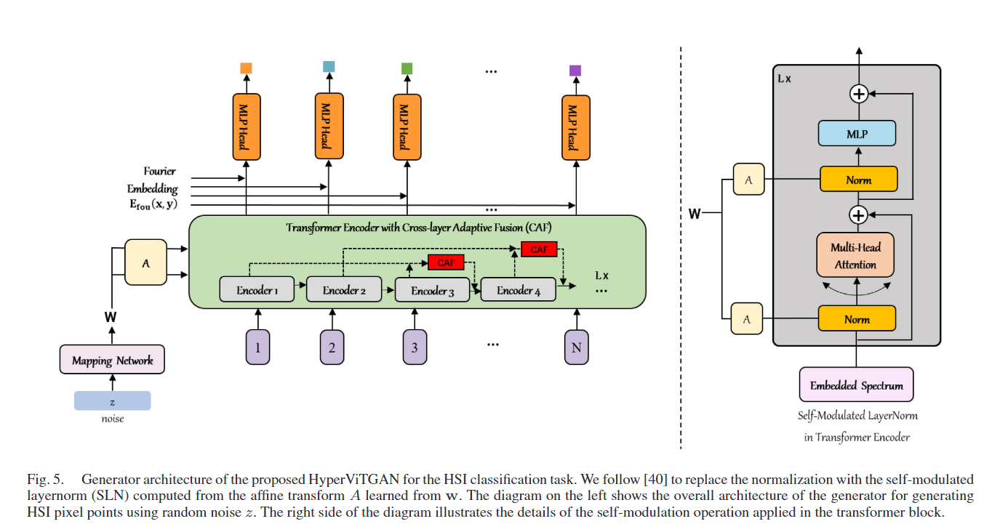
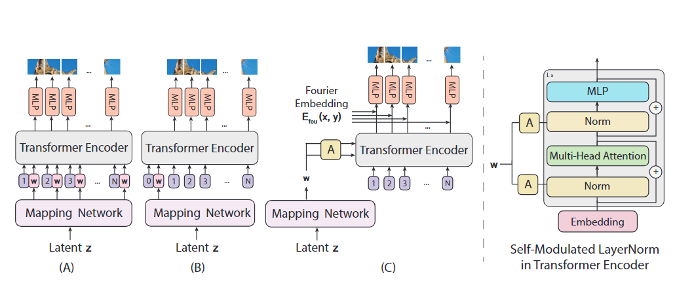
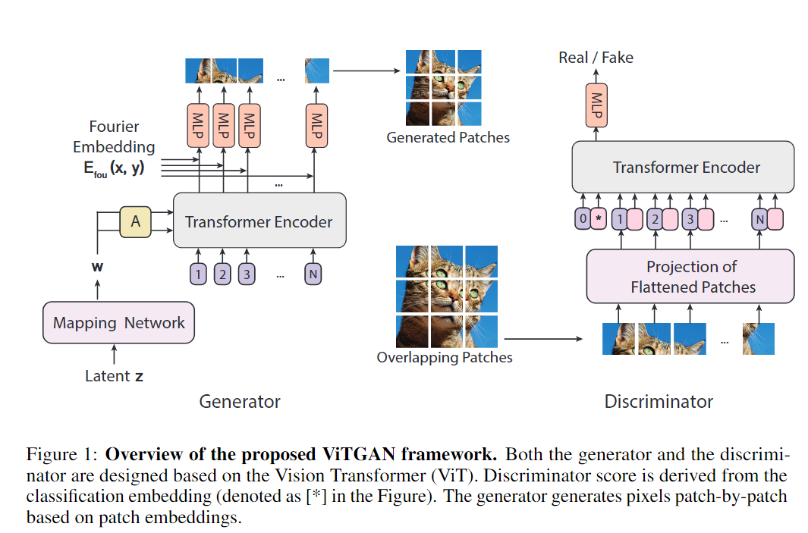

原文：《HyperViTGAN: Semi-supervised Generative Adversarial Network with Transformer for Hyperspectral Image Classification》

## 摘要

近年来，生成对抗网络（GAN）在高光谱图像（HSI）分类中取得了许多优异的成果，因为GAN可以有效解决HSI分类中训练样本有限的困境。然而，由于HSI数据的类不平衡问题，GAN总是将少数类样本与假标签相关联。为了解决这个问题，我们首先提出了一个包含Transformer的半监督生成对抗网络，称为HyperViTGAN。 所提出的HyperViTGAN设计有一个外部半监督分类器，以避免鉴别器执行分类和鉴别任务时的自相矛盾。具有跳跃连接的生成器和鉴别器用于通过对抗性学习生成HSI补丁。提出的HyperViTGAN捕获语义上下文和低级纹理以减少关键信息的丢失。此外，HyperViTGAN的泛化能力通过使用数据增强得到提升。在三个著名的 HSI 数据集 Houston 2013、Indian Pines 2010 和 Xuzhou 上的实验结果表明，与当前最先进的分类模型相比，所提出的模型实现了具有竞争力的HSI分类性能。

## 本文思路

尽管GAN与卷积神经网络（CNN）和RNN相结合在HSI分类中取得了有竞争力的结果，但在针对序列数据的方法仍然存在一些局限性。对于CNN来说，对于类别众多、光谱特征极其相似的HSI，很难很好地捕捉到序列属性，此外，CNN过于关注空间信息，扭曲了频谱上学习特征中的序列信息。以长短期记忆（LSTM）[34]和GRU[35]为代表的RNN是为顺序数据设计的。RNN能够像顺序网络一样从顺序数据中提取丰富的上下文语义。然而，RNN中的有效光谱信息存储在单个碎片神经元中，无法有效保留超长数据依赖性。此外，顺序网络结构使得难以有效地扩展和并行化LSTM和GRUs的计算。Transformer[36]的出现成功解决了CNN在捕获远程信息方面的不足。与 RNN 相比，Transformer允许并行计算，这减少了训练时间和由于长期依赖性导致的性能下降。计算两个位置之间的相关性所需的操作次数不会随着距离的增加而增加，其自注意力模块比 CNN 更容易捕获远程信息，使Transformer成为当今最前沿的模型之一。视觉 Transformer（ViT）[37]表明，Transformer不仅在自然语言处理（NLP）方面表现出色，而且在图像分类方面也取得了出色的性能。当前最先进的Transformer骨干网络在HSI分类领域也表现出了卓越的性能。

## 本文方法

在本文中，我们首先针对HSI分类任务提出了一种基于半监督GAN的新型模型HyperViTGAN，并结合目前用于 HSI 分类的前沿且有前途的 Transformer。三个精心设计的基于高光谱ViT的级联元素——生成器、鉴别器和外部分类器——构成了 HyperViTGAN。设计一个具有单个判别输出的判别器和一个具有单个分类输出的外部分类器，可以有效消除当判别器执行分类和判别任务时的自相矛盾。此外，由于HyperViTGAN是专门为HSI设计的，它可以更好地保存频谱序列信息，以避免关键信息的丢失。同时，HyperViTGAN通过数据增强可以获得更好的泛化能力。
本文贡献如下：

1. 本文首次提出了一个完全基于Transformer的HSI GAN——HyperViTGAN。HyperViTGAN为单一的判别任务和单一的分类任务分别设计了不同架构的判别器和外部半监督分类器。通过对抗学习和半监督学习，HyperViTGAN可以生成高光谱HSI patch，同时缓解HSI中类别不平衡的挑战。
2. 设计了级联架构和跳跃连接，用于生成器、判别器和分类器，以提供类似于内存的信息，从而避免关键组件的丢失并提高分类性能。

<!--more-->

## 相关工作

### 生成对抗网络

将辅助信息应用于GAN可以有效增强现有的生成模型，因此形成了两种优化方法。第一种方法是使用辅助标签信息来增强原始的GAN，并使用标记数据训练生成器和判别器，即条件GAN（CGAN）[46]。CGAN是为了更好地使用辅助信息来控制GAN而开发的。它在初始GAN模型中添加了一些先决条件，使GAN更加可控。具体而言，CGAN向G和D都添加条件约束c，以引导数据生成过程。第二种方法是通过修改鉴别器，加入一个辅助解码器网络来直接重建辅助信息，从而提高GAN的生成效果，即SGAN [47]，[48]。结合前面两种方法的优点，ACGAN [49]表明，在GAN的潜在空间中加入更多的架构以及专门的损失函数可以产生高质量的样本。ACGAN被用于HSI分类[29]，其框架如图1所示。ACGAN的生成器具有两个输入，条件约束$c$和随机噪声$z$，并输出生成的数据$X_{fake}=G(c，z)$。$D$同时执行两个任务：确定输入数据是否为真的概率分布，以及类别的概率分布$P(S|X)$、$P(O|X) = D(X)$。ACGAN的目标函数包含两部分，第一部分针对数据是否真实的损失函数，第二部分针对数据分类准确性的损失函数。ACGAN的最终目标函数由$L_S$和$L_O$两部分组成。因此，D和G的目标函数分别是最大化$L_S+L_O$和$L_O-L_S$。

$$
\begin{align} \tag{2}
L_{S} =&E[\log P(S=\mathrm{real}|\mathbf{X}_{\mathrm{real}})] \\
&+E[\log P(S=\mathrm{fake}|\mathbf{X}_\mathrm{fake})]&& \label{2}
\end{align}
$$

$$
\begin{align} \tag{3}
L_{O} =&E[\log P(O=\mathrm{class}|\mathbf{X}_{\mathrm{real}}] \\
&+E[\log P(O=\mathrm{class}|\mathbf{X}_{\mathrm{fake}})&&
\end{align}
$$

其中，$L_S$和$L_O$分别表示确切来源和类别的对数似然。

### 视觉 Transformer (ViT)

ViT（Vision Transformer）[37]是2020年提出的一种无卷积模型，可直接将Transformer应用于图像分类。ViT将图像分成许多大小相等的块，并通过线性变换获取块嵌入。ViT的具体实现如下所述。
为了适应Transformer的输入，2-D图像$X\in\mathbb{R}^{H×W×I}$被分成一系列的块$X_p\in\mathbb{R}^{N×(P^2·I)}$，其中$N=\frac{H×W}{P^2}$表示块的数量，$P^2·I$是每个块的维度。其中，$H$、$W$、$I$和$P$分别表示图像的高度、宽度、通道数和块的大小。
其中，$E\in\mathbb{R}^{P^2·I×d}$和$E_{pos}\in\mathbb{R}^{(N+1)×d}$分别是块嵌入和位置嵌入。频谱中嵌入的单元数量用$d$表示。$X_{class}$表示可学习的分类嵌入。我们将$X_{class}$置于嵌入块序列的最前面$(h_0^0=X_{class})$，其在Transformer编码器输出的状态$(h_L^0)$用作块表示$y$[参见（7）]。$y$是一个$1×n$维的块表示，由包括LayerNorm（LN）和线性层的多层感知机（MLP）头（分类头）计算得出。ViT由MLP、多头自注意力（MSA)和LN模块主导。根据[50]，嵌入块$h_0$由可学习的分类嵌入$X_{class}$和一维位置嵌入$E_{pos}$组成。

$$
\begin{align}
h_{0} &=[\mathbf{X}_{\mathrm{class}};\mathbf{X}_{p}^{1}\mathbf{E};\mathbf{X}_{p}^{2}\mathbf{E};\ldots;\mathbf{X}_{p}^{N}\mathbf{E}]+\mathbf{E}_{\mathrm{pos}} \tag{4}\\
\mathrm{h}_{\ell}^{\prime} &=\mathrm{MSA}(\mathrm{LN}(\mathrm{h}_{\ell-1}))+\mathrm{h}_{\ell-1} \tag{5}\\
\mathrm{h}_{\ell} &=\mathrm{MLP}(\mathrm{LN}(\mathrm{h}_\ell^{\prime}))+\mathrm{h}_\ell^{\prime} \tag{6}\\
\text{y} &=\mathrm{LN}(\mathrm{h}_{\mathcal{L}}^{0}, ) \tag{7}
\end{align}
$$

其中，$E\in\mathbb{R}^{P^2·I×d},{\scr l}=1,...,{\cal L}$。
查询、键和值表示由可学习的矩阵$W_q\in\mathbb{R}^{d×d_k}$，$W_k\in\mathbb{R}^{d×d_k}$和$W_v\in\mathbb{R}^{d_k×d_v}$表示。公式（8）展示了单个自注意力头（索引为$j$）的计算。

$$
\begin{equation} \tag{8}
\mathrm{Attention}_j(\mathcal{X})=\mathrm{softmax}\left(\frac{\mathrm{QK}^T}{\sqrt{d_j}}\right)\mathrm{V}
\end{equation}
$$

其中，$Q={\cal X}W_q$，$K={\cal X}W_k$和$V={\cal X}W_v$，${\cal X}=LN(h_{\scr l}),{\scr l}=1,...,{\cal L}$表示Transformer编码器的输入。
在(9)中，(5)中的MSA通过串联和线性投影整合了来自$J$个自注意力头部的信息。

$$
\begin{equation} \tag{9}
\mathrm{MSA}(\mathcal{X})=\mathrm{concat}_{j=1}^J[\mathrm{Attention}_j(\mathcal{X})]\mathrm{W}
\end{equation}
$$

其中，$W\in\mathbb{R}^{d_v×d}$表示变换矩阵。

## 具体方法

在这一部分中，我们的HyperViTGAN的示意图首先在图2中说明，然后介绍基于ViT的三个级联操作(即鉴别器、生成器和分类器)的设计。我们将以下技术引入到鉴别器和生成器中，使其能够很好地应用于高精度的HSI分类：

1. 高光谱鉴别器和生成器的设计；
2. 新设计的外部分类器；
3. 跨层自适应融合。

### 鉴别器设计

ACGAN[29]、[49]的鉴别器同时执行分类和判别两种不同的任务，因此两种损失的设计存在一些缺陷。 首先，单一架构的鉴别器不能同时在两个不同的任务上是最优的。 其次，ACGAN为D设计的损失函数在生成少数类样本方面存在缺陷。 这种设计导致少数类样本被D识别为假样本。因此，鉴别器总是将少数类样本视为假样本，从而损害分类性能。与ACGAN中的判别器设计不同，我们将高光谱判别器（HyperD）设计为仅用于判别任务的单一输出，以便判别器不会自相矛盾。最终，鉴别器训练旨在最大化 (10)。
$$
\begin{align}
L_D = &E[\log P(S = \text{real} | \mathbf{X}_{\text{real}})] \\
&+ E[\log P(S = \text{fake} | \mathbf{X}_{\text{fake}})] \tag{10}
\end{align}
$$

其中$X_{real}$和$X_{fake}=G(z)$分别表示生成器生成的真实HSI patch和假HSI patch。$P(S|X)=D(X)$表示真实HSI patch $X_{real}$和假HSI patch $X_{fake}$的鉴别器的概率分布。
我们提出的HyperViTGAN中的鉴别器仅用于判断输入HSI patch的来源。$D$被训练以最大化 (10) 中的对数似然，使其能够正确分配HSI的来源。HyperViTGAN中HyperD的架构是基于 [40] 设计的。HyperD完全是一个纯基于 ViT 的网络。与 [40] 中的鉴别器不同，HyperD仅鉴别输入的真实性，不执行分类。鉴别器的概览框架如图3所示。

HyperD中使用的两个主要模块：跨层自适应融合（CAF)和数据增强。

1. **跨层自适应融合 (CAF)：**由于Transformer中的skip connection只用在单个block中，这削弱了不同层之间的连接。因此，引入CAF模块来加强Transformer的不同层或块之间的关联[38]。CAF的示意图如图 4 所示。

   

   CAF是专为学习跨层特征融合而设计的模块，它使用了中程跳跃连接（SC）机制。令$h_{l-2}\in\mathbb{R}^{1×d}$和$h_l\in\mathbb{R}^{1×d}$分别是第$(l−2)$层和第 $(l)$ 层的输出（或表示)。$d$设置为128，CAF可以表示为：

   $$
   \begin{equation} \tag{11}
   \hat{\mathrm{h}}_\ell\leftarrow\ddot{\mathrm{w}}
   \begin{bmatrix}
   \mathrm{h}_\ell\\\mathrm{h}_{\ell-2}
   \end{bmatrix}
   \end{equation}
   $$

   其中$\hat{h}_l$是具有CAF的第$l$个块的集成表示，$\ddot{w}\in\mathbb{R}^{1×2}$表示自适应融合的参数。
2. **数据增强：**为了减少GAN对对抗样本的敏感性和内存开销，我们引入了mixup [51] 来增强真实样本的数据。具体来说，mixup机制在成对样本及其标签的凸组合上训练网络模型，以使网络正则化，从而提高模型的泛化能力，提高其对对抗性攻击的鲁棒性。然后，我们通过在鉴别器训练期间通过mixup叠加真实光谱特征来设计GAN以获得增强数据，这有效地提高了GAN在HSI上的泛化能力。增强的HSI数据的标签是根据 [51] 中获得的计算获得的。

### 生成器设计

我们遵循 [40] 中的生成器架构，为HSI生成任务设计了一个高光谱生成器（HyperG)。与 [40] 不同，我们使用HSI像素嵌入而不是patch嵌入。这种设计使生成器能够更好地适应高光谱数据。生成器$G$生成可以欺骗鉴别器$D$的样本。为此，以最大化训练HyperG $G$如下：

$$
\begin{equation} \tag{12}
L_G=E[\log P(S=\text{real}|\mathbf{X}_\text{fake})]
\end{equation}
$$

$G$力求使生成的$X_{fake}$被$D$分配给属于类$c$的标签，而$D$则力求准确地将$X_{fake}$识别为新的类fake。通过$G$和$D$之间的对抗性学习，$G$能够生成无法区分真假的假数据。
在本节中，我们专门为HSI设计了一个生成器。学习一个线性投影$E_G\in\mathbb{R}^{d×(B·p^2)}$来生成HSI像素向量。请注意，$p$表示 HSI 立方体中每个像素的大小，$p$的大小为 1。$E$将$d$维输出嵌入映射到$B×p×p$的 HSI 块。最终，$N=\frac{W×H}{p^2}$个 HSI 像素$[X_p^i]_{i=1}^N$的序列被重塑为一个完整的HSI补丁$X\in\mathbb{R}^{W×H×B}$。生成器的原理如下：

$$
\begin{align}
&h_{0} =\mathrm{E}_{\mathrm{pos}} \tag{13}\\
&\mathrm{h}_{\ell}^{\prime} =\mathrm{MSA}(\mathrm{SLN}(\mathrm{h}_{\ell-1},\mathrm{w}))+\mathrm{h}_{\ell-1} \tag{14}\\
&h_{\ell} =\mathrm{MLP}(\mathrm{SLN}(\mathrm{h}_\ell^{\prime},\mathrm{w}))+\mathrm{h}_\ell^{\prime} \tag{15}\\
&\text{y} \mathrm{'}=\mathrm{SLN}(\mathrm{h}_{\mathcal{L}},\mathrm{w})=[\mathrm{y}^1,\ldots,\mathrm{y}^N] \tag{16}\\
&\text{X} =[\mathbf{X}_{p}^{1},\ldots,\mathbf{X}_{p}^{N}]=[f_{\theta}(\mathbf{E}_{\mathrm{fou}},\mathbf{y}^{1}),\ldots,f_{\theta}(\mathbf{E}_{\mathrm{fou}},\mathbf{y}^{N})] \tag{17}
\end{align}
$$

其中$E_{pos}\in\mathbb{R}^{N×d}$表示生成器中的补丁嵌入和位置嵌入单元，$i=1,...,N$表示当前序列，$w\in\mathbb{R}^d$是来自随机向量$Z$的中间潜在嵌入。$E_{fou}\in\mathbb{R}^{p^2\cdot D}$和$f_{\theta}(.,.)$分别表示$p×p$空间位置的傅里叶编码和双层MLP。
(14) 中的 SLN 由下式计算：

$$
\begin{align}
\mathrm{SLN}(\mathrm{h}_{\ell}^{\prime},\mathrm{w})&=\mathrm{SLN}(\mathrm{h}_{\ell},\mathrm{MLP}(\mathrm{z}))\\&=\gamma_\ell(\mathrm{w})\odot\frac{\mathrm{h}_\ell-\mu}\sigma+\beta_\ell(\mathrm{w}). \tag{18}
\end{align}
$$

其中，符号$\odot$是逐元素点积。 层内输入总和的均值和方差分别由$\mu$和$\sigma$跟踪。由噪声$z$控制的自适应归一化参数由${\scr\gamma_l}$和${\scr\beta_l}$计算。最终，HSI 像素值$X_p^i\in\mathbb{R}^{p^2\times B}$通过一个隐式神经表示单元从 HSI patch 嵌入$y^i\in\mathbb{R}^d$进行映射，如公式 (17) 所示。
值得指出的是，在生成器的设计中也使用了CAF模块，以加强不同块之间的关联，减少关键信息被遗忘的程度。

### 分类器设计

虽然同时执行分类和判别任务的判别器的设计在HSI分类任务 [29]、[32] 上实现了出色的分类性能，但这种设计迫使判别器收敛到分类和判别任务的单独数据分布 ，从而破坏了基于GAN的模型的整体HSI分类性能。GAN使用单一架构进行分类和判别时无法很好地解决HSI类不平衡问题，判别器容易将假数据与少数类相关联，导致对少数类样本的分类能力较弱。Haque[52]使用GAN和半监督算法，通过补充人工数据来为监督分类器提供辅助。该算法被称为EC-GAN，被证明在小型、真实的数据集上是有效的。这个模型由三部分组成：生成器、鉴别器和分类器。分类器的架构与鉴别器不共享，这避免了在进行判别和分类时出现自相矛盾的情况。受上述问题的启发，我们为HSI分类专门设计了一种半监督的基于ViT的级联外部分类器C，称为高光谱分类器（HyperC）。

$$
\begin{align}
L_{C} = &E[\log P(O=\mathrm{class}|\mathbf{X}_{\mathrm{real}})] \\
&+\lambda E[\log P(O=\mathrm{class}|\mathbf{X}_{\mathrm{fake}})]& \tag{(19)}\\
\mathrm{argmax}(\mathbf{X}_{\mathrm{fake}}) = &\mathrm{argmax}(C(\mathbf{X}_{\mathrm{fake}}))>t
\end{align}
$$

其中，$P(O|X)=C(X)$表示分类器$C$对于将样本$X_{real}$和$X_{fake}$分配到每个HSI类别中的概率分布，表示为$class$；$\lambda$表示无监督损失的权重；$t$是$X_{fake}$的伪标签置信度阈值。在公式(19)中，第一项是使用真实 HSI 样本和真实 HSI 标签的监督损失。第二项是假 HSI 样本及其相应伪标签的无监督损失。高质量的假HSI样本被选择出来用于补充监督的HSI分类。由于存在权重$\lambda$，假样本对模型更新和分类器损失计算的贡献不大。我们按照[52]的方法将$\lambda$设置为0.1。较小的$\lambda$确保模型仍然主要从真实的HSI样本中学习，同时使用高质量的假HSI样本对模型进行微调。选择高质量的假样本对于模型的训练也很关键。我们遵循 [52] 和 [53] 的设计并采用了基于置信度的伪标签方案。GAN初始生成能力较弱，导致生成器生成低质量样本。伪标签置信度阈值$t$成功防止了低质量样本加入分类器模型的训练过程。随着 GAN 的生成能力随着训练逐渐提高，越来越多的高质量假样本将被引入GAN训练过程，绕过置信度阈值$t$。无监督损失是通过计算假样本及其对应的伪标签获得的。这里，$t$设置为 0.7，遵循[52]的设置。

## 补充

1. $N=\frac{H×W}{P^2}$我的理解是，整个图像大小为$H\times W$，取patch展平后，就变成$N$个图像，每幅图像的像素就变为了$P\times P$，算上通道数$I$，每个图像的大小就是$P\times P\times I$，最后每个块的维度就是$P^2\cdot I$。

2. 其中，$E\in\mathbb{R}^{P^2·I×d},{\scr l}=1,...,{\cal L}$。此处${\cal L}$有错误，原论文是${\cal L}$，相当于这个论文的${\cal N}$，因为 Transformer 只吃一连串的Embedding (1D) 作为输入，本文将输入图像切分为大小$P\times P$的区块 (Patch)，透过隐藏向量（Constant latent vector）$E$，将一维的Patch映射到维度为$d$的线性空间 (Patch Embedding) (Eq. 1)，完成将影像从$P\times P$降维成$d$。

3. 公式(1)中的$X_{class}$对应图中的Extra learnable [discrimination] Embedding，文中说这个参数类似于NLP中的Bert(词向量) [class] token，在 Transformer Encoder 输出的状态为影像的类别$y$(Eq.4)。不管在预训练或微调都会有一个 Classification head 指到$y$，Classification head 在预训练透过 MLP 实现。

4. 生成器参考ViTGAN
   
   
   相当于两个模型交换ViT的输入和输出，以从嵌入中生成像素。具体地，从通过MLP从高斯噪声向量$z$导出的潜在向量$w$中生成像素，即，$w=MLP(z)$(称为映射网络)。将位置嵌入序列作为输入，并将中间潜在向量$w$添加到每个位置嵌入中。用通过从$w$学习的仿射变换(在图中表示为A)计算的self-modulated layernorm形态(SLN)代替归一化
   **Self-modulated LayerNorm：**本文不是将噪声矢量$z$作为输入发送给ViT，而是使用$z$来调制等式(14)中的layernorm运算。这被称为自调制[On self modulation for generative adversarial networks]，因为调制不依赖于外部信息。

5. $E_{fou}\in\mathbb{R}^{p^2\cdot D}$也可能写错了，原文是$D$，此处我感觉是$d$。

6. **Mplicit Neural Representation for Patch Generation（隐式神经表示）：**本文使用隐式神经表示来学习从嵌入$y_i\in\mathbb{R}^d$的patch到patch像素值$X_p^i\in\mathbb{R}^{p^2\times B}$的连续映射，与傅里叶特征或正弦激活函数结合时，隐式表示可以将生成的样本空间约束到平滑变化的自然信号空间。具体来说，类似于[Image generators with conditionally-independent pixel synthesis]，$X_p^i=f_{\theta}(E_{fou},y_i)$其中$E_{fou}\in\mathbb{R}^{p^2\cdot d}$是$p\times p$空间位置的傅里叶编码，$f_{\theta}(.,.)$是双层MLP。

7. 补充一下原文的公式：

   **鉴别器：**
   $$
   \begin{align}
       \mathbf{h}_0 &= \left[ \mathbf{x}_\text{class}; \mathbf{x}_p^1 \mathbf{E}; \mathbf{x}_p^2 \mathbf{E}; \cdots ; \mathbf{x}_p^L \mathbf{E} \right] + \mathbf{E}_\text{pos}, && \mathbf{E} \in \mathbb{R}^{(P^2 \cdot C) \times D}, \; \mathbf{E}_\text{pos} \in \mathbb{R}^{(L+1) \times D} \tag{1} \\
       \mathbf{h}'_\ell &= \text{MSA}(\text{LN}(\mathbf{h}_{\ell-1})) + \mathbf{h}_{\ell-1}, && \ell = 1, \ldots, L \tag{2}\\
       \mathbf{h}_\ell &= \text{MLP}(\text{LN}(\mathbf{h}'_\ell)) + \mathbf{h}'_\ell, && \ell = 1, \ldots, L \tag{3} \\
       \mathbf{y} &= \text{LN}(\mathbf{h}_L^0) \tag{4}
   \end{align}
   $$

   **生成器：**
   $$
   \begin{align}
       \mathbf{h}_0 &= \mathbf{E}_{\text{pos}}, && \mathbf{E}_{\text{pos}} \in \mathbb{R}^{L \times D}, \tag{9} \\
       \mathbf{h}'_\ell &= \text{MSA}(\text{SLN}(\mathbf{h}_{\ell-1}, \mathbf{w})) + \mathbf{h}_{\ell-1}, && \ell = 1, \ldots, L, \mathbf{w} \in \mathbb{R}^{D}, \tag{10} \\
       \mathbf{h}_\ell &= \text{MLP}(\text{SLN}(\mathbf{h}'_\ell, \mathbf{w})) + \mathbf{h}'_\ell, && \ell = 1, \ldots, L, \tag{11} \\
       \mathbf{y} &= \text{SLN}(\mathbf{h}_L, \mathbf{w}) = [\mathbf{y}^1, \ldots, \mathbf{y}^L] && \mathbf{y}^1, \ldots, \mathbf{y}^L \in \mathbb{R}^{D}, \tag{12} \\
       \mathbf{x} &= [\mathbf{x}_p^1, \ldots, \mathbf{x}_p^L] = [f_\theta(\mathbf{E}_{\text{fou}}, \mathbf{y}^1), \ldots, f_\theta(\mathbf{E}_{\text{fou}}, \mathbf{y}^L)] && \mathbf{x}_p^i \in \mathbb{R}^{P^2 \times C}, \mathbf{x} \in \mathbb{R}^{H \times W \times C} \tag{13}
   \end{align}
   $$
