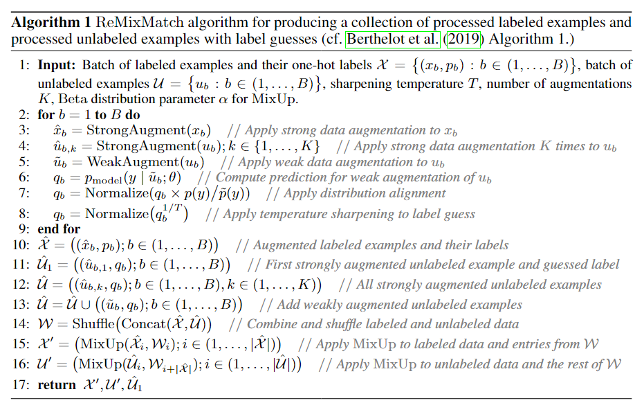
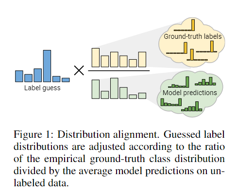
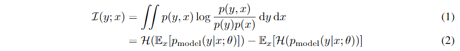
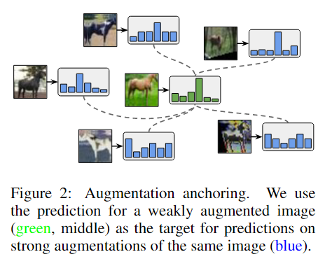
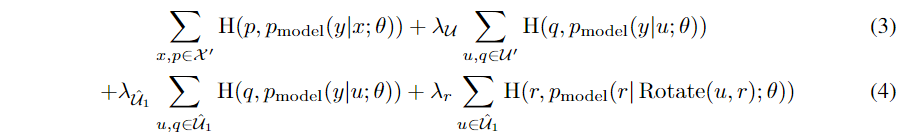

原文：《ReMixMatch: Semi-Supervised Learning with Distribution Matching and Augmentation Anchoring》

## 摘要

我们通过引入两种新技术改进了最近提出的“MixMatch”半监督学习算法：分布对齐和增强锚定。 **分布对齐鼓励未标记数据的预测边缘分布接近真实标签的边缘分布。 增强锚定将输入的多个强增强版本提供给模型，并鼓励每个输出接近同一输入的弱增强版本的预测。**为了产生强大的增强，我们提出了 AutoAugment 的变体，它在训练模型时学习增强策略。 我们称为 ReMixMatch 的新算法比之前的工作具有更高的数据效率，需要 5 倍到 16 倍的数据才能达到相同的精度。 例如，在带有 250 个标记示例的 CIFAR10 上，我们达到了 93.73% 的准确率（相比之下，MixMatch 的准确率为 93.58%，带有 4,000 个示例），而每个类别只有四个标签的准确率中值为 84.92%。 我们在 https://github.com/google-research/remixmatch 上开源我们的代码和数据。

## 本文思路

半监督学习 (SSL) 提供了一种在只有有限的标记数据可用时利用未标记数据来提高模型性能的方法。 当标记数据昂贵或不方便时，这可以启用大型、强大的模型。 SSL 研究产生了多种方法，包括一致性正则化（Sajjadi 等人，2016 年；Laine 和 Aila，2017 年），它鼓励模型在输入受到扰动时产生相同的预测，以及熵最小化（Grandvalet 和 Bengio， 2005）鼓励模型输出高置信度的预测。 最近提出的“MixMatch”算法（Berthelot 等人，2019 年）将这些技术结合在一个统一的损失函数中，并在各种图像分类基准上实现了强大的性能。 在本文中，我们提出了两项可以轻松集成到 MixMatch 框架中的改进。

1. 首先，我们引入了“分布对齐”，**它鼓励模型的聚合类预测的分布与基本真相类标签的边际分布相匹配。**Bridle等人(1992)引入了这个概念作为“公平”目标，其中一个相关的损失项显示出来自模型输入和输出之间相互信息的最大化。在回顾了这个理论框架之后，我们将展示如何通过使用模型预测的运行平均值修改“猜测的标签”来直接将分布对齐添加到MixMatch中。
2. 其次，我们引入了“增强锚定”，它取代了MixMatch的一致性正则化组件**。对于每个给定的未标记输入，增强锚定首先生成一个弱增强版本(例如，只使用翻转和裁剪)，然后生成多个强增强版本。该模型对弱增强输入的预测被视为所有强增强版本的猜测标签的基础。** 为了产生强大的增强，我们引入了一种基于控制理论的 AutoAugment 变体（Cubuk 等人，2018 年），我们称之为“CTAugment”。 与 AutoAugment 不同，CTAugment 在模型训练的同时学习增强策略，使其在 SSL 设置中特别方便。

我们将改进后的算法称为“ReMixMatch”，并在一套标准SSL图像基准测试上对其进行实验验证。

## 相关背景

半监督学习算法的目标是以提高标记数据性能的方式从未标记数据中学习。 实现这一目标的典型方法包括针对未标记数据的“猜测”标签进行训练，或优化不依赖于标签的启发式目标。
**一致性正规化：**许多 SSL 方法依赖于一致性正则化来强制模型输出在输入受到扰动时保持不变。最常见的扰动是应用特定领域的数据增强，用于衡量一致性的损失函数通常是模型针对扰动和非扰动输入的输出之间的均方误差或交叉熵。
**熵最小化：**Grandvalet & Bengio (2005) 认为应该使用未标记的数据来确保类被很好地分离。 这可以通过鼓励模型的输出分布对未标记数据具有低熵（即做出“高置信度”预测）来实现。例如，可以显式地添加一个损失项，以最小化模型在未标记数据上预测的类分布的熵(Grandvalet & Bengio, 2005;Miyato et al., 2018)。
**标准正则化：**在SSL设置之外，在过度参数化的情况下对模型进行正则化通常是有用的。在对有标签和无标签数据进行训练时，通常都可以应用这种正则化。例如，标准的“权重衰减”（Hinton & van Camp，1993），其中参数的 L2 范数被最小化，通常与 SSL 技术一起使用。 同样，强大的 MixUp 正则化 (Zhang et al., 2017) 最近已应用于 SSL（Berthelot et al., 2019；Verma et al., 2019），该模型训练输入和标签的线性插值模型。

<!--more-->

##  Remixmatch

ReMixMatch的完整算法如算法1所示。

### 分布对齐

我们的第一个贡献是**分布对齐（distribution alignment），它强制对未标记数据的预测聚类与已标记数据的分布相匹配。**这个总体思想在25年前首次提出(Bridle等人，1992年)，但据我们所知，现代SSL技术还没有使用它。分布对齐示意图见图1。在回顾和扩展了该理论之后，我们将描述如何将其直接包含在ReMixMatch中。

#### 输入输出互信息

SSL算法的主要目标是使用未标注的数据来提升模型的精度。Bridle等人(1992)首先提出了一种将这种直觉形式化的方法，即最大化未标记数据输入和输出之间的互信息。直观地说，一个好的分类器的预测应该尽可能地依赖于输入。根据Bridle等人(1992)的分析，我们可以将这个目标形式化为：

其中$\mathcal{H}(\cdot)$为熵。参见附录A的证明。为了解释这一结果，观察eq.(2)中的第二项是我们熟悉的熵最小化目标(Grandvalet & Bengio, 2005)，它只是鼓励每个单独的模型输出具有低熵，即表明对类标签的高置信度（MixMatch论文有提到这一点）。然而，第一项在现代SSL技术中并没有广泛使用。这一项（粗略地说)鼓励在整个训练集中模型以相同的频率预测每个类。Bridle等人将此称为“公平”的模型。

#### Mixmatch中的分布对齐

MixMatch已经包含了一种通过“锐化”操作实现的熵最小化形式，这使得未标记数据的猜测标签具有更低的熵。因此，我们也有兴趣在 ReMixMatch 中加入一种“公平”形式。然而，注意到目标$\mathcal{H}(\mathbb{E}_x|p_{model}(y|x;\theta)-\mathbb{E}_x|\mathcal{H}(p_{model}{y|x;\theta}))$本质上意味着模型应该以相同的频率预测每个类别（自带公平性）。如果数据集的边缘类分布$p(y)$不是均匀的，这就不一定是一个有用的目标（也就是说，labeled data几乎不可能每一类的数量都是一样的，必定存在某一类占主要部分，另外一些类的数量比较少。这样的话，数据集的边缘类别分布就不是均匀的，自然就不可能“公平”）。虽然原则上可以在每批处理的基础上直接最小化此目标，但我们更感兴趣的是将其集成到MixMatch中，以一种不引入额外损失项或任何敏感超参数的方式。
为了解决这些问题，我们引入了一种我们称为“分布对齐”的方法，其过程如下：在训练过程中，我们首先计算未标记的数据在过去所有次预测中的平均值，我们称之为$\tilde{p}(y)$。对于未标注数据$u$，给定模型当前的预测$q=p_{model}(y|u;\theta)$，数据集的类别分布为$p(y)$，我们将$q$按$p(y)/\tilde{p}(y)$的比例进行缩放，然后将结果重新规范化，形成一个有效的概率分布：$\tilde{q}=\mathrm{Normalize}(q\times p(y)/\tilde{p}(y))$，其中$\mathrm{Normalize}(x_i)=x_i/\sum_jx_j$。$\mathrm{Normalize}$是对每个data的类别概率向量进行归一化（否则有的数就比1大了，失去了概率的意义）。然后我们使用$\tilde{q}$作为$u$的标签猜测，并按照MixMatch进行锐化和其他处理。在实际处理中，我们计算模型在过去128次预测中，对未标记示例的预测的移动平均值（感觉类似EMA）作为$\tilde{p}(y)$。我们还根据能看见的已标记示例估计边缘类分布$p(y)$。注意，如果$p(y)$是先验已知的，可以使用一个更好的估计。在本文中，我们没有进一步探讨这个方向。
**补充：**
根据有标签数据的标签分布，对无标签的 guessing label 进行对齐。换句话说，就是使用 ground truth 的类别比例去调整 guessing label 的类别比例。举例来说，如果在 ground truth 中 A 类占 90% ，而目前所猜的 A类占50%，则该次猜测 A 类的 possibility 都会被乘以 0.9 / 0.5 = 1.8。直观的看，当 groundtruth partition >>> guessing partition 时，也就是 guessing label 的比例远低于 ground truth 时，就会乘上一个非常大的项次增加猜测该类别的信心，反之则是大幅减少猜测该类别，这将使得 guessing label distribution 往 ground truth label distribution 靠拢。

### 改进的一致性正则化

一致性正则化是大多数SSL方法的基础。对于图像分类任务，通常要求对同一未标记图像的两个增强版本的输出要保持一致性。为了保证一致性，MixMatch对每个未标记的示例$u$生成$K$次增强，并取它们的输出的平均值，作为$u$的“猜测标签”。
最近的研究发现，应用更强形式的增强可以显著提高一致性正则化的性能。特别是，对于图像分类任务，使用AutoAugment的变体产生了可观的收益。**由于MixMatch使用简单的翻转和裁剪增强策略，我们很想看看用AutoAugment替换MixMatch中的弱增强是否会提高性能，但发现训练不会收敛。**为了避免这个问题，我们在MixMatch中提出了一种新的一致性正则化方法，称为“增强锚定”。基本思想是使用模型对弱增强的未标记图像的预测作为对同一图像的许多强增强版本的猜测标签，然后使强增强图像的预测值尽量向弱增强预测靠拢。
**使用AutoAugment技术的另一个逻辑问题是，它使用强化学习来学习一个需要多次有监督学习训练试验的策略。这在SSL设置中造成了问题，因为我们通常只有有限的标记数据。**为了解决这个问题，我们提出了一种名为“CTAugment”的AutoAugment变体，它使用控制理论中的思想进行在线调整，而不需要任何形式的基于强化学习的训练。我们将在以下两个小节中描述增强锚定和CTAugment。

#### 增强锚定

我们推测带有AutoAugment的MixMatch不稳定的原因是：MixMatch对$K$个增强版本的图像的预测取平均值。更强的增强可能导致不同的预测，所以它们的平均值可能不是一个有意义的目标。相反，给定一个未标记的输入，我们首先通过对其应用弱增强来生成一个“锚”。然后，我们使用CTAugment生成同一个未标记输入的$K$个强增强版本。我们使用猜测标签（在应用分布对齐和锐化后，这个猜测标签应该是直接用弱增强图像的猜测标签）作为$K$个增强版本的图像的标签。这个过程如图2所示。

在实验时，我们发现可以用标准的交叉熵损失来替换MixMatch的均方误差损失函数（对于unlabeled data而言)。这样既保持了稳定性，又简化了实现。当MixMatch仅在$K=2$时获得最佳性能时，我们发现增强锚定在$K=8$的情况下表现最好。我们在第4节中比较了不同的$K$值，以衡量不同的效果。

#### 控制理论中的增强方法

AutoAugment是一种学习数据增强策略的方法，可获得较高的验证集精度。增强策略由一系列应用于每个图像的变换参数幅度元组组成。**至关重要的是，AutoAugment 策略是在监督学习下的：转换的大小和顺序是通过在代理任务上训练许多模型来确定的，例如，在 CIFAR-10 上使用 4,000 个标签，在 SVHN 上使用 1,000 个标签。这使得AutoAugment难以应用于少标签的半监督学习任务。**
因此，在这项工作中，我们开发了CTAugment，一个设计高性能增强策略的替代方法。**像RandAugment一样，CTAugment也随机地选取图像变换的方式，但在训练过程中动态地改变图像变换的相关参数。由于CTAugment不需要在有监督的代理任务上进行优化，也没有超参数，我们可以直接将其融入我们的半监督模型中**。直观地说，对于每个增强参数，CTAugment计算增强图像被归类为正确标签的可能性。利用这些可能性，CTAugment然后只采样在网络容忍范围内的增强。这个过程与Fast AutoAugment中的密度匹配有关，以便增强图像的分布与训练集图像的相匹配。
首先，CTAugment对于每个图像变换涉及到的超参数的定义域进行区间划分，初始化每个区间的权重为1。在每个训练步骤中，对于每个图像，随机均匀地采样两个变换。为了增强用于训练的图像，对于这些转换的每个参数，我们生成一组修改后的 bin 权重$\hat{m}$，其中如果$m_i>0.8$则$\hat{m}=m_i$，否则$\hat{m}=0$，并从$\mathrm{Categorical}(\mathrm{Normalize}(\hat{m}))$中生成采样幅度 bin。为了更新采样变换的权重，我们首先为每个变换参数均匀随机采样一个大小bin $m_i$。将生成的转换应用于带有标签$p$的带标签样本$x$以获得增强版本$\hat{x}$。然后，我们测量模型的预测与标签匹配的程度为$\omega=1-\frac{1}{2L}|\sum p_{model}(y|\hat{x};\theta)-p|$，即如果它的预测和标签比较接近，那么就使得权重比较大。每个采样幅度 bin 的权重更新为$m_i=\rho m_i+(1-\rho)\omega$，其中$\rho=0.99$，即更新权重为$m_i=0.99m_i+0.01\omega$，类似于EMA。

## 汇总

ReMixMatch 用于处理一批标记和未标记示例的算法如算法 1 所示。该算法的主要目的是生成集合$\cal X'$和$\cal U'$，其中包含应用了 MixUp 的增强标记和未标记示例。$\cal X'$和$\cal U'$中的标签和标签猜测被输入到标准交叉熵损失项中，以对抗模型的预测。 算法 1 还输出$\cal \hat{U'}$，它由每个未标记图像的单个高度增强版本及其未应用 MixUp 的标签猜测组成。$\cal \hat{U'}$用于两个额外的损失项，除了提高稳定性外，还提供了轻微的性能提升：

### Pre-mixup unlabeled loss

我们将猜测的标签和预测输入到一个单独的交叉熵损失项中。

### Rotation loss

最近的结果表明，将自监督学习的思想应用于SSL可以产生强大的性能。我们通过将每个图像$u\in \hat{\mathcal{U}}$旋转为$\mathrm{Rotate}(u,r)$来整合这个想法，其中我们从$r\sim\{0,90,180,270\}$均匀地采样旋转角度$r$，然后要求模型预测旋转量作为四类分类问题。总的来说，ReMixMatch的损失是：

### 算法流程

1. 输入：一批包含已标注数据（含标签）的数据，一批包含未标注数据的数据、超参数；
2. 对于每一笔数据（因为两批数据的数量一致）：
   增强操作：对已标注数据进行一次强增强，对未标注数据进行K次强增强和1次弱增强；
   为未标注数据生成猜测标签（分布对齐、锐化）
3. 生成三个数据集：强增强后的已标注数据、强增强后的未标注数据和弱增强标注后的未标注数据；
4. 对已标注数据和未标记数据进行MixUp；
5. 返回三个数据集，计算损失函数：
   
   第一项是常规的有监督损失；第二项和第三项是无标注数据的“监督损失”；第四项是旋转角度预测。

与Mixmatch对比：

1. 增加了一个损失函数：角度预测；
2. 伪标签生成的方式不同，引入了强增强和弱增强，并以弱增强作为label anchor；
3. 引入CTAugment控制图像变换的参数取样和方式取样。