原文：《SoftMatch: Addressing the Quantity-Quality Tradeoff in Semi-supervised Learning》

## 主要问题

1. SSL的主要挑战在于如何有效地利用未标记数据的信息来提高模型的泛化性能。
2. 具有置信度阈值的伪标记非常成功并被广泛采用，基于阈值的伪标签的核心思想是用预测置信度高于硬阈值的伪标签来训练模型，而其他的则被简单地忽略。然而，这种机制固有地表现出数量与质量的权衡，这破坏了学习过程。例如，FixMatch 中利用的高置信度阈值确保了伪标签的质量。然而，它丢弃了大量不自信但正确的伪标签。
3. 动态增长的阈值或类阈值鼓励使用更多的伪标签，但不可避免地会完全使用可能误导训练的错误伪标签。例如，FlexMatch。

综上所述，具有置信度阈值的数量-质量权衡限制了未标记数据的利用率，这可能会阻碍模型的泛化性能。

**解决方法：**

1. 所以作者提出softmatch的方法，采用截断高斯函数。根据我们对边缘分布的假设，采用一个截断的高斯函数来拟合置信度分布，该置信度分布根据伪标签的置信度与高斯均值的偏差，为可能正确的伪标签分配较低的权重。
2. 通过统一对齐的方法来解决伪标签类不平衡的问题。

## 主要方法

我们正式定义了 SSL 中伪标签的数量和质量，并从统一样本权重公式的角度总结了先前方法中存在的固有权衡。我们首先确定数量-质量权衡背后的根本原因是缺乏加权函数对伪标签分布施加的复杂假设。其中，置信度阈值可以看作是根据样本的置信度分配二元权重的阶梯函数，它假设置信度高于阈值的伪标签是正确的，而其他伪标签是错误的。在分析的基础上，我们提出了SoftMatch来克服这种权衡，在训练过程中保持高数量和高质量的伪标签。根据我们对边缘分布的假设，采用一个截断的高斯函数来拟合置信度分布，该置信度分布根据伪标签的置信度与高斯均值的偏差，为可能正确的伪标签分配较低的权重。高斯函数的参数是在训练期间使用模型的历史预测来估计的。此外，我们提出了统一对齐的方法来解决伪标签中由于不同类别的学习困难而导致的不平衡问题。它进一步巩固了伪标签的数量，同时保持了伪标签的质量。在图1(c)和图1(b)所示的Two-Moon数据集中，SoftMatch获得了明显更好的伪标签精度，同时在训练过程中保持了始终较高的伪标签利用率，因此，可以获得如图1(d)所示的更好的学习决策边界。
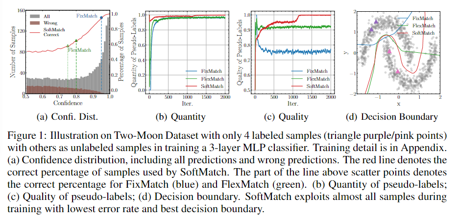
贡献可以概括为：

1. 我们通过正式定义伪标签的数量和质量，以及它们之间的权衡，证明了统一加权函数的重要性。我们发现，以前的方法中固有的权衡主要源于对伪标签分布缺乏仔细的设计，这是由加权函数直接施加的。
2. 我们提出了SoftMatch，以有效地利用低置信度但正确的伪标签，将截断的高斯函数拟合为置信度分布，从而克服了权衡。我们进一步提出统一对齐来解决假标签的不平衡问题，同时保持其高数量和高质量。
3. 我们证明了SoftMatch在各种图像和文本评估设置上优于以前的方法。我们还通过经验验证了在SSL中追求更好的无标签数据利用率的同时保持伪标签的高精度的重要性。

<!--more-->

## 重温 SSL 的数量-质量权衡

### 问题陈述

我们首先在$C$类分类问题中制定 SSL 的框架。将标记和未标记数据集分别表示为$\mathcal{D}_L=\{x_i^l,y_i^l\}_{i=1}^{N_L}$和$\mathcal{D}_U=\{x_i^u\}_{i=1}^{N_u}$，其中$\mathrm{x}_i^l，\mathrm{x}_i^u\in\mathbb{R}$是$d$维标记和未标记训练样本，$\mathrm{y}_i^l$是标记数据的one-hot真实标签。我们分别用$N_L$和$N_U$来表示$D_L$和$D_U$中训练样本的数量。令$\mathbf{p}(\mathbf{y}|\mathbf{x})\in\mathbb{R}^C$表示模型的预测。在训练期间，给定一批标记数据和未标记数据，使用联合目标$\cal L=L_s+L_u$优化模型，其中$\mathcal{L_s}$是$B_L$大小的标记batch的交叉熵损失$(\mathcal{H})$的监督目标：
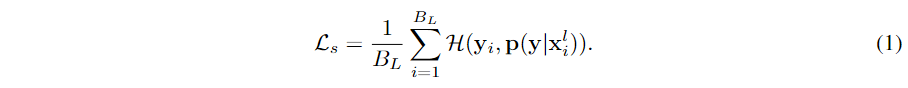
对于无监督损失，大多数现有的伪标签方法都利用置信度阈值机制来掩盖训练中不自信和可能不正确的伪标签。在本文中，我们更进一步，从样本加权的角度提出了一个统一的置信度阈值方案(以及其他方案)。具体来说，我们将无监督损失$\mathcal{L_u}$表示为模型对强增强数据$\Omega(\mathrm{x}^u)$的预测与弱增强数据$\omega(\mathrm{x}^u)$的伪标签之间的加权交叉熵：
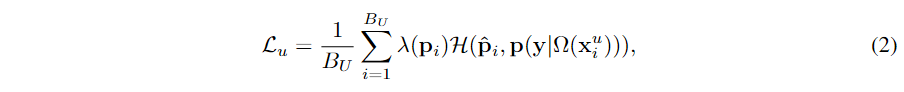
其中$\mathbf{p}$是$\mathbf{p}(\mathbf{y}|\omega(\mathrm{x}^u))$的缩写，$\mathbf{\hat{p}}$是one-hot伪标签argmax($\mathbf{p}$)；$\lambda(\mathbf{p})$为取值范围为$[0, λ_{max}]$的样本加权函数；$B_U$是未标记数据的批量大小。

### 从样本加权的角度进行数量-质量权衡

**定义 2.1**(伪标签的数量)：参加训练的伪标签的数量$f(\mathbf{p})$定义为样本权重$\lambda(\mathbf{p})$对未标记数据的期望(总体引入的伪标签的权重的期望值)：
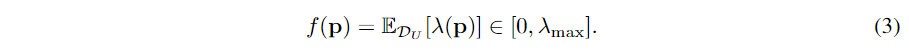
**定义 2.2**(伪标签的质量)：质量$g(\mathbf{p})$是伪标签的加权 0/1 误差的期望，假设标签$\mathrm{y}^u$是为$\mathrm{x}^u$给出的，仅用于理论分析目的(假设真实标签已知，实际引入的伪标签中正确比例的期望值)：
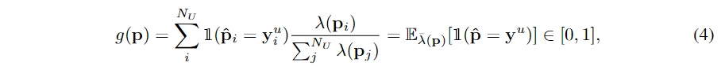
其中$\bar{λ}(\mathbf{p})=\lambda(\mathbf{p})/\sumλ(\mathbf{p})$是$\mathbf{p}$接近$\mathrm{y}^u$的概率质量函数 (PMF)。
**定义 2.3**(数量-质量权衡)：由于$\mathrm{PMF\ \lambda(\mathbf{p})}$对模型预测的边缘分布有隐含的假设，如果在其上缺乏精细的设计，通常会在数量和质量之间做出权衡 - 当其中一个增加时，另一个必须减少。理想情况下，一个明确定义的$\lambda(\mathbf{p})$应该反映真实的分布并且同时具有高数量和质量。
尽管$\lambda(\mathbf{p})$非常重要，但在先前的方法中很少有明确或正确定义它的情况。在本文中，我们首先总结了相关方法中$\lambda(\mathbf{p})$，$\bar{\lambda}(\mathbf{p})$，$f(\mathbf{p})$和$g(\mathbf{p})$的定义，如表1所示，详细的推导在附录A.1中给出。
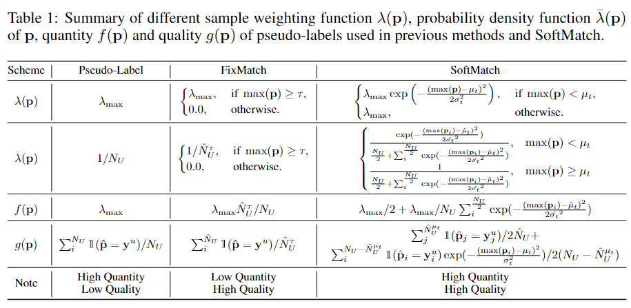

## Softmatch

### 样本加权的高斯函数

与以前的方法本质上不同，我们通常假设边缘分布的基础$\mathrm{PMF\ \bar\lambda(\mathbf{p})}$在第$t$次训练迭代时遵循均值$\mu_t$和方差$\sigma_t$的动态截断高斯分布。我们选择高斯是因为它的最大熵性质，并通过经验验证了它有更好的泛化能力。请注意，这相当于将置信度$max(\mathbf{p})$与高斯均值$\mu_t$的偏差视为模型预测正确性的代理度量，其中具有较高置信度的样本比具有较低置信度的样本更不容易出错， 与图 1(a)所示的观察结果一致。
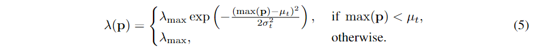
这也是一个在$[0,\lambda_{max}]$范围内的截断高斯函数，其置信度为$max(\mathbf{p})$。
然而，潜在的真实高斯参数$\mu_t$和$\sigma_t$仍然未知。尽管我们可以像 FixMatch（Sohn 等人，2020 年）那样将参数设置为固定值，或者像 Ramp-up（Tarvainen & Valpola，2017 年）那样在某个预定义范围内对它们进行线性插值，但这可能会再次过度简化前面讨论的$\mathrm{PMF}$假设。如前所述,回想一下$\mathrm{PMF\ \bar\lambda(\mathbf{p})}$是在$max(\mathbf{p})$上定义的，我们可以改为将截断的高斯函数直接拟合到置信度分布以实现更好的泛化。具体来说，我们可以根据模型的历史预测来估计$\mu$和$\omega^2$。在第$t$次迭代中，我们将经验均值和方差计算为：
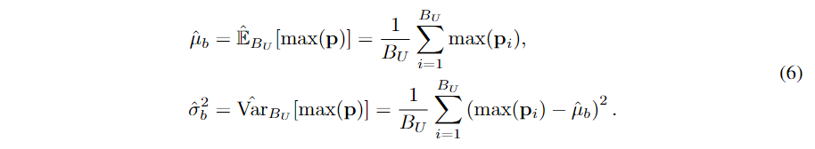
然后，我们使用动量为$m$的指数移动平均线 (EMA) 来汇总前几批次的统计数据，以获得更稳定的估计：
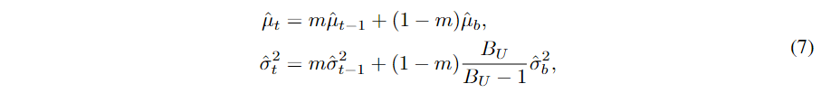
其中，我们对 EMA 使用无偏方差，并将$\hat\mu_0$初始化为$\frac{1}{c}$，将$\hat\sigma_0^2$初始化为1.0。 将估计的均值$\hat\mu_t$和方差$\hat\sigma_t^2$代入式 (5) 计算样本权重。
在训练期间根据置信度分布自适应地估计高斯参数不仅提高了泛化能力，而且更好地解决了数量-质量的权衡问题。我们可以通过计算伪标签的数量和质量来验证这一点，如表 1 所示。
推导出的量$f(\mathbf{p})$以$[\frac{\lambda_{max}}{2}(1+exp(-\frac{(\frac{1}{C}-\hat{\mu}_t)^2}{2\hat{\sigma}_t^2})),\lambda_{max}]$为界，说明SoftMatch在训练过程中保证了至少$\lambda_{max}/2$的量。随着模型学习能力的提高，置信度的增加，即$\hat\mu_t$增加而$\hat\sigma_t$减少，数量的下限变得更加紧密。在数量保持较高的同时，伪标签的质量也有所提高。在训练过程中，随着高斯函数尾部呈指数级增长，模型高度不自信的错误伪标签被赋予较低的权重，而置信度在$\hat\mu_t$左右的伪标签被更有效地利用。截断高斯加权函数通常表现为置信度阈值的软性和自适应版本，因此我们将该方法称为SoftMatch。

### 公平数量的统一对齐

由于不同的类别表现出不同的学习难度，生成的伪标签可能具有潜在的不平衡分布，这可能会限制$\mathrm{PMF}$假设的泛化能力。为了克服这个问题，我们提出了统一对齐（UA），鼓励不同类别的更统一的伪标签。具体来说，我们将伪标签中的分布定义为模型预测对未标记数据的期望：$\mathbb{E}_{\mathcal{D}_U}[\mathbf{p(y|x^\mathcal{u})}]$。在训练期间，使用未标记数据的批量预测的 EMA 估计为$\mathbb{\hat{E}}_{B_U}[\mathbf{p(y|x^\mathcal{u})}]$。我们使用均匀分布$u(C)\in\mathbb{R}^C$和$\mathbb{\hat{E}}_{B_U}[\mathbf{p(y|x^\mathcal{u})}]$之间的比率对未标记数据的每个预测$\mathbf{p}$进行归一化，并使用归一化概率计算每个样本的损失权重。我们将 UA 操作制定为：
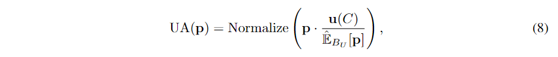
其中$\rm Normalize(\cdot)=(\cdot)/\sum(\cdot)$，确保归一化概率之和为 1.0。 插入UA后，SoftMatch 中的最终样本加权函数变为：
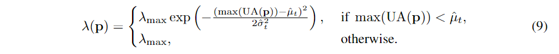
在计算样本权重时，UA 鼓励将较大的权重分配给预测较少的伪标签，将较小的权重分配给预测较多的伪标签，从而缓解不平衡问题。
UA与之前提出的分布对齐(DA)(Berthelot et al., 2019a)之间的本质区别在于无监督损失的计算。归一化操作使预测概率偏向于预测较少的类。在 DA 中，这可能不是问题，因为归一化预测在交叉熵损失中用soft target。 然而，使用伪标签，标准化后可能会创建更多错误的伪标签，这会损害质量。UA 通过利用原始预测来计算伪标签和标准化预测来计算样本权重来避免这个问题，从而在 SoftMatch 中保持伪标签的数量和质量。 完整的训练算法如附录 A.2 所示。
**补充：**在训练过程中，我们首先计算未标记的数据在过去所有次预测中的平均值，我们称之为$\mathbb{E}_{\mathcal{D}_U}[\mathbf{p(y|x^\mathcal{u})}]$，期望、平均值。对于未标注数据$u$，给定模型当前的预测$\mathbf{p}$，数据集的类别分布为$u(C)\in\mathbb{R}^C$，构造分布$\rm UA(p)$。

## 算法过程

我们在本节中介绍了 SoftMatch 的伪算法。 SoftMatch 采用截断高斯函数，在每个训练步骤从置信度分布的 EMA 估计参数，这引入了简单的计算。
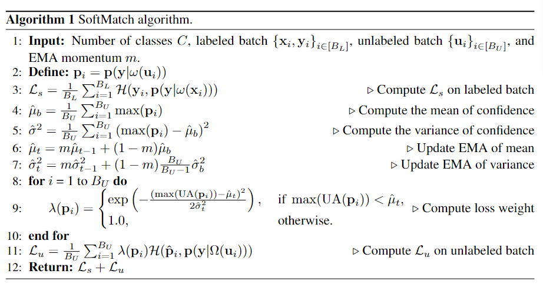
