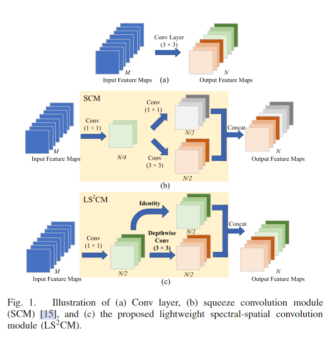
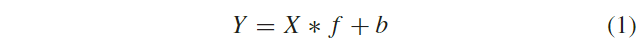
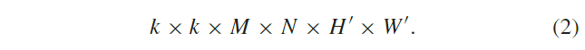
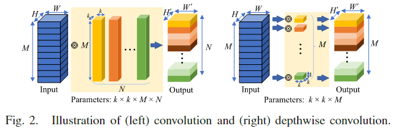
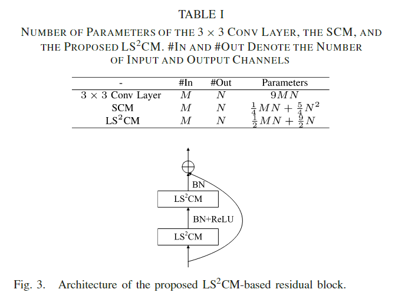
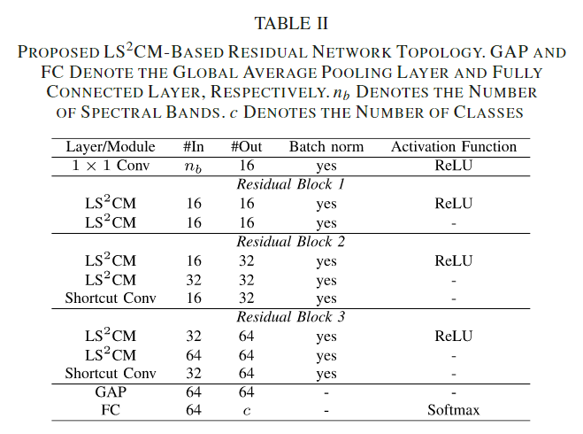

原文：《A Lightweight Spectral-Spatial Convolution Module for Hyperspectral Image Classification》

## 摘要

摘要——卷积神经网络（CNN）在高光谱图像（HSI）分类方面表现出色。 然而，卷积层包含大量参数，这限制了 CNN 在存储和计算资源有限的卫星和机载平台上的部署。 在本篇论文中，我们提出了一种轻量级的光谱空间卷积模块（$\rm LS^2CM$）作为卷积层的替代方案。 所提出的$\rm LS^2CM$可以在乘法累加运算（MAC）方面大大降低网络参数和计算复杂度，同时保持甚至提高分类性能。 此外，它是一个即插即用组件，可用于升级现有的基于 CNN 的 HSI 分类模型。 两个基准 HSI 数据集的实验结果表明，与其他最先进的方法相比，所提出的$\rm LS^2CM$取得了有竞争力的结果。

## 本文思路

考虑到基于 CNN 的 HSI 分类模型依赖于具有$3×3$内核大小的空间卷积，这在模型大小上非常昂贵。 在本篇论文中，为了减小 CNN 模型的大小，我们提出了一种轻量级的光谱-空间卷积模块（$\rm LS^2CM$）作为$3×3$空间卷积的替代方案，其灵感来自[18]和[19]。所提出的$\rm LS^2CM$旨在执行光谱-空间联合特征提取，并基于廉价的变换操作构建，即逐点卷积和深度卷积。 所提出的模块可以大大减少所需的参数数量，从而降低网络的复杂性，从而可以减轻过度拟合现象并保持甚至提高分类精度。

## 本文方法

### 基于 CNN 的 HSI 分类

深度学习模型，尤其是 CNN，在 HSI 分类方面表现出色。 一般来说，为了获得良好的分类性能，基于 CNN 的方法将空间上下文信息与光谱信息相结合，以确定每个像素的预测标签 [20]、[21]。 具体来说，在训练和测试阶段，以相应像素为中心的图像块被裁剪并输入 CNN。 它们通过一系列的卷积、池化和全连接层转化为特征向量。 向量被输入到 softmax 层进行分类。 可以通过使用反向传播算法最小化交叉熵损失来优化 CNN 中的所有参数。
基于 CNN 的 HSI 分类模型通常包含大量用于学习判别和抽象特征的卷积 (Conv) 层，从而产生大量参数 [7]。 因此，由于存储和计算资源的限制，很难在卫星和机载平台上部署 CNN。 在本文中，提出了一个$\rm LS^2CM$来代替 Conv 层，它可以有效地减少参数的数量，将在下面详细介绍。

<!--more-->

### $\rm LS^2CM$模块

图 1(a) 显示了一个带有$3×3$个滤波器的 Conv 层。 为了构建高效的 CNN，Fang 等人提出了一个$\rm SCM$来代替 Conv 层，它不仅可以大大减少模型大小，而且可以保持高 HSI 分类性能 [15]。 图 1(b) 说明了$\rm SCM$中 Conv 层的结构。 可以看出，首先执行一个$1×1$ Conv 层以减少$3×3$ Conv  层的输入通道数。 此外，有一半$3×3$ Conv 过滤器被替换为$1×1$过滤器，其参数比$3×3$ Conv 过滤器少9倍。
最近，Xception[18]和MobileNet[22]等工作引入了点卷积和深度卷积以更有效地使用模型参数，在许多领域取得了相当大的成功。 滤波器尺寸为$1×1$的标准卷积称为逐点卷积。 深度卷积对每个输入通道应用一个卷积滤波器，相对于标准卷积来说效率极高。具体来说，给定输入特征图$X\in\mathbb{R}^{H×W×M}$，其中$H$和$W$是空间高度和宽度，$M$是输入通道数，用于生成$N$个特征图的标准 Conv 层的操作可以表示为：

其中$Y\in\mathbb{R}^{H'×W'×N}$是$N$个通道的输出特征图，$*$是卷积运算，$b$表示偏差项，$f\in\mathbb{R}^{k×k×M×N}$是本层假设为正方形的卷积核，$k×k$是卷积核的空间大小。标准卷积的计算成本可以计算为：

如图 2 所示，深度卷积层对每个输入通道应用一个滤波器。 用于生成$M$个特征图的深度卷积层的操作可以表示为：

可以看出，深度方向 Conv 层所需的计算成本明显低于标准 Conv 层。
为了进一步减少 SCM 内的参数数量，我们用$3×3$深度 Conv 滤波器替换标准$3×3$ Conv 滤波器。 然后，深度卷积层的特征与之前的逐点卷积特征连接在一起并输出。
图 1(c) 显示了所提出的$\rm LS^2CM$的架构，其中$1×1$滤波器用于光谱特征提取，$3×3$滤波器用于空间特征提取。如图1所示，每个层/模块以$M$个特征图为输入，输出$N$个特征图，所需参数数量如表1所示。对于$3×3$ Conv 层，所需参数数量为$3×3×M×N$。对于$\rm SCM$来说，所需参数数量可以计算为$1×1×M×N/4+3×3×N/4×N/2+1×1×N/4×N/2$。对于所提出的$\rm LS^2CM$，所需的参数数量可以计算为$1×1×M×N/2+3×3×N/2$。请注意，计算成本可以通过将参数数量乘以输出特征图的空间大小（即$H'×W'$）来获得。我们假设输入和输出特征图的数量分别为64和128。 所提出的$\rm LS^2CM$ (4 672) 需要的参数比$3×3$ Conv 层 (73 728) 少约16倍，比$\rm SCM$ (22 528) 少5倍，证明了所提出的模块在有效减少参数方面的优越性。

### 基于$\rm LS^2CM$的残差网络

在本节中，首先介绍一种新颖的基于$\rm LS^2CM$的残差块，它类似于残差网络（ResNet）[23]中的基本残差块，如图3所示。具体来说，第一个$\rm LS^2CM$的输入和第二个$\rm LS^2CM$的输出通过附加快捷连接进行组合。请注意，对于第一个$\rm LS^2CM$，在每层之后应用批量归一化 (BN) 和 ReLU 激活函数。对于第二个$\rm LS^2CM$，不应用 ReLU 激活函数，如[24]中所建议的。

然后，构建了一个基于$\rm LS^2CM$的 ResNet，拓扑详细信息如表 II 所示。可以看出，我们的 ResNet 包含三个块，并且首先应用$1×1$ Conv 层来减少光谱带的数量。请注意，对于第二个和第三个残差块，使用快捷 Conv 层 ($1×1$ Conv ) 来使输入通道的数量适应输出通道的数量。
