原文：《Boosting Semi-Supervised Learning by Exploiting All Unlabeled Data》

## 摘要

半监督学习（SSL）由于其在减轻对大型标记数据集的依赖方面的巨大潜力而引起了极大的关注。最新的方法（例如 FixMatch）结合使用一致性正则化和伪标签来取得显着的成功。然而，这些方法都浪费了复杂的样本，因为所有伪标签都必须通过高阈值来选择以滤除噪声标签。因此，预测不明确的样本不会对训练阶段做出贡献。为了更好地利用所有未标记的样本，我们提出了两种新技术：熵意义损失（EML）和自适应负学习（ANL）。EML将非目标类的预测分布纳入优化目标，以避免与目标类竞争，从而生成更多高置信度的预测来选择伪标签。ANL 为所有未标记的数据引入了额外的负伪标签，以利用低置信度样本。它通过动态评估模型的 top-k 性能来自适应地分配该标签。EML和ANL没有引入任何额外的参数和超参数。我们将这些技术与 FixMatch 集成，并开发了一个简单但功能强大的框架，称为 FullMatch。对几种常见 SSL 基准（CIFAR10/100、SVHN、STL-10 和 ImageNet）的大量实验表明，FullMatch 大幅超过 FixMatch。与 FlexMatch（一种基于 FixMatch 的高级框架）集成，我们实现了最先进的性能。源代码位于 https://github.com/megvii-research/FullMatch。

## 本文思路

基于 FixMatch 的方法有一个显着的缺点，即**它们依赖于极高的阈值来生成准确的伪标签，这导致忽略大量具有模糊预测的未标记示例，**尤其是在早期和中期训练阶段。一种直观的解决方案是为潜在示例分配伪标签（即最大置信度接近预定义阈值）。**我们认为部分类别之间的竞争导致无法产生高置信度的预测，而在使用伪标签训练示例时，FixMatch（即交叉熵）的无监督损失仅关注目标类别。**因此，我们提出了一种新的方案来增强目标类别的置信度，即熵意义损失（EML）。对于带有伪标签的示例，EML 对所有非目标类（即指定不存在特定标签的类）施加额外的监督，以使它们的预测接近均匀分布，从而防止与目标类发生任何类竞争。由于 EML 试图产生更多的低熵预测来选择更多带有伪标签的示例，而不是调整阈值，因此它也可以应用于任何动态阈值方法。
尽管如此，仍然不可能通过阈值策略生成伪标签来利用所有未标记的数据。这促使我们进一步考虑如何利用没有伪标签的低置信度未标记示例（即最大置信度远离预定义阈值）。直观上，预测可能会在 top 类别之间混淆，但可以确信输入不属于排在这些类别之后的类别。
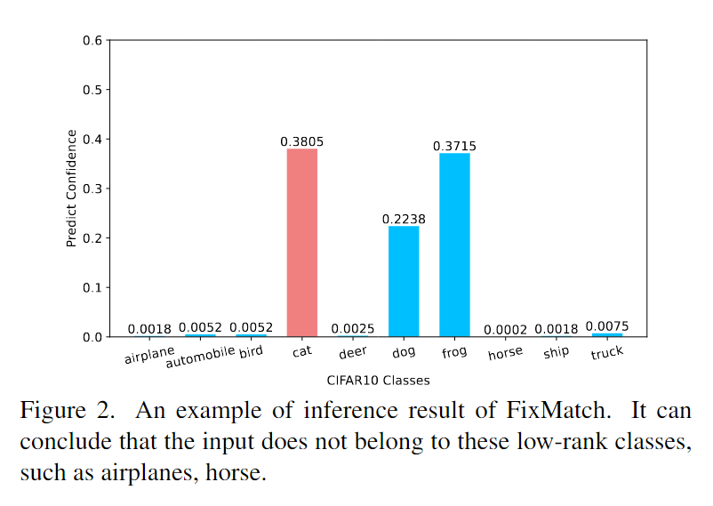
图2展示了 FixMatch 的推理结果。真实类别是“猫”，FixMatch 被几个 top 类别（例如“狗”、“青蛙”）混淆并做出低置信度预测，但它显示出对某些低等级类别（例如“飞机”、“马”)不是真实类别的高度置信度，因此我们可以安全地为这些类别分配负伪标签。基于这一见解，我们提出了一种名为自适应负学习（ANL）的新方法。具体来说，ANL 首先根据预测一致性自适应计算 $k$ ，使得 top-$k$ 的准确率接近1，然后将排名在 $k$ 之后的类视为负伪标签。此外，如果样本被选为伪标签，ANL 将缩小非目标类的范围（即EML只需要约束除目标类之外的 top-$k$ 类)。请注意，ANL 是一种与阈值无关的方案，因此可以应用于所有未标记的数据。

## 本文贡献

1. 在使用伪标签训练样本时，我们引入了一种额外的监督，即熵意义损失（EML），它强制非目标类的均匀分布，以避免它们与目标类竞争，从而产生更多的高置信度预测。
2. 我们提出了自适应负学习（ANL），这是一种动态负伪标签分配方案，它以非常有限的额外计算开销的为所有未标记数据（包括低置信度样本）设置负伪标签。
3. 我们设计了一个简单而有效的框架，名为 FullMatch，通过简单地将 FixMatch 与所提出的 EML 和 ANL 集成，它利用所有未标记的数据，从而在五个基准上取得显着的收益。

<!--more-->

## 本文方法

### 熵意义损失（EML）

我们提出熵意义损失来分配更多带有伪标签的样本。当前大多数工作都集中在动态调整阈值（例如 FlexMatch、Dash）。与它们不同的是，我们的目标是加强模型本身的表示能力，以产生更多远离决策边界的预测（即高置信度预测），这意味着它与那些动态阈值工作正交。
我们假设$Q^{(i)}=[q_1^{(i)},...,q_C^{(i)}]$表示样$i$的弱增强版本的预测向量。令$S^{(i)}=[s_1^{(i)},...,s_C^{(i)}]\subseteq\{0,1\}^C$为表示所选标签的二元向量，其中$s_c^{(i)}=1$表示类别$c$被选为目标类（例如，伪标签类），并且当该类缺少特定标签时$s_c^{(i)}=0$。该向量可以计算为：
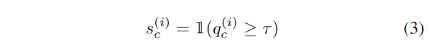
其中$\tau$是选择阈值。此外，我们可以计算向量$U^{(i)}=[u_1^{(i)},...,u_C^{(i)}]$，其中$u_c^{(i)}=1$表示类$c$是非目标类，样本$i$是分配一个伪标签，其公式为：
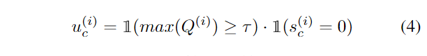
我们假设$P(i)=[p_1^{(i)},...,p_C^{(i)}]$表示样本$i$的强增强上的预测置信度向量，$p_{tc}^{(i)}$表示目标类的置信度 （即伪标签类）。通过无监督损失函数（即交叉熵）的优化，$p_{tc}^{(i)}$将逐渐收敛于给定标签（即随着模型学习，伪标签类的置信度将逐渐增加到1）。但对于某些具有挑战性的样本，混淆类和目标类之间的竞争总是导致无法生成高置信度的预测。 为了解决这个问题，我们对其余类别（即所有非目标类别)施加额外的约束，以允许它们平等地共享剩余的置信度$1-p_{tc}^{(i)}$，以避免与目标类别的任何类别竞争 。这可以表述为：
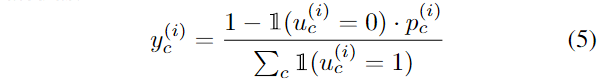

其中$y_c^{(i)}$是非目标类的标签。它表明一旦确定了目标类的预测概率，其他非目标类应该平等地分享剩余的置信度分数。 请注意，EML 仅应用于伪标签样本，这意味着由于$max(Q^{(i)}\ge\tau)$，$\sum_c\mathbb{1}(u_c^{(i)}=1)$始终大于 0。由于$y_c^{(i)}$从 0 变化到 1，因此可以使用二元交叉熵（BCE）损失来训练模型。因此，我们提出的熵意义损失（EML）可以定义为：
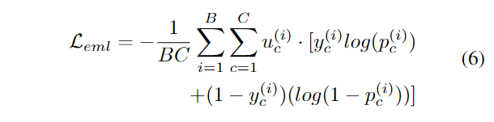
请注意，$y_c^{(i)}$是根据目标类别的分数计算的，因此 EML 也会产生目标类别的梯度，可以计算为：
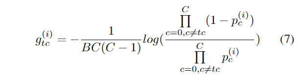
 EML 和无监督损失$\mathcal{L}_{us}$ (式2) (即交叉熵损失) 的梯度方向相同，这表明EML可以与$\mathcal{L}_{us}$配合进一步提升目标类的置信度，同时约束非目标类的分布。详细证明，请参阅补充材料，第 A 节。
 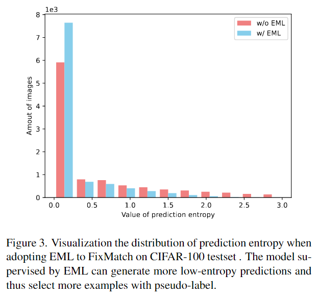
为了直观地说明 EML 的有效性，图 3 比较了引入 EML 和不引入 EML 的情况下 CIFAR100 测试集上的预测熵分布。 总图像为 10000 张。显然，引入 EML 后，低熵预测量（例如预测熵值小于 0.25）将增加约 18%（78% vs 60%)。 我们通过在 CIFAR-10 和 STL-10 [5] 上使用 t-SNE [28] 进一步证明了 EML 的有效性。 图 4 表明 EML 可以产生更清晰、可分离的边界，从而给出更高置信度的预测。
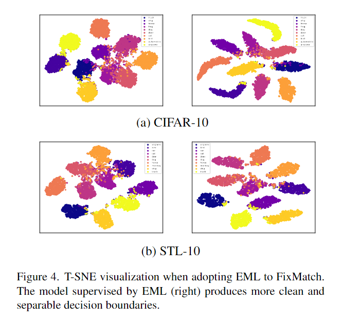

### 自适应负学习（ANL）（动态负伪标签）

由于在复杂的场景下很容易产生模糊的预测（例如，最大置信度只有0.3，而阈值是0.95），这些例子很难被分配伪标签（通过阈值过滤或不正确的预测），因此对模型优化没有贡献。为了解决这个问题，我们分配了一个噪声较小的附加标签来利用这些示例。
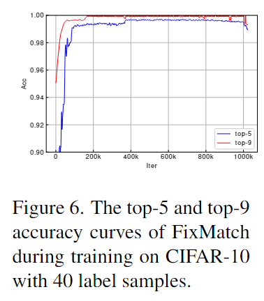
图 6 展示了当标记数据量仅为 40 时 FixMatch 在 CIFAR-10 上的 top-$k$（例如 top-5 和 top-9  ）精度曲线。top-5 预测在 100k 次迭代后可以达到有希望的精度 ，这意味着当迭代次数大于 100k 时，CIFAR-10 中的所有未标记数据很可能不属于最后 5 个预测类别（即 top-5 之后的类别)。这种现象促使我们为未标记的数据渲染负伪标签。
因此，理想的方法是利用额外的数据集来评估 top-k 性能，从而计算出合适的 $k$ 值，使 top-$k$ 错误率接近于零。 由于我们无法在模型训练过程中使用测试集，因此一种可选策略是从标记数据中分离出额外的验证集。 然而，这带来了两个严重的缺陷：1）将验证集与标记训练集分开是昂贵的，特别是当标记数据量特别有限时（例如，每个类只有四个标签）。 2)每次迭代时需要额外的前向传播来动态调节 $k$，导致模型训练效率急剧下降。
在这项工作中，我们提出了一种近似评估 top-$k$ 性能的方案，称为自适应负学习（ANL)。 ANL 不需要额外的标记验证集，也不需要冗余的推理过程。 这是受到 UDA [33] 的启发，通过优化两个增强版本之间的一致性，模型相对于输入空间的变化变得更加平滑，从而整体性能可以更好。因此，我们的关键假设是模型性能可以通过不同增强输入的预测的一致性来反映。 也就是说，无论最大分数是否大于阈值，我们首先根据弱增强预测计算临时标签，然后将临时标签视为强增强版本的基本事实并计算最小 $k$ 以便它的 top-$k$ 准确率为100%。 这可以表述为：
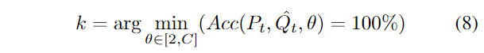
其中 $\hat{Q}_t=argmax(Q,t)$ 是步骤 $t$ 的临时标签，$P_t$ 表示强增强的预测向量，它们是在总批次样本中计算的。$Acc$ 和 $C$ 分别表示计算 top-$k$ 准确率和类别数的函数。由于在每个训练步骤中总是存在某些没有伪标签的示例 (见图1(a) ) ，同时我们对所有未标记的数据计算 $k$，因此可以缓解过拟合问题。最后，我们将负伪标签分配给弱增强版本的预测分布上排名前 $k$ 的类别。因此，向量 $S^{(i)}$ ( 第 3.2 节 ) 可以重新计算为：
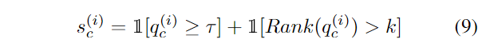
其中 $Rank$ 是基于置信度分数降序排列的类别排序函数。在训练过程的早期阶段，当模型在相同样本上输入不同的增强版本时，输出分布显著不同，因此 $k$ 的值将被放大，即当 $k=C$ 时，ANL 将不会提供任何负伪标签。通过一致性损失（即交叉熵损失)的优化，模型对输入噪声具有更强的输出不变性，$k$ 的值会变小，并且会选择更多的负伪标签。自适应负学习损失 $\mathcal{L}_{anl}$ 可以表示为：
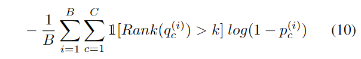
请注意，使用 ANL 的成本几乎是免费的。它不引入任何额外的前向传播过程来评估性能，也没有引入任何新的超参数。与 $\rm UPS$ [24] 和 $\rm NS^3L$ [4] 不同，ANL 不依赖于置信度值，并且允许将负伪标签分配给具有模糊预测的示例。有关 ANL 的更多分析（例如，使用有限的标记示例进行训练)，请参阅补充材料 B 部分。

### FullMatch

通过将熵意义损失（EML）和自适应负学习（ANL）集成到 FixMatch 中，我们提出了一种名为 FullMatch 的高级 SSL 算法。由于 ANL 可以为所有未标记的数据分配负伪标签，因此它鼓励我们在计算 $y_c^{(i)}$ 和 $\mathcal{L}_{eml}$ 时将负伪标签作为附加目标考虑在内。这意味着带有伪标签的样本中非目标类的计数是 $k−1$ 而不是 $C−1$。
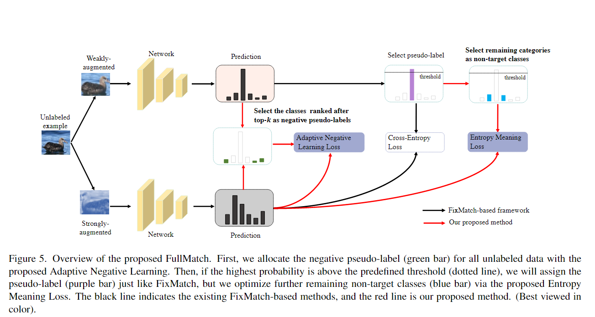
如图 5 所示，我们首先计算 $k$ 为所有未标记的示例分配负伪标签，并使用Eq.(10)来训练模型。这意味着网络可以从低置信度示例中学习，而不是直接忽略它们。然后，我们基于弱增强样本的预测来设置伪标签，并使用交叉熵作为损失函数，类似于FixMatch。对于带有伪标签的样本，我们进一步将剩余类别视为非目标类别，并利用 EML 在强增强预测中训练相应的类别输出。因此，我们可以将 FullMatch 中的总体损失表示为 FixMatch 损失（即监督损失、无监督损失)、ANL 损失和 EML 的简单加权和：
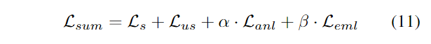
为了简单起见，我们将$\alpha$和$\beta$设置为1。$\mathcal{L}_{sum}$和$\mathcal{L}_{us}$ (式 (2) ) 分别是标记样本的监督损失和未标记样本的一致性损失：
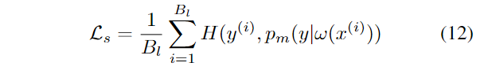
其中 $B_l$ 是标记示例的批大小。有关 FullMatch 的完整算法，请参阅补充材料 C.1 节。
