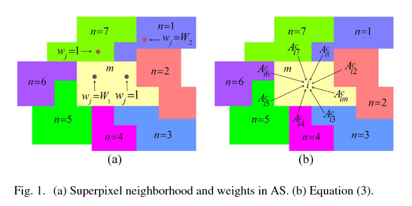
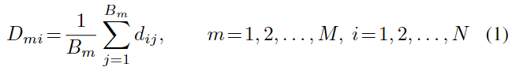
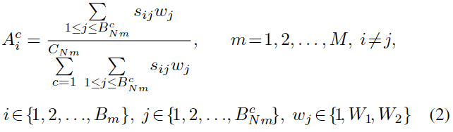
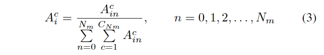
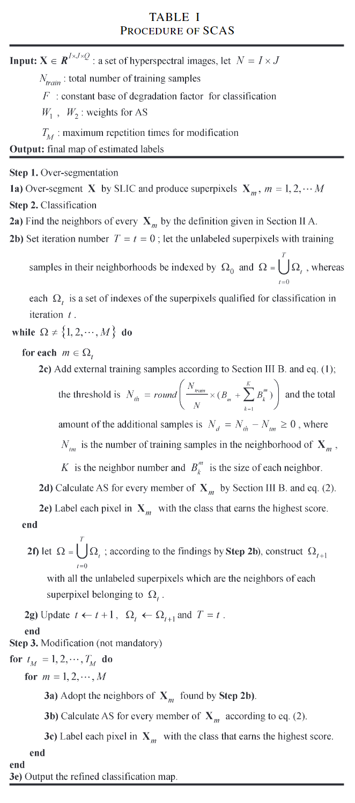

原文：《Semisupervised Spectral–Spatial Classification of Hyperspectral Imagery With Affinity Scoring》

## 摘要

半监督分类已变得流行，因为它可以利用高光谱图像中有限的先验知识。 然而，光谱内部类别的可变性给任务增加了巨大的挑战。 为了解决这些问题，我们提出了一种基于亲和力评分 (AS) (SCAS) 的新型半监督光谱空间分类方法。AS（Adaptive-Supportive）算法是从模糊逻辑中改进而来，它利用光谱和空间特征的模糊贡献，通过权衡局部类别一致性、光谱相似度和先验知识三个因素进行分类。SCAS方法包括三个主要步骤：超像素分割、半监督分类和修改。 第一步生成超像素并使用它们来保持局部类的一致性。 第二步和第三步分别使用 AS 对超像素进行分类并细化分类图。 实验表明，该方法可以优于一些经典方法和最先进的分类器。

## 主要问题

1. 无监督分类仅通过图像统计在没有任何先验知识的情况下将图像划分为相关的组，但它们不会产生与用户所需类别明确相关的聚类[4]。
2. 然而，监督方法仅通过标记样本学习或训练模型，然后将其应用于未标记样本。它们的有效性在很大程度上取决于训练数据的数量和质量。此外，它们忽略了空间信息，因此容易受到光谱异质性的影响。
3. 另一种方法是主动学习，但它要求用户标记最不确定的像素，因此不是全自动的[4]。

## 本文方法

为了解决上述问题，我们提出了一种基于亲和评分(SCAS)的半监督分类方法。他包括三个主要步骤：超像素分割、半监督分类和修改。首先，对HSI进行超像素分割，然后使用AS算法作为分类器。最后，再次使用AS算法对分类图进行细化，以减少椒盐噪声误差。SCAS基于HSI的局部类别一致性，像素或超像素的类别归属很可能与其邻居的类别一致。捕获到局部类别一致性，即使是粗糙的超像素分割对SCAS也有价值。

1. 整个过程的核心是AS，它源自模糊逻辑[11]。 它权衡三个因素：局部类别一致性、光谱相似性和先验知识。 这里的新颖性涉及在它们对分类的贡献中利用模糊性。
2. AS通过对每个像素在同一区域内进行个别决策的同时，总体上对邻居对像素的影响进行了评分，平衡了区域相似性和像素个性之间的关系。通过利用超像素的特性和重复使用有限的先前知识。

<!--more-->

## 相关工作

### 超像素

超像素广泛用于图像分割领域[10]，它代表图像的一部分。 对于SCAS，需要引入超像素邻域的概念。如果两个超像素中的任意一个与另一个相邻，则它们可以视为邻居。图1(a)显示超像素${\bf X}_m$有7个邻居$(n=1,2,...,7)$。

像素-超像素距离$D_{mi}$定义如下：

其中$B_m$表示超像素$\mathbf{X}_m\in \boldsymbol{R}^{B_m×Q}$的大小，即$\mathbf{X}_m$中像素$\boldsymbol{x}_j$的个数。$Q$是光谱维度。
$M$和$N$分别是超像素总数和像素总数。$d_{ij}$可以是$\boldsymbol{x}_i$和$\boldsymbol{x}_j$之间的任何光谱距离，例如欧氏距离 (ED)。

### 亲和力分数

亲和性是模糊逻辑中的一个概念。 对像素与类的亲和力进行评分的方法已经用于融合几种不同的分类方法 [11]。 在这里，我们使用 AS 来表征 HSI 的各个角度。它通过对三个因素进行加权来利用光谱和空间特征对分类贡献的模糊性：类归属中的局部类一致性、光谱相似性和先验知识。$A_i^c$表示将成员$\boldsymbol{x}_i$与超像素$\mathbf{X}_m$内的类$c$联系起来的AS，计算如下：

其中，$A_i^c$的范围从0到1。分数越高，亲和力越大。$B_{Nm}^c$为类$c$标记的像素个数，其中$c=1,2,...,C_{Nm}$为$\mathbf{X}_m$(包括$\mathbf{X}_m$)邻域内所有标记样本的类。由于空间邻近性和局部一致性，只考虑这些类。$s_{ij}$是像素级光谱相似度。文中，$s_{ij}=exp(0.5\cdot CCij)$，其中$CCij$是光谱相关系数$(CC)$。这是一种用于光谱相关性的直接指数。自然指数函数被添加以放大测量结果并避免零除数。如果$\boldsymbol{x}_j$在$\mathbf{X}_m$内并且在分类之前被标记，则$w_j=W_1$。如果$\boldsymbol{x}_j$被标记为先验但属于$\mathbf{X}_m$的邻居，则$w_j=W_2(1≤W_2≤W_1)$；否则，$w_j=1$。图 1(a) 给出了一些超像素成员（点）的权重示例。式 (2)中的$A_i^c$也可以改写为：

其中$n=0$指的是$\mathbf{X}_m$，$N_m$是$\mathbf{X}_m$邻域内超像素的数量。鉴于此，一个像素的类亲和力由邻域中的每个超像素共同确定，如图1(b)所示。
由此可见，一个分数只适用于一个超像素中的一个成员及其邻居，因此在考虑空间一致性的同时引入了合理的光谱变异性。AS 还通过对最初标记的样本进行大量加权来利用先验知识。 此外，AS 易于实现，因为它只涉及标量计算。

**补充：**

1. $A_i^c$表示超像素内$\mathbf{X}_m$成员$i$属于类别$c$的亲和度评分。
2. $c=1,2,...,C_{Nm}$为一个超像素$\mathbf{X}_m$(包括$\mathbf{X}_m$)邻域内，初步分类结果中的类别。
3. $A_i^c$的分子$\sum_{1\leq j\leq B_{Nm}^c}s_{ij}w_j$是超像素$\mathbf{X}_m$邻域内类$c$成员贡献的评分，$B_{Nm}^c$为超像素$\mathbf{X}_m$内类$c$标记的像素个数，只有类$c$。$w_j$实际上为邻域内训练样本的加权值。
4. $A_i^c$的分母$\sum_{c=1}^{c_{Nm}}\sum_{1\leq j\leq B_{Nm}^c}s_{ij}w_j$超像素$\mathbf{X}_m$邻域内所有有标记类成员贡献的评分，一共有$c_{Nm}$个类别。
5. 如果$\boldsymbol{x}_j$被标记为先验但属于$\mathbf{X}_m$的邻居，意思是不在$\mathbf{X}_m$的内部，则关联性就比较低，所以设置$1≤W_2≤W_1$。

## 提出的方法

### 总览

SCAS的步骤见表I，由于SCAS只要求超像素能够保持局部一致性，因此它不需要完整的分割图。因此，采用了一种高效的过分割技术，简单线性迭代聚类(SLIC)[10]。其他两个步骤都与AS有关，将在以下部分中详细说明。需要注意的是，“训练”样本指的是分类前被标记的样本，“标记”样本包括“训练”样本和原本未标记但分类后的样本。

**补充：**

整体过程相当于一个扩散过程，先对有训练样本的超像素(包括邻域)中每一个成员计算AS，然后重新标注为得分最高的类，此时原超像素邻域内的超像素均被标注了，再以标记过的超像素及其邻域重复上述步骤，向外扩散。$\Omega_t$的作用是记录已标记的超像素，判断未标记的有没有达到$M$个总数，所以每次要令$T=t+1$

- $F$：用于分类的退化因子的常量基数
- $T_M$：修改的最大重复次数

1. 步骤1：超像素分割
   **1a)** 通过SLIC过分割$\mathbf{X}$生成$\mathbf{X}_m$

2. 步骤2：分类

   **2a)** 根据Section II A的定义找到每个$\mathbf{X}_m$的邻居

   **2b)** 设置迭代次数$T=t=0$，让邻域内具有训练样本的未标记超像素以$\Omega_0$为索引，$\Omega=\bigcup_{t=0}^T\Omega_t$而每个$\Omega_t$是迭代$t$中符合分类条件的超像素的一组索引。
   **while** $\Omega\neq\{1,2,...,M\}$ **do**
       **for each** 超像素$m\in\Omega_t$
           **2c)** 根据Section III B和eq. (1)添加外部训练样本；阈值是$N_{th}=round(\frac{N_{train}}{N}\times(B_m+\sum_{k=1}^KB_k^m))$，额外样本的总数是$N_d=N_{th}-N_{tm}\geq0$
           其中$N_{tm}$是$\mathbf{X}_m$邻域内的训练样本数，$K$是邻居编号，$B_k^m$是每个邻居的大小。
           **2d)** 通过Section III B 和 eq. (2)为$\mathbf{X}_m$上的每个成员计算 AS
           **2e)** 用得分最高的类别标记$\mathbf{X}_m$中的每个像素。
       **end**
       **2f)** 让$\Omega=\bigcup_{t=0}^T\Omega_t$，根据步骤 **2b)** 的发现，用所有未标记的像素构建$\Omega_{t+1}$，这些超像素是属于$\Omega_{t}$的每个超像素的邻居。
       **2g)** 更新$t\leftarrow t+1$，$\Omega_t\leftarrow\Omega_{t+1}$和$T=t$
   **end**

3. 步骤3：修改（非强制）

   **for** $t_M=1,2,...,T_M$ **do**
       **for** $m=1,2,...,M$
           **3a)** 采用步骤 **2b)** 找到的邻居。
           **3b)** 根据eq. (2)为$\mathbf{X}_m$的每个成员计算 AS。
           **3c)** 用得分最高的类别标记$\mathbf{X}_m$中的每个像素。
       **end**
   **end**
   **3e)** 输出细化后的分类图。

### 分类步骤

该步骤使用 AS 分类器联合考虑光谱和空间信息，并将其嵌入到区域扩展过程中以实现半监督。分类过程从包含其邻域内训练样本的超像素开始，并自我迭代，直到每个像素都被标记。由于局部一致性，在每一次迭代中，只有邻域内包含标记样本的超像素被认为是符合分类条件的。当选择这些超像素中的一个时，每个未标记的成员都与邻域内每个类别的标记成员配对。接下来，计算每对像素的AS，这表示像素属于类的“程度”。为了细致地处理空间信息的模糊性，除了光谱相似性之外，还使用了像素级的空间欧几里得距离（ED）。最后，将该像素分配给与该像素相关联的所有可选类别中得分最高的类别。为此，AS 分类器并不要求每个超像素至少包含一个训练样本。 如果两个空间上不相交的超像素实际上是同一类，但只有一个超像素有训练样本来启动区域扩展过程，则另一个将在稍后的一些迭代中被分类。 由于局部类一致性，AS 在小区域内的分类非常准确。 从而保证整体精度。
尽管出于局部一致性的考虑，每个决策都发生在超像素中，但它们可能会受到有偏差的标签像素的影响。此外，由于大多数像素标签是先前迭代的结果，其中一些可能是不正确的，尽管可能性很低。相比之下，训练样本更可靠，因为它们肯定属于它们被分配到的类别。特别是在训练样本稀缺的半监督场景中，分类器应该充分利用训练样本。因此，如果邻域内的训练样本比例低于阈值，则在分类过程中引入超像素邻域外的额外训练样本。为了考虑光谱均匀性和空间亲和性，同时考虑光谱均匀性和空间亲和力，一半的外部样本在空间上最接近超像素，另一半在光谱上最接近超像素。
此外，**标签估计得越晚**，它们的可靠性就越差。因此，式(2)中的$w_j$被替换为$r_{ij}f_j$，其中$r_{ij}=exp(−0.5\cdot d_{ij}^{spa})$，$f_j$是可靠性退化因子。$d_{ij}^{spa}$是由位置坐标计算的像素级的空间欧几里得距离（ED）。如果$x_j$是训练样本，则$f_j=W_1$。 如果$x_j$是非训练但标记的样本，则$f_j=W_1F^t$，其中$t$代表对$x_j$进行分类的迭代次数。$W_1$固定为与 (2) 中相同的值。
**补充：**标签估计得越晚感觉像是距离远，所以扩散晚，所以通过$r_{ij}$来缩小权重

### 修改步骤

此步骤旨在通过 AS 细化分类地图。 它不是强制性的，但在先验知识稀缺且分类准确性需要提高时最需要。 它采用与分类步骤类似的程序。**在一个超像素内，每个成员都被赋予一个在邻域中每个类别的得分，然后被分配到得分最高的唯一类别中。 一旦修改了每个超像素，就可以重复该过程以进一步提高准确性。** 重复次数取决于用户。 与强调先前知识重复利用的分类步骤不同，修改步骤利用了空间平滑性。 此外，它使在较晚的分类迭代中标记的像素能够对较早获取的像素的标签进行投票。 鉴于此，修改步骤能够生成具有更高准确性和增强视觉效果的最终预测图。
此外，关于分类和修改程序，还有两点说明。 首先，如果一个像素有多个类获得最高亲和力分数（这种情况非常罕见），则在整个邻域中出现频率最高的类获胜。 如果仍然无法解决，则将像素随机分配到其中一个类。 其次，如果在当前迭代中其邻域中的所有超像素都被一致标记，则整个超像素可以被视为下一次迭代的“训练”样本。 这应该可以通过高度可靠的结果来弥补原本稀缺的先验知识。
