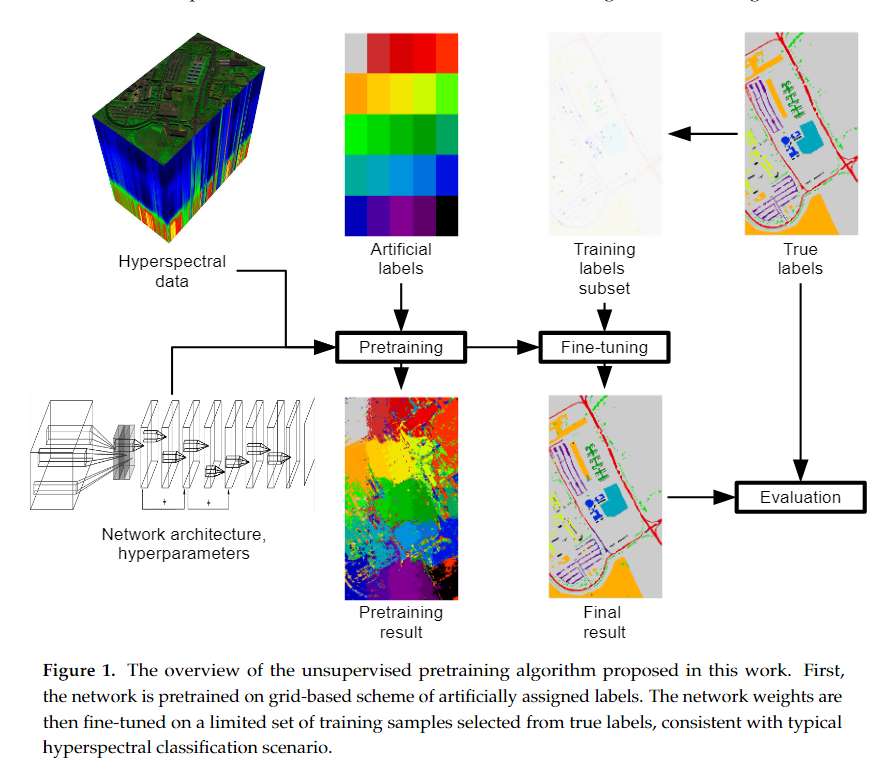

原文：《Effective Training of Deep Convolutional Neural Networks for Hyperspectral Image Classification through Artificial Labeling》

## 主要问题

1. 虽然深度学习神经网络（DLNN）可以获得非常好的精度分数，但它的缺点是需要大量的训练数据来估计模型参数。这样的数据并不总是可用的，因为通常一个高光谱图像只有少量训练标签可用。
2. 迁移学习可以解决训练样本数量少的问题，但是这一策略并不直接适用于高光谱图像，因为通常情况下只有一种特定类型或特征的图像可用。

## 思路

对于DLNN分类，缺乏大量的训练数据是一个严重的复杂问题，因为它们通常需要大量数据才能实现高效率。DLNN在HSI分类中的最佳使用将需要仅用几个标记样本来学习它们。这可以通过搜索针对特定任务的定制良好的体系结构来获得，然而，这种方法需要相对较大的验证集才能获得有意义的结果。一种方法是扩大可用的训练集。这可以通过人工增加训练集或使用不同的数据集作为预训练的来源来实现。另一种方法是增加正则化步骤，以提高有限训练样本数量的泛化能力。在MugNet网络中采用了用于分类的网络体系结构的简化，其中训练样本很少。最后，在可能的情况下，使用转移学习方法。
迁移学习使用来自两个领域的训练样本，这两个领域具有共同的特征。网络首先在第一个域上进行预训练，该域有充足的训练样本供应，但不能解决手头的问题。随后，用第二个域更新训练，使权重适应实际问题。

## 本文方法

为了缩小数据效率低下的深度学习模型与HSI实际应用之间的差距，我们提出了一种利用HSI图像上大量未标记数据点的方法。准确地说，我们提出了一个假设：可以利用未标记数据点的空间相似性来获得高光谱分类的准确性。为了证实我们的假设，我们构建了一个简单的空间聚类方法，该方法根据图像上的每个像素的空间位置为其分配人工标签。利用该人工数据集对深度学习分类器进行预训练。接下来，使用原始数据集对模型进行微调。通过一系列实验，我们证明了该方法优于标准的学习过程。我们的方法是由两个已知的现象驱动的:聚类假设和类中噪声的正则化效应。我们注意到，许多遥感图像具有共同的属性，最值得注意的是“聚类假设”——彼此接近或形成不同的聚类或组的像素经常共享类标签。此外，由于我们的聚类方法的简单形式，我们有目的地在预训练阶段使用的标签中引入噪声；只要正确标记的示例数量按比例缩放，这个标签噪声对最终的精度几乎没有影响。
我们的方法适用于以下情况：

1. 高光谱遥感图像像素的分类；
2. 神经网络用作分类器；
3. 可用的培训标签很少。

在这种情况下，我们建议用一个使用人工标签的预训练步骤来增强训练，这是独立于训练标签的。这一预训练步骤的加入可以看作是迁移学习方法的一种改进。在这种情况下，传统的迁移学习将使用具有大量标签的相关数据集(源域)进行预训练，然后使用当前数据集(目标域)进行微调。在我们的例子中，源域由高光谱图像中的每个点组成，而目标域仅由标记的样本组成。

<!--more-->

## 人工标记方法

我们为预训练步骤创建人工标签的方法是一种简单的分割算法，该算法假设样本光谱特征的局部同质性。它的工作原理是将考虑的图像分为$k$个矩形，其中每个矩形都有自己的标签。对于高$h$宽$w$的图像，我们将其高分为$m$个大致相等的部分，将其宽分为$n$个大致相等的部分，使$k = m·n$。然后我们得到$k$个矩形，其中每个矩形的高约等于$h/m$，而宽度约等于$w/n$。每个矩形用不同的标签定义一个不同的人工类。图1给出了一个示意图。

人工标签的功能是让网络学习数据中存在的与类无关的blob模式。这将网络训练的重点放在实际训练标签的微调上，而网络“面向”当前图像的特征。当一个类由多个blob组成，并且并非所有的blob在训练集中都有样本的情况下，它也是很有优势的。在这种情况下，仅使用训练样本不太可能获得足够正确的标签[62]，但提出的网格结构迫使网络估计整个图像的特征。这种方法的另一个优点是将潜在耗时的预训练从专家标记时刻转移到习得时刻。换句话说，网络培训不需要等到专家的标签可用，而是可以在图像记录后立即开始。

## 实验

1. 实验1使用不同的高光谱图像和神经网络结构对所提出的方法进行了评估，以证明其鲁棒性。
2. 实验2调查了人工标记中使用的补丁大小和形状引入的可变性。
3. 实验3我们测试了这样的假设，即划分更多的patch比划分更少的patch产生更好的预训练集。我们使用一张特别设计的高光谱测试图像来研究这一点。
4. 实验4我们检查了第2.2节中关于在神经网络训练中使用提出的带有噪声标签的人工标签方案出现的数据依赖表示的说法。