原文：《Grouped Multi-Attention Network for Hyperspectral Image Spectral-Spatial Classification》

## 摘要

深度学习 (DL) 已成为高光谱图像 (HSI) 分类的强大工具。 然而，由于高维和复杂的光谱空间特征，有效地从 HSI 中学习高度区分的特征仍然是一个悬而未决的问题。 为了解决这个问题，我们提出了一种新的波段分组引导多注意力模块，用于提高光谱空间特征学习的性能。 首先，基于相邻光谱带之间的高相关性和远程光谱带之间的低依赖性这一事实，将所有光谱带自适应地划分为多个不重叠的组，其中包括相关波段。 优点是在处理和分析每组时降低光谱维数和数据复杂度。 然后，将一种不仅探索组内显着信息而且传播组间差异信息的多注意机制嵌入到卷积神经网络 (CNN) 中，以学习组特定的光谱空间特征。 通过强调有用的光谱/空间信息并用注意机制压缩无用信息，增强了学习特征的可分割性。 在此模块的基础上，构建了一个光谱空间分类网络，命名为分组多注意力网络（GMA-Net）。 GMA-Net 包含一个双分支架构，即像素级光谱特征学习和补丁级光谱空间特征学习。 通过融合来自两个分支的特征，可以整合像素级和补丁级学习方式提供的互补和判别特征，以进一步提高分类性能。 实验结果表明，所提出的方法优于几种最先进的方法。 代码位于：https://github.com/luting-hnu。

## 本文思路

**传统方法对数据中有用和无用的信息一视同仁，不管信息是否有用。很可能会引入一些无用的信息，导致分类精度的降低和计算资源的浪费。**最近，视觉注意力机制在增强图像分类结果方面表现出了良好的性能，也被引入到光谱和空间特征提取过程[46]，[47]，[48]中作为一种有效的特征优化方法。这种注意机制突出了对包含最有价值信息的特征的敏感性，这有助于学习判别特征以获得更准确的分类。
大多数基于注意力的方法一次处理所有光谱波段，以掌握全局代表性特征，而忽略了光谱分布信息和光谱反射率特征。即相邻波段之间具有较高的光谱相关性，而远距离波段之间具有较低的相关性;同时，不同波段的光谱反射率特性对不同材料的分类也很敏感。**通过全局注意机制，全局显著特征会被很好地学习，而一些局部显著特征可能会被削弱，从而导致一些重要的区分信息没有足够的关注，这些信息对识别缺乏足够关注的类别有用。**为了克服上述限制，我们设计了一种新颖的分组多注意力驱动深度学习网络，以增强 HSI 分类的特征区分能力。具体而言，所提出的深度学习网络采用了双分支结构，包括基于像素的光谱特征学习分支和基于patch的空间-光谱特征学习分支。对于基于像素级的分支，它以高光谱像素作为输入，并使用具有1×1卷积核的多个卷积层来丰富光谱特征。另一个分支是基于patch的空间-光谱特征提取分支，它以高光谱 patch 作为输入，通过一个先进的band-grouping引导的多注意力模块提取光谱-空间特征。
为此，我们首先在基于patch的空间-光谱特征学习分支中使用了自适应分组机制，将光谱波段自适应地分成多个组。 然后，在每个组中，设计光谱和空间注意模块来加权权衡输入数据的重要性，即强调重要的光谱带和空间像素以提取光谱空间特征。最后，通过全连接网络将这些基于patch的光谱-空间特征与像素的光谱特征相耦合，并通过Softmax函数用于预测类别标签。我们将所提出方法的主要贡献总结如下。

1. 在基于DL的HSI分类方法中首次引入了对高度相关相邻波段进行自适应分组的机制。其动机是由于某些物质的判别信息通常包含在一个或几个光谱范围内（例如，绿色植物对红色和近红外波段敏感）。与处理所有波段相比，分组特征提取可以减轻许多不重要波段的影响。
2. 我们提出了一种新颖的多注意力模块用于分组特征提取，以使网络更加关注少数关键和有价值的光谱和空间信息。为此，我们分别构建了光谱注意力和空间注意力块。前者利用组内光谱相关性生成光谱注意力权重。后者不仅利用像素组内显著信息，还充分利用它们之间的组间通信，更好地刻画空间像素的重要性。
3. 本工作中，我们开发了一种新的双分支网络架构用于高光谱图像分类。其中一个分支负责使用CNN和多注意力模块学习高度区分的光谱-空间特征。另一个分支提供由空间卷积引入的互补光谱信息。来自两个分支的特征被融合以提升最终的分类性能。我们对知名的高光谱图像进行了各种实验，以确认所提方法的有效性。

<!--more-->

## 本文方法

### 方法概述

设$X\in\mathbb{R}^{H×L×B}$表示HSI，其中$H×L$和$B$分别表示光谱带的空间大小和个数。为了更好地利用光谱和空间信息对HSI像素$x_i\in\mathbb{R}^{1×1×B}$进行分类，通常从$X$中裁剪出HSI patch $x_i\in\mathbb{R}^{s×s×B}$，并输入到CNN中提取光谱空间特征。其中，$s×s$为patch大小，$x_i$为$X_i$的中心像素。众所周知，CNN中的空间卷积运算会聚集相邻像素的信息，**由于相邻像素属于不同的类别，会导致光谱特性的退化**。因此，除了HSI patch之外，还需要HSI像素的纯光谱信息。 为此，我们将 HSI 像素$x_i$和 HSI patch $X_i$输入到一个名为 GMA-Net 的统一网络中，该网络具有双分支架构。GMA-Net的概述如图1所示。
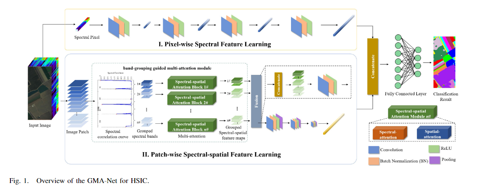
具体来说，像素光谱特征提取分支(以下简称像素分支)以像素$x_i$为输入，提取光谱特征$O_{pixel}$。patch级光谱-空间特征提取分支（简称patch分支)以HSI图块$X_i$作为输入，提取光谱-空间特征$O_{patch}$。
最后，将这两个分支的输出特征连接并注入到由全连接层和softmax函数组成的输出层中。将标签向量$y$（为方便起见，我们将忽略上标）通过以下等式表示：
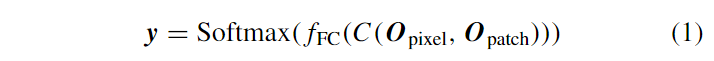
式中，$C(\cdot)$表示多个特征的连接操作，$f_{\mathbf{FC}}(\cdot)$表示通过全连接层进行特征学习，$y$表示对不同类别的分类概率。

### 像素光谱特征学习

在像素分支中，设计了一个简化的CNN从输入$x_i$中提取光谱特征。考虑到像素$x_i$是一维光谱向量，我们采用1 × 1卷积核，并在激活前的每次卷积后进行批处理归一化（batch normalization, BN）来加快CNN的收敛速度。因此，由四个结构相似的级联卷积层组成的CNN可以用下式表示：
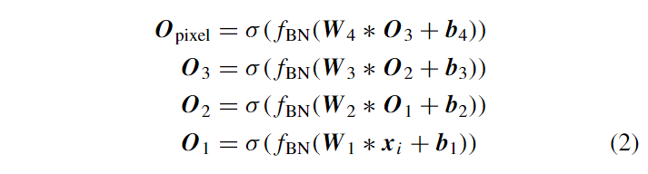
其中，$O_{pixel}$表示像素分支的输出，$O_1,O_2$和$O_3$是对应层获得的特征，${W_1,...,W_4}$和${b_1,...,b_4}$分别是不同层的权重和偏置。在第II-D和II-E节中，为了简化所提方法的描述，我们省略了偏置。此外，$∗$表示卷积操作，$f_{\mathbf{BN}}(\cdot)$表示 BN 操作，$\sigma(\cdot)$表示激活函数。在这里，我们采用线性修正函数（ReLU)作为激活函数。这四个卷积层使用的卷积核数量依次设置为32、64、128和256。

### patch级光谱-空间特征学习

**根据相邻光谱波段和空间像素趋向于相似的光谱反射特性，有用信息通常被光谱和空间冗余所包围，因此需要特殊关注。**此外，高维数据使得难以专注于局部的精细判别。在patch分支中，为了解决上述问题，我们开发了一个基于波段分组的多注意力模块来提升光谱-空间特征学习的性能。如图1所示，我们首先自适应地将光谱波段分成几个低维波段组。在此基础上，我们设计了多注意力框架，使用学习到的注意力权重强调多个组的有用信息并抑制无用信息。之后，注意力引导的特征被传递给CNN进行进一步的细化。
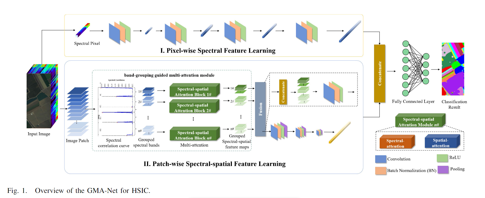
为了实现各波段的划分，基于光谱相关性分析，我们开发了自适应波段分组方法。如图2所示，绘制了相邻光谱波段的相关系数，其中有一些显著的谷点。这些谷点表示光谱波段在一定范围内相似。因此，只要我们能找到这些谷点，就可以实现自适应的波段分组。为了达到这个目的，首先通过以下公式计算相邻光谱波段的皮尔逊相关系数$\rho$：
其中，$y_j$和$y_{j+1}$分别表示第$j$个和第$j+1$个光谱波段，Cov(·)表示协方差的计算，$\sigma_j$和$\sigma_{j+1}$分别是$y_j$和$y_{j+1}$的标准差。然后，小于某些相邻点的点被视为谷点。该处理可以表示如下：
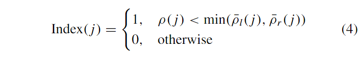
其中，$Index(j) = 1$表示谷点，$\bar{\rho}_l(j)=1/M\sum_{m\in\Omega_l}\rho m$和$\bar{\rho}_r(j)=1/M\sum_{m\in\Omega_r}\rho m$分别是位于点$j$的左侧和右侧的$M$个相邻点的相关系数的平均值（$M$对于不同的HSI固定为4)。通过这些谷点，光谱波段被自适应地分组。最后，使用后处理将具有高相关性或非常少的波段的相邻组合并，以进一步优化和输出n个波段组$\{X_i^1,X_i^2,...,X_i^n\}$。
针对这些波段组，基于组内关联计算和组间协作，建立多注意框架，学习注意引导特征。该模型的结构如图1所示。首先，光谱模块和空间模块可以分别利用群内信息获取每一组的光谱和空间注意权值。光谱和空间模块的详细描述将在以下章节中进行演示。
由于材料对不同波长的光具有不同的光谱反射特性，各个组往往具有不同的注意力信息。然后，基于这种组间关系，我们使用不同组的注意力信息共同优化特征。具体而言，设$F_n$表示通过空间注意力块获得的第$n$组的注意力图。压缩的注意力信息$1-\bar{F}_n$可用于其他组，其中$\bar{F}_n$是$F_n$的平均图。因此，第$n$组$X_i^n$相对应的注意力引导的空间特征$Z_i^n$可以通过以下公式获得：
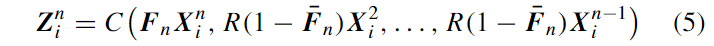
其中$1-\bar{F}_n$通过$R(\cdot)$重塑为各种组的大小。此外，通过光谱注意力块可以得到总共$n$组的注意力引导的光谱特征$\{E_i^1,...,E_i^n\}$。
接下来，通过连接$\{Z_i^1,...,Z_i^n\}$和$\{E_i^1,...,E_i^n\}$,得到的分组的光谱空间特征，通过卷积层进一步细化强调的光谱空间信息。 **卷积层采用 1×1 卷积核进行特征融合。** 最后，将融合的特征传递给由三个卷积层组成的 CNN（内核大小设置为 5×5)，以获得光谱空间特征$O_{patch}$。

### 光谱注意力块

对于每个光谱组，光谱注意块旨在强调有助于特征学习和最终分类的重要光谱波段。为了实现这一目的，基于自注意机制设计了一种新的可学习光谱注意块，其详细结构如图 3 所示。
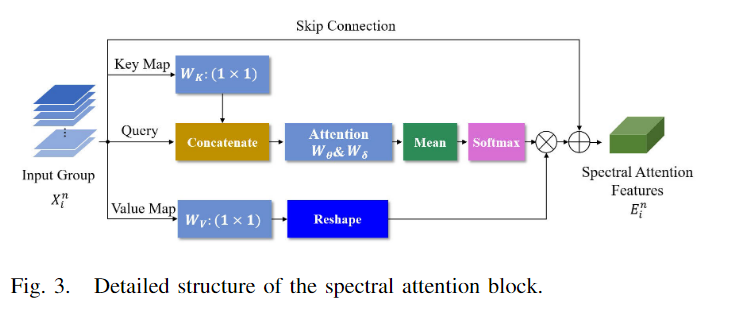
首先，我们通过将输入组$X_i^n$映射到不同的特征空间来实现query $Q$、key $K$和value $V$。 即$K=W_K∗X_i^n$ , $V=W_V∗X_i^n$, $Q=X_i^n$, 其中$W_K$和$W_V$是卷积运算实现的嵌入矩阵。借助于 1×1 卷积核，嵌入矩阵的映射可以有效地保留$Q$和$V$中的光谱信息。 然后，协同使用$K$和$Q$生成第$n$组的光谱注意力图$F_n'$，其公式如下：
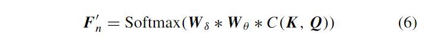
其中$W_\theta$是具有 1×1 卷积核和 ReLU 激活函数的卷积层，$W_\delta$是 1×1 卷积层后跟均值运算和 Softmax 函数。 基于此，通过将$V$和注意力图相乘来强调关于$X_i^n$的关键光谱信息，即$P_i^n=F_n'V$。
最后，受到残差网络的启发，我们使用跳跃连接（skip connection)来保留更多有用的信息，从而通过以下公式获得第$n$组的光谱注意力特征$E_i^n$：
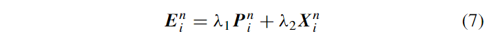
其中$\lambda_1$和$\lambda_2$是用来权衡$P_i^n$和$X_i^n$贡献的可学习权值。所有的光谱关注特征${E_i^n}$将被叠加，用于CNN中接下来的特征融合和特征学习。

### 空间注意力块

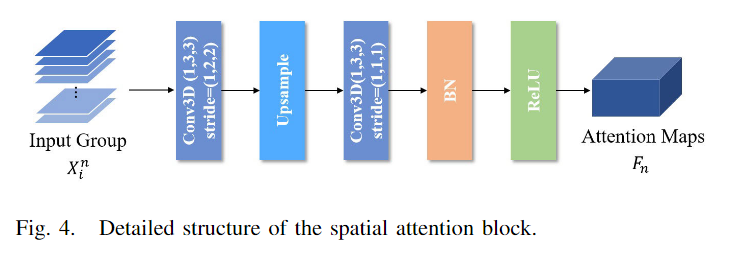
对于每个光谱组，空间注意力块旨在生成由注意力权重组成的空间注意力图，用于强调显著的空间信息，并对特征学习和最终分类起到作用。为了实现这个目的，我们设计了一个可学习的空间注意力块，如图4所示。**首先，对输入的光谱组$X_i^n$进行降采样，以减少冗余并突出显著信息。**我们采用可学习的卷积层进行降采样，而不是使用无需学习的池化操作。具体而言，使用3D卷积和最近邻插值，可以表示为：
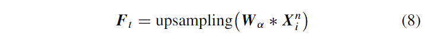
其中，$F_t$表示用于粗略提取显著空间信息的特征图，$W_α$表示一个3×3×1的3D卷积层，$\rm upsampling(\cdot)$是基于最近邻插值的上采样操作，用于恢复特征图的空间尺寸。
然后，使用3D卷积层对$F_t$进行进一步的特征学习。此外，通过Sigmoid函数对学习到的特征进行归一化，生成注意力权重。因此，可以通过以下公式获得注意力图$F_n$：
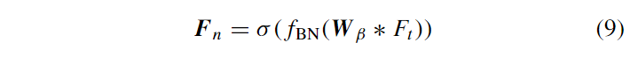
其中，$W_\beta$表示核大小为3 × 3 × 1的3D卷积，$\omega$表示激活函数（此处使用Sigmoid函数）。最后将$F_n$代入式(5)，得到注意引导特征$Z_i^n$。
