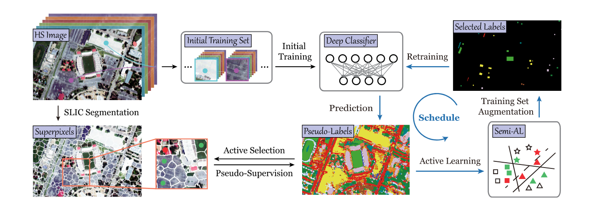
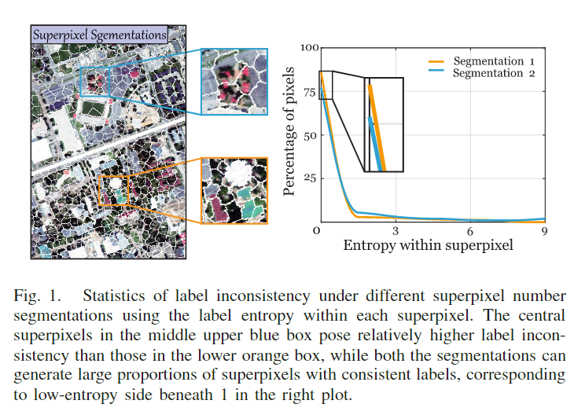
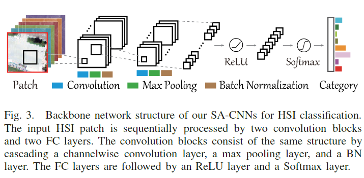
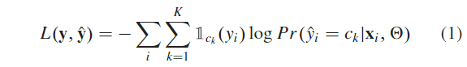
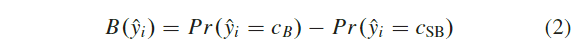
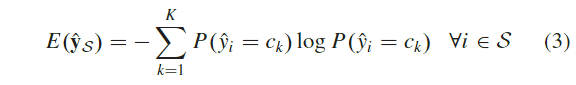
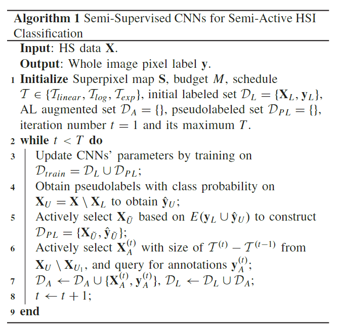
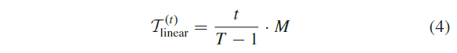
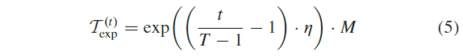
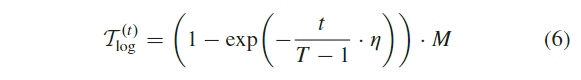

原文：《Semi-Active Convolutional Neural Networks for Hyperspectral Image Classification》

## 本文思路

1. HS图像容易出现昂贵且耗时的标签标注问题，同时在分类过程中有大量的未标记数据。如何在调查场景中选择样本，无论是标记还是未标记的，并充分利用它们来扩大深度分类器的能力正在变得更具不可忽略的。
2. 通过根据当前模型的不确定性测量标准主动采样信息像素，包含AL的先进HSI分类算法总是能够减轻对足够标记的需求，并获得比经典分类算法更好的性能。
3. AL和SSL在HSI分类的背景下整合这两种互补技术并取得了良好的性能，但是一方面，它们对深度分类器的相互影响仍然缺少研究。另一方面，现有的大多数方法都依赖于复杂的特征提取和选择标准设计，这可能会限制它们在更广泛的情况下的实用性和可扩展性。
4. 因此，在本文中，我们提出了一个统一的 SSAL 框架，通过以半主动的方式学习 CNN。

## 本文贡献

1. 设计了一种新的半主动HSI分类框架工作，通过学习半监督CNNSA-CNN，简称SA-CNN，通过迭代的方式主动选择标记数据和未标记数据，允许CNN在有限的标记数据下学习更具区分性的特征。
2. 展示了三种直观但有效的AL调度，通过逐步添加主动选择的训练样本，可以很好地拟合网络训练，进一步使训练后的深度分类器具有更强的数据自适应能力。

## 本文方法

### 方法总览

为了进一步消除深度模型对大量标记训练样本的强烈依赖，我们提出了半主动学习框架，即同时主动选择标记和未标记数据，从而可以利用更多的全局数据结构信息 相互关联的监督和伪监督允许以渐进的方式相互促进，如图 2 中的工作流程所示。 此外，我们将提出的 SA-CNN 与针对训练集和测试集之间的数据分布差异而设计的三个 AL 计划相结合，从而使我们的方法能够更好地泛化处理各种 HSI 数据集。
上图框架：我们的网络通过同时利用监督和伪监督信息以渐进的方式进行训练。 在每次迭代中，我们首先主动选择那些基于 SLIC 产生高标签一致性的样本，如绿色标记的超像素，及其伪标签来构建可靠的伪标签集。 然后，我们根据三个建议的Schedule对其余样本进行 AL 过程，这些样本在红色超像素中构成高度不一致的语义。 通过这种方式，我们的框架有望充分利用未标记部分的知识，进一步提高 AL 的效率和有效性，实现半 AL。

<!--more-->

### 超像素分割

代表性的超像素分割算法包括 SLIC [55] 和包含可微分 SLIC 的超像素采样网络 [56]。 与以前关注超像素在提供有效特征表示方面的潜力的方法不同，我们注意到，如图 1 所示，超像素内的高标签一致性可用于实现所提出的半主动学习策略。 值得注意的是，这种具有不同参数的过分割在标签一致性方面表现出相对一致的趋势，并且没有明显的额外计算负担。

### 提出的SA-CNNs

令$D=\{X,y\}$表示调查的HSI数据集，其中$X=\{x_1,...,x_n\}\in\mathbb{R}^{N×D}$包含感兴趣的$N$个像素的$D$维光谱特征，$y\in\mathbb{R}^N$是标签向量，其中每个元素代表每个像素的土地利用或土地覆盖类别，给定标签设$C={c_1,c_2,...,c_k}$与$K$预定义类。 我们HSI分类的目标是采用在训练集$D_{train}=\{X_{train},y_{train}\}$上训练的基于 CNN 的深度分类器来预测剩余测试集$D_{test}$的标签$\hat{y}$。
基于AL的方法通常初始化一个标记集$D_{L_0}$，$|D_{L_0}|\leqslant|D_{train}|$，其中$|·|$是集合的基数，然后主动选择一个带有查询标签$D_A$的辅助集，这样会使得在$D_{L_0}\cup D_A$上的训练比在$D_{train}(|D_{L_0}\cup D_A|\leqslant|D_{train}|)$上训练有一个明显的分类器表现的提升，其中$\cup$代表两个数据集的并集。然而，未标记比例的信息往往被忽略，实际上在高维特征空间中起着主导作用。 因此，我们表明，通过对标记和未标记数据进行适当的主动选择，它们的标签和伪标签能够共同有助于学习半监督 CNN 以实现更好的 HSI 分类。
我们采用如图 3 所示的具有骨干结构的普通 CNN，不失一般性，它由两个卷积层以及一个最大池化层和一个 BN 层组成，两个 FC 层在第一个之后有一个 ReLU 激活层， 和一个 Softmax 输出层。

在每次迭代中，用于网络训练的分类交叉熵损失定义为：

其中，$\Theta$收集在$D_{train}$上训练的CNNs的参数，$\mathbb{1}_{ck}(·)$表示指示函数，$Pr(·)$表示每类的输出分数，为了简单起见，下面将省略$(X_i,\Theta)$的条件。
像往常一样，我们使用一个小的标记集$D_{L0}$初始化$D_{train}$，采用无偏抽样。例如，在我们的例子中，Houston2013数据集的每一类都有20个。传统的基于 AL 的方法直接实现未标记样本的主动选择和人工注释的查询。 在这些方法中，Cao 等人[44] 已经验证了基于 BvSB （Best versus second best，最佳与次最佳)的标准 [57] 相对于通过 3D-CNN 实施的基于熵的标准的优越性，其中 BvSB 在多类分类的背景下测量基于边缘的不确定性可以定义为：

其中$c_B$和$c_{SB}$分别表示未标记样本$x_i\in D\setminus D_{train}$属于最大概率和次大概率的类索引。
然而，一个经常被忽视的问题在于，在早期迭代中提供的有限监督倾向于生成一个过拟合模型，该模型不能很好地解释未标记集，进一步直接误导了接下来的s的AL过程。这个问题在我们的实践中也得到了验证，当逐步向CNN输入主动选择的标记数据时，性能通常不能保证不断改进。因此，我们有动力为基于 DL 的 HSI 分类设计一个强大的 AL 框架，该框架有望实现 CNN 强大的特征提取潜力。
从这个意义上说，SSL 可以作为一种替代方法，因为它能够利用未标记数据的伪监督，相当多的 SOTA 方法显示了它的有效性，无论是基于与 AL [52] 集成的传统 MLR 模型，还是使用精心设计的 CRNN 辅助 Dirichlet 过程混合模型 [47]。 然而，与这些方法不同，我们建议迭代选择标记和未标记的数据，通过这种方法，伪监督在很大程度上被用来促进统一框架中的传统 AL。
我们直观而明确的动机在于，即使在具有不同数量的超像素的分割下，超像素内的类别信息也是高度一致的——如图1中调查的HSI场景所示。基于当前的网络输出，我们可以引入标签熵来衡量每个超像素 S 中的标签一致性。

其中 $P(·)$表示类成员概率。 请注意，对于每个超像素，高标签熵往往表示两种情况。 第一个对应于分割不足的情况，即超像素组的像素具有不一致的语义，这可能是由于超像素集数量过多或未识别的像素特征差异造成的。 在第二种情况下，当前分类器倾向于表现出对预测缺乏信心，因此生成的概率在类别之间没有明显差距。
考虑到上述讨论，我们建议迭代执行以下三个步骤来实现我们的 SA-CNN 的半监督学习。首先，我们在$E(\hat{y}_S)$上设置一个阈值，将未标记的样本$X_U$分为两部分。对于标签熵小于该阈值的$X_{\tilde{u}}$部分，我们将它们视为关于当前分类器的可靠样本，并将它们的预测一起收集到伪标记集$D_{PL}=\{X_{\tilde{u}},\hat{y}_{\tilde{u}}\}$中。我们接下来对剩余部分样本$X_U\setminus X_{\tilde{u}}$使用 AL 过程，即通过现成标准（例如BvSB)主动选择最易混淆的候选$X_A$，并查询其注释$y_A$以获得通过添加到初始标签集$D_L=D_{L_0}\cup \{X_A,y_A\}$来扩展标签集。最后，深度分类器可以通过对$D_{train}=D_L\cup D_{PL}$的监督训练进行更新，因此有望通过互补利用可靠的伪监督和信息丰富的监督信息来改善分类性能。

### AL Schedule

鉴于只有有限的标记样本被初始化，它们扩展的特征子空间对于 CNN 来说可能太脆弱，无法学习可靠的数据表示，从而在早期阶段降低以下生成伪标签。一般来说，我们建议更新通常采用的线性计划，以逐渐释放的方式主动选择标记样本，而不是一次性提取它们。具体地，给定预算$M$，即可以选择的样本总数，在某次训练迭代$t$时，新标记样本的累加数$T^{(t)}$如下：

其中T表示最大迭代次数。请注意，与以下两个Schedule相比，此Schedule是一个无偏选项。
然而，在实际场景中，用户可能会面临初始训练集和测试集之间的数据分布差异。例如，如果初始采样的数据在整个特征空间中均匀分布，则可以得出一个直观的结论，即当前的 CNN 容易学习稳健的特征表示，从而能够判断分类器可能在接下来的迭代中最需要哪些样本。从理论上讲，我们可以尽可能小心地为 CNN 提供新标记的样本——在极端情况下，每次迭代一个样本——以充分发挥 AL 的潜力，这也需要对网络进行无休止的训练。为了在性能增益和不可承受的计算成本之间进行权衡，我们考虑根据 exp-schedule 添加样本，如下所示：

其中$\eta$是控制进度变化速度的缩放参数； 如图 4 所示，$\eta$越大，调度越陡峭。 基本动机在于早期添加的样本比后期选择的样本对模型的影响更为关键。
相反，如果样本分布稀疏，或者说数据分布之间存在明显差距，则最初仅使用有限训练集学习的 CNN 很难为未标记样本输出可靠的类别概率。在这种情况下，由于初始集数量有限，一开始就精心选择可能会危及模型过度拟合整个数据集。因此，我们建议对SA-CNNs采用log-schedule在迭代开始时吸收更多标记数据，并促进后续学习的更健全的轨迹：

通过整合建议的AL Schedule，我们的 SA-CNN 的整个过程可以总结在算法 1 中。
