原文：《Hyperspectral imagery classification based on semi-supervised 3-D deep neural network and adaptive band selection》

## 1 主要问题

HSI分类仍然有以下问题：

1. 光谱波段之间的高度相关性；
2. 不同光谱特征的空间变异性；
3. 产生Hughes现象的大量光谱波段，即当波段数量非常高时，分类性能降低，而训练样本的数量非常有限。

所以降维(DR)在HSI分类之前是必要的，因为它允许减少光谱波段的数量，以及分类所需的时间。DR的两个主要方法是特征提取和光谱波段选择。特征提取旨在将原始高光谱数据投影到具有原始光谱波段线性或非线性变换的缩减子空间中，其中缩减子空间的维度远小于原始 HSI 的维度。波段选择试图选择相关光谱波段的子集，即所选择的光谱带应该是最有鉴别力的，信息量最大的，而且相关性和冗余度都很低的。

## 2 解决方法

1. 提出了一种自适应DR方法，通过寻找最具信息量、最具辨识度和最具特色的低冗余光谱波段，同时保留HSI的物理意义，解决维数问题。它是一种半监督波段选择方法，不需要大量的训练样本来选择光谱波段。
2. 提出了一种基于卷积编码器-解码器的半监督三维CNN的HSI空间光谱分类方法，利用较少的训练样本提取HSI的空间光谱特征，提高了分类性能。

<!--more-->

## 3 主要思路

自适应降维方法可以解决维度诅咒的问题，休斯。事实上，当每个类别的标记训练样本的数量与像素的维度相比非常小时，即HSI的光谱带（特征）的数量与用于训练的样本数量之间的比率非常低时，就会出现这个问题。事实上，休斯现象经常导致错误的分类，因此导致不良的表现。此外，当我们增加3-D CNN分类器的输入（HSI）中的规格带数量时，分类率会下降。通常情况下，维数的诅咒会限制三维CNN分类器的泛化能力，并引起过度拟合问题。因此，为了克服维数诅咒，避免半监督3-D CNN模型的过度拟合，我们提出了一种半监督频段选择方法，其目的是在保留HSI中原始数据的物理意义的同时，找到信息量最大、鉴别力最强和最具特色的频段。因此，我们不使用全部的光谱带来训练半监督的三维CNN模型，而只使用减少的相关带子集。

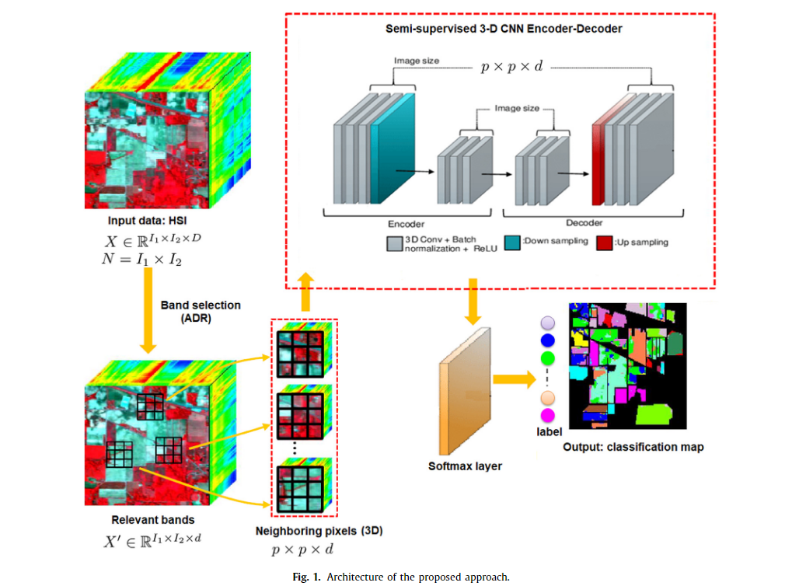

### 3.1 适应性降维(ADR)

所提出的自适应降维 (ADR) 的主要目标是通过找到最相关的光谱波段来降低 HSI 的高维。因此，我们提出了一种半监督方法，旨在寻找具有高鉴别、高信息和低冗余准则(DIR)的相关波段。
形式上，给定一个HSI表示为$X=[x_1,...,x_N]\in R^{D×N}$，其中$x_i$表示像素的光谱向量。$D$是光谱波段的数目$B={B_1,B_2,...,B_D}$，$N$为像素数。$X^t$的每一列$X_j$对应一个光谱波段$j$, ADR寻求基于DIR准则选择一个约简的$d$个光谱波段集合，其中$d\ll D$。设$p$个训练样本集合，$p=u+l$，其中$u$和$l$分别为未标记和标记训练样本的个数。设$x_j^l\in X_j$对应有标记样本，$x_j^u\in X_j$对应未标记的样本。
第一步旨在仅使用标记样本找到前 $d$ 个判别光谱波段，如下所示：
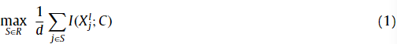
其中$R$包含具有$d$个元素的$B$的所有子集，$d$为所选波段的个数，$I(.)$为标记的训练样本$X_j^l$与类标签$C$之间的互信息(MI)，它衡量$X_j^l$与$C$之间的共享信息，定义为:
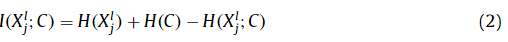
其中$H(.)$是熵的度量。
但是，所选波段可能是冗余的。因此，多变量 MI (MMI)可用于减少所选光谱波段之间的冗余，如下所示：
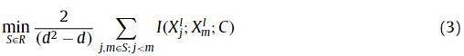
第二步使用未标记的训练样本寻找信息光谱波段，减少冗余，如下所示:
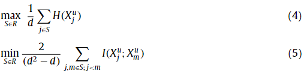
因此，通过结合方程式。 (1)、(3)、(4) 和 (5)，我们可以选择具有最高冗余的前$d$个相关波段。这可以通过最大化以下表达式来实现：
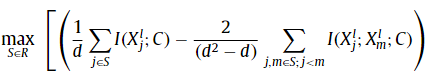
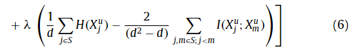
其中使用$\lambda$作为参数来调整未标记和标记训练样本的相对重要性。式(1)可以得到$SB_{(ADR)}={B_{<1>},B_{<2>},...,B_{<d>}}$作为半监督3D-CNN模型的输入。

### 3.2 用于HSI分类的半监督三维CNN

在本节中，我们提出了用于HSI空间光谱分类的半监督3-DCNN。HSI用三维立方体表示，它包含两个空间维度(每个光谱带的大小)和一个光谱维度(光谱带的数量)。每个像素连同它的相邻像素，即大小为$p×p×d$的立方体。这些立方体被认为是半监督三维CNN的输入数据。$P×P$为窗口大小(空间维度)，$d$为所选相关波段的个数。在监督学习中，我们使用softmax损失函数来训练模型，其中神经元的数量等于要分类的HSI类的数量。让我们考虑$N$个标记的训练样本$(x_1,t_1),(x_2,t_2),...,(x_N,t_N)$，其中$x_i$是一个像素，$t_i$是它的标签。每个像素$x_i$可以定义为$x_i=[x_{i1},x_{i2},...,x_{id}]$，其中$d$为谱向量的长度。softmax 损失函数可以表示为:
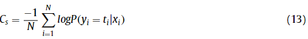
其中$N$是训练样本的个数，$t_i$是第一个训练样本的标签，$y_i$是一个随机变量，对应于样本像素的标签。然而，为了鲁棒性，这需要大量的标记训练样本来训练一个好的3D cnn模型。

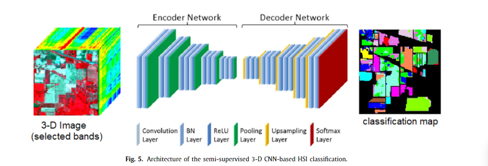
因此，我们将卷积编码器-解码器与监督3DCNN进行扩展，以执行半监督3DCNN，该CNN通过保留空间特征来考虑标记和未标记样本。
形式上，让我们考虑$M$个未标记的训练样本，$x_{N+1},x_{N+2},...,x_{N+M}$。卷积编码器-解码器包含两个主要映射：一个编码器映射$f$和一个解码器映射$g$。$f$试图采用 CNN 的前馈过程，而$g$包含卷积操作和过采样。通常，卷积编码器-解码器旨在最小化$x_i$和预测输入$\hat{x}_i$（重构解码器)之间的差异，如下所示：
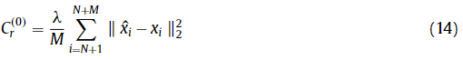
其中，$\hat{x}_i$为重构的解码器输入。
在我们的例子中，基于卷积编码器-解码器的半监督3D CNN对于无标记和有标记的训练样本有三条路径:干净编码、噪声编码和解编码:

* **干净编码路径：**通过干净的编码路径处理标记和未标记的训练样本，以计算隐藏变量$z_i^l,l=1,...,L$。因此，该函数可以表示如下：
  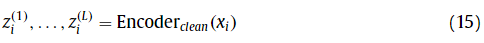
* **噪声编码路径：**使用高斯噪声对标记和未标记的训练样本进行损坏。此外，通过使用噪声编码器将它们转换为抽象表示$\breve{z}_j^l$。形式上，我们可以将此步骤定义为：
  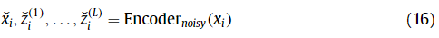
* **解码器：**它寻求重建预测的$\hat{x}_i$，使它们尽可能接近$x_i$。这可以表示如下：
  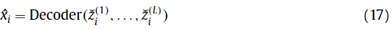

因此，我们提出的半监督三维CNN旨在使用两种成本函数，即用于标记训练样本的softmax函数和用于未标记训练样本的卷积编码器-解码器。使用方程式(13)和 (14)，我们可以得到这个公式：
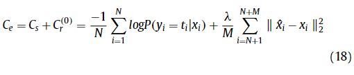
使用这个半监督 3D CNN，我们可以同时从 HSI 中学习所提出的网络模型和频谱空间特征。
图5显示了所提出的用于HSI空间光谱分类的半监督三维CNN的架构。在三维CNN的编码器网络中，我们有以下操作:三维卷积、批量归一化和池化。在三维CNN的解码器网络中，我们有以下操作:三维卷积、批量归一化和 unpooling（解池化？)。最后一层是soft-max函数。
