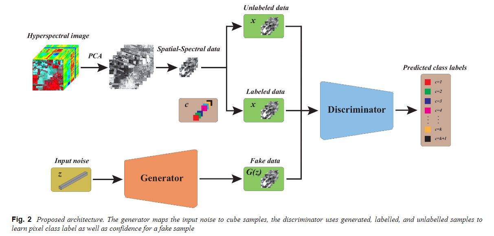
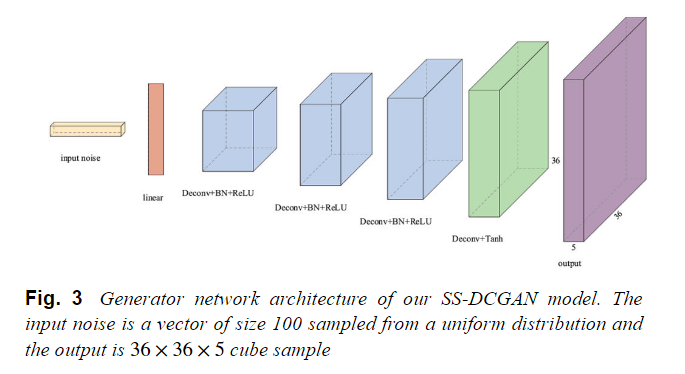
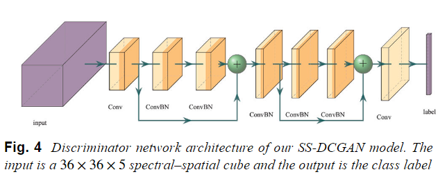

原文：《Semi-supervised convolutional generative adversarial network for hyperspectral image classification》

## 主要问题

1. 获取标记样本既耗时又昂贵，基于深度学习的分类模型包含大量的系数，需要足够的样本进行训练，因此基于深度学习的分类方法将面临过拟合问题。严重的过拟合问题会导致训练过程中训练精度较高，但在测试阶段表现较差的现象。
2. 现有的基于GAN的HSI分类方法没有利用3D深度残差网络（ResNet）的优良分类能力，这些模型也没有综合利用生成样本、标记样本和未标记样本的互补特征进行半监督分类。

## 解决方法

1. 半监督学习通过生成模型、低密度分离、基于图和基于包装器的方法，同时利用标记样本和未标记样本来提高模型泛化能力。本文提出的方法同时使用生成数据、标记样本和未标记样本来训练鉴别器，有效地提高了模型的泛化能力和分类性能
2. 在GAN框架中，3D全卷积网络和3D深层ResNet可以结合起来，分别利用它们在图像生成和分类方面的能力，将生成的样本、标记的样本和未标记的样本整合在一起，可以提高识别器的分类精度。

## GAN

标准GAN是一种新颖的生成模型，它包含一个生成模型$G$和一个判别模型$D$，并同时训练两个模型，生成器捕获真实训练数据的分布并输出伪样本，而鉴别器试图判断输入样本来自生成数据还是真实数据。GAN的训练过程是一个两人对抗性博弈，其中鉴别器$D$学习建立输入样本的概率是数据分布或生成模型分布，而$G$试图最大化$D$出错的概率。对抗训练过程使两个参与者提高了他们的表现，直到他们最终处于纳什均衡。
假设真实训练样本具有分布$p_{data}(X)$，并且输入噪声$z$具有数据分布$p_z(z)$，生成器将输入噪声$z$映射到生成样本空间$G(Z)$，而鉴别器估计输入样本$x$来自训练数据而不是$G(Z)$的概率。在对抗性训练过程中，我们将$log(D(X))$最大化来为相应的训练或生成的样本分配正确的标签，同时训练$G$来最小化$log(1-D(G(X)))$也就是生成的假数据无限接近真实数据。因此对于生成模型$G$来说，为了尽可能欺骗判别模型$D$。两人极大极小对策的最终函数为：

$$
\begin{align}
\operatorname*{min}_{G}\operatorname*{max}_{D}V(D,G) = &E_{x\sim p_{\mathrm{data}}(x)}[\log(D(x))] \\
&+E_{z\sim p_{z}(z)}[\log(1-D(G(z)))] \tag{1}
\end{align}
$$

其中$E$是概率期望值的经验估计。
3D-GAN是为了解决3D立方体样本的生成问题而提出的，它使用体积卷积网络从概率空间生成3D对象[28]。对于半监督学习，已经提出了几种半监督策略来指导遗传算法从未标记数据和生成数据中学习，解决了分类过程中标记样本有限的问题[29，30]。

<!--more-->

## 本文方法

### 模型描述

由于深度卷积网络在图像处理领域的出色处理能力和半监督学习在有限标记样本下的优势，我们将DCGAN架构和半监督GAN策略结合起来。在我们提出的方法中，我们使用一个具有分数步长卷积的深度卷积网络作为生成器，并将判别器$D$替换为一个深度ResNet分类器，该分类器不仅从$K$个类中为输入样本分配一个类标签$y$，而且还将假样本标记为额外的$K+1$个类。具体来说，鉴别器$D(x)$是一个参数化为深度ResNet的函数，它使用生成的数据、标记和未标记的数据同时训练，并预测$K$类样本和假样本的置信度。
在一个标准的softmax分类器中，分类器将样本$x$与$k$个可能的类进行分类，分类器将$x$作为输入并输出类概率。

$$
\begin{equation} \tag{3}
p_{\text {model }}\left(y_{i}=j \mid \boldsymbol{x}\right)=\frac{\exp \left(l_{i, j}\right)}{\sum_{k=1}^{K} \exp \left(l_{i, k}\right)}.
\end{equation}
$$

在传统的监督分类中，这种模型可以利用模型预测分布$p_{model}(y∣x)$与训练样本真实标签之间的交叉熵来训练。我们通过将生成的样本添加到数据集中来进行半监督学习，用一个新的“生成”类$y=K+1$来标记它们，并使用$p_{model}(y=K+1∣\boldsymbol{x})$来提供$x$是假的概率，对应于原始GAN框架中的$1−D(x)$。我们还从未标记的数据中学习，因为我们通过最大化可以知道它对应于真实数据的$K$类之一。

$$
\begin{equation} \tag{4}
-E_{x\sim p_{\mathrm{data}}(x)}\mathrm{log}[p_{\mathrm{model}}(y_i\in1,...,K\mid \boldsymbol{x})].
\end{equation}
$$

在提出的半监督DCGAN架构中，我们向鉴别器提供三个输入:生成的、未标记的和标记的数据。假设我们有相同数量的这三种类型的样本，因此每种类型的样本在训练中具有同等的重要性。相应地，我们将像素级鉴别器损失函数$ℒ_D$定义为三个项的和。

$$
\begin{equation} \tag{5}
\mathscr{L}_{D}=\mathscr{L}_{\text{labelled}}+\mathscr{L}_{\text{unlabelled}}+\mathscr{L}_{\text{fake}}.
\end{equation}
$$

标记样本的损失与标准分类网络相同，我们考虑平均交叉熵

$$
\begin{equation} \tag{6}
\mathscr{L}_{\mathrm{labelled}}=-E_{\boldsymbol{x},y\sim p_{\mathrm{data}}(y,\boldsymbol{x})}\mathrm{log}[p_{\mathrm{model}}(y\mid \boldsymbol{x},y<K+1)].
\end{equation}
$$

对于无标记样本，损失为

$$
\begin{equation} \tag{7}
\mathscr{L}_{\mathrm{unlabelled}}=-E_{\boldsymbol{x}\sim p_{\mathrm{dala}}(\boldsymbol{x})}\mathrm{log}[1-p_{\mathrm{model}}(y=K+1\mid \boldsymbol{x})].
\end{equation}
$$

最后，对生成的样本进行假预测，作为$K+1$类的训练样本，并定义相应的损失为

$$
\begin{equation} \tag{8}
\mathscr{L}_{\mathrm{fake}}=-E_{\boldsymbol{z}\sim p_{z}(\boldsymbol{z})}\mathrm{log}[p_{\mathrm{model}}(y=K+1\mid D(G(\boldsymbol{z}))]
\end{equation}
$$

其中$y=1,...,K$是类别标签，$p(x,y)$是标签$(y)$和数据$(x)$的联合概率。
我们发现最小化(6)的最佳策略是$exp[l_i,j]=c_i(x)⋅p(y_i=j,x),∀j<K+1$并且$exp[l_i,K+1]=c_i(x)⋅p_G(x)$，其中$c_i(x)$是第$i$个像素的待定缩放函数，有$K+1$个输出是一个过参数化公式[29]。利用伪类的对数$l_{i,k+1}$作为减法函数，我们得到$[(l_{(i,1)}−l_{(i,K+1)}),...,(l_{(i,K)}−l_{(i,K+1)}),0]$，因此只有$K$个有效(即非零)输出。在softmax(6)中使用这些“归一化”对数，然后得到以下修改后的损失函数：

$$
\begin{align}
\mathscr{L}_{D}=&-E_{\boldsymbol{x},\boldsymbol{y}\sim p_{\mathrm{data}}(\boldsymbol{x},\boldsymbol{y})}\mathrm{log}[p_{\mathrm{model}}(y_i\mid\boldsymbol{x})]\\
&-E_{\boldsymbol{x}\sim p_{\mathrm{data}}(\boldsymbol{x})}\mathrm{log}\frac{Z_i(\boldsymbol{x})}{Z_i(\boldsymbol{x})+1} \\
&-E_{\boldsymbol{z}\sim p_z(\boldsymbol{z})}\mathrm{log}\frac1{Z_i(G(\boldsymbol{z}))+1} \tag{9}
\end{align}
$$

其中，$Z_i(x)=\sum_{k=1}^Kexp[l_{i,k}(x)]$。
在半监督GAN中，常用的训练生成器的策略可能会导致不稳定和较差的性能，我们改用特征匹配(FM)损失来训练生成器[29]。在FM中，生成器的目标是匹配鉴别器中间层中的特征$f(X)$的期望值。在我们的工作中，$f(X)$包含我们模型中的鉴别器的最后两层的激活。

$$
\begin{equation} \tag{10}
\mathscr{L}_G=\parallel E_\boldsymbol{x}\sim p_{\mathrm{data}}(\boldsymbol{x})f(\boldsymbol{x})-E_{\boldsymbol{z}\sim p_z(\boldsymbol{z})}f(G(\boldsymbol{z}))\parallel_2^2.
\end{equation}
$$

由于FM只匹配一阶统计量，FM生成器可能最终得到一个平凡的解，并崩溃为未标记特征的平均值，这将无法覆盖流形之间的某些区域。为了处理这个问题，我们可以通过最小化生成器的修改损失来增加生成分布的熵。

$$
\begin{equation} \tag{11}
\mathscr{L}_G=-H(p_G)+\parallel E_\boldsymbol{x}\sim p_{\mathrm{data}}(\boldsymbol{x})f(\boldsymbol{x})-E_{\boldsymbol{z}\sim p_z(\boldsymbol{z})}f(G(\boldsymbol{z}))\parallel_2^2
\end{equation}
$$

### HSI分类的结构

在用于HSI分类的SS-DCGAN模型中，考虑到计算效率和分类精度，我们首先通过主成分分析(PCA)将HSI波段的数目减少到5个分量，这样不仅保留了空间和光谱信息，而且在用于HSI分类的SS-DCGAN模型中，考虑到计算效率和分类精度，我们首先将计算复杂度降低到合适的规模，以稳定GAN的训练过程。生成器将输入噪声转换为与具有五个主成分的HSI数据相同大小的伪样本，鉴别器接受三种类型的样本作为输入，并给出输入样本的类别标签。
我们方法的生成器是一个3D全卷积网络，它用步长卷积代替了池化函数。生成器的第一层只是一个线性矩阵乘法，它可以将均匀的噪声分布$z$作为输入，并输出一个4D张量用于下一个卷积叠加。接下来的四个分数步长卷积运算然后将该高级表示转换为$36×36×5$立方体图像。在卷积层中，通过将每个单元的输入归一化为零均值和单位方差，使用批归一化来稳定学习。归一化可以帮助处理由于初始化不佳而产生的训练问题，有助于更深层次的模型中的梯度流动，也可以解决GAN训练过程中经常出现的共模崩溃问题。此外，为了避免样本振荡和改善模型的不稳定性，我们没有对产生器的输出层施加批量归一化。在生成器中使用ReLU激活，以帮助模型更快地学习，除了最后一个输出层使用Tanh函数。用于生成HSI立方体样本的3D Depth CNN如图3所示。

鉴别器是一个 3D 深度 ResNet，它具有两个残差块和三个卷积层，如图 4 所示。与生成器一样，我们对除输入和输出层之外的所有层应用批量归一化来促进训练。LeakyReLU激活是 ReLU 激活的改进，它可以比鉴别器中的 ReLU 效果更好，因此我们对除鉴别器中最后一个卷积层之外的所有层使用LeakyReLU激活。此外，在卷积层的末端使用一个softmax分类器来给出输入样本的标签。

## 结论

我们提出了一种新颖的SS-DCGAN模型用于高光谱图像（HSI）的半监督分类，该模型依赖于两个方面。第一，生成器和判别器均使用3D深度学习模型来处理立方体HSI，以保持内部的光谱-空间特征。第二，半监督策略可以有效利用有限的标记样本、大量的未标记样本和生成样本，在标记样本有限的情况下提高分类性能。因此，通过在半监督学习框架中使用生成和未标记样本，大多数深度学习方法引起的过拟合问题可以得到缓解。在分类实验中，使用PCA提取光谱-空间特征并稳定训练过程，高光谱图像被归一化到0到1之间。SS-DCGAN的性能在三种广泛使用的高光谱图像数据集上进行了测试，并与最先进的传统和基于深度学习的分类方法进行了对比，结果证实了所提方法的有效性。值得注意的是，卷积GAN在图像处理领域具有广阔的前景，将基于图的GAN引入HSI半监督分类也是一个可能的未来研究方向。
