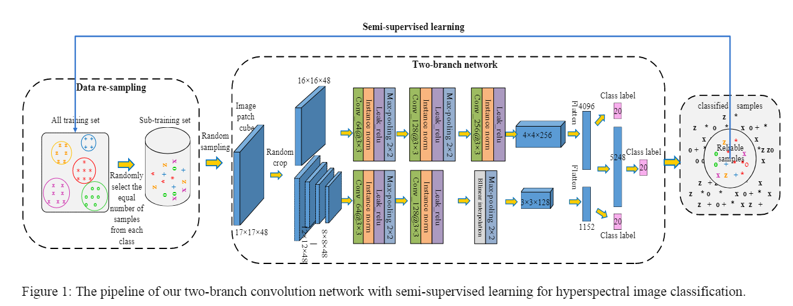

原文：《A Two-Branch Network with Semi-Supervised Learning for Hyperspectral Classification》

## 主要问题

一维卷积网络的输入是仅由中心像素组成的向量，当它们是噪声或混合像素时，这可能不完全合适。

## 主要方法

1. 数据重采样：对于不平衡的训练数据，我们引入了一种数据重采样方法，能够在保持数据多样性的同时重新平衡训练数据。
2. 双分支网络：我们提出了一种双分支结构来提取图像块的多尺度特征，以确保更可靠的图像描述符。
3. 半监督学习：我们从我们的网络中选择一些具有高置信度的分类数据，以迭代方式扩充小训练数据。

<!--more-->

## 双分支网络

图1为双分支网络，有两个并行卷积分支，一个全连接层和一个softmax层，输入patch大小为17×17。对于上半部分分支，输入patch大小为16×16。下分支类似于上分支，但是更多的注重多尺度信息。具体的，在不改变中心点的情况下，我们随机剪裁图片到$[8×8，12×12]$。为了保证输出大小不变，我们在下分支的最后一个池化层采用RoIAlign操作。
这种双分支结构使我们能够从多尺度视图中学习特征，并使网络聚焦于patch的中心，而不是次要边缘。

## 训练方法

1. 基于级联特征的交叉熵损失函数直接对整个网络进行优化。
2. 针对两个卷积分支各自的特点，分别利用交叉熵函数对其进行优化，同时基于融合后的特征对整个网络进行优化。
3. 首先优化上支路，然后交替优化下支路和最后一层全连接层。

## 半监督学习

由于训练样本数量较少，许多深度模型容易出现过拟合问题。我们的研究表明，在训练数据中添加某些验证样本可以显著提高整体性能，即使这些添加的样本的标签并不都是正确的。这启发我们在训练过程中引入具有特定数据选择标准的半监督学习。准确地说，我们利用上述三个分类器来预测每个验证样本的标签并输出其置信值。我们只选择具有相同预测标签和至少两个分类器的高置信度的验证样本，对它们进行训练以扩大数据集，并再次使用三种训练方法对网络进行训练。这一策略带来了一个额外的优势，它加强了第三分类器，它做出了不同的决定，学习可信的标签。这个过程反复重复，直到找不到明显的改善。

## 预测

在训练过程中，下分支的输入大小在$[8×8，12×12]$的范围内；而在测试过程中，为了减少预测结果的不确定性，我们将下分支的输入大小固定为$[12×12]$。最终结果由三个分类器的预测投票决定。如果它们之间的预测不一致，则将置信度最高的标签设置为最终结果。

## 结果分析

1. 三个模型的结合提高了预测的可靠性
2. 通过半监督学习增加了数据，增加了训练样本的多样性。
