原文：《A Semisupervised Siamese Network for Hyperspectral Image Classification》

## 摘要

随着高光谱成像技术的发展，高光谱图像（HSI）在分析地面物体类别时变得越来越重要。近年来，得益于海量标注数据，深度学习在多个研究领域取得了一系列突破。然而，标记HSI需要足够的领域知识，并且费时费力。因此，如何有效地将深度学习应用于小标记样本是HSI分类研究的一个重要课题。为了解决这个问题，我们提出了一种半监督孪生网络，将孪生网络嵌入到半监督学习方案中。它集成了自编码器模块和孪生网络，分别研究大量未标记数据中的信息，并用有限的标记样本集对其进行校正，称为3DAES。首先，在大量未标记数据上训练自编码器方法以学习精细表示，创建一个无监督特征。其次，基于这个无监督特征，使用有限的标记样本训练孪生网络，以纠正无监督特征，提高各类别之间的特征可分性。此外，通过训练孪生网络，采用随机抽样方案加速训练并避免各样本类别之间的不平衡。对三个基准HSI数据集的实验一致表明，所提出的3DAES方法在有限的标记样本下具有有效性和鲁棒性。为了复现研究，本研究开发的代码可在https://github.com/ShuGuoJ/3DAES.git上获取。

## 相关工作

**迁移学习：**迁移学习旨在将知识从源域转移到目标域，减少后者中大量标记样本的要求。它主要包括两条技术线——微调和数据分布自适应。
**主动学习：**一般来说，很多标记样本可能是多余的和不必要的，因为可能存在提供相似或相同信息的重复样本。因此，如何利用数据集中有价值的标记样本是主动学习想要解决的问题。**在HSI分类中，大多数主动学习方法[33]，[47]，[48]是基于后验概率，后验概率依赖于另一个分类器来发现那些难以分类和更有价值的概率。**
**孪生网络：**最近，旨在利用样本之间的差异来测量样本相似度的孪生网络引起了各个研究领域研究者的关注。由于样本对的构建可以增加标记样本的数量，因此孪生网络是小型训练集场景的一个很好的候选。**一般采用朴素样本构造方法，遍历样本集中所有可能的组合来生成样本对。然而，标记样本对的增加会加剧分类失衡，最终牺牲分类性能。**
**GAN：**此外，生成对抗网络(GAN)[57]是另一种流行的样本增强方法，它生成接近真实样本的假样本。近年来，生成器和鉴别器的GAN被应用于HSI分类[58]、[59]，以解决小样本标记问题。通过重复对抗学习，GAN中的生成器可以生成更多接近的真实样本，判别器可以更准确地识别假样本。在此过程中，鉴别器可以从真实样本中提取出越来越多的鉴别特征。因此，在对抗性学习之后，它可以看作是HSI的一个特征提取器模块，用分类器对小的标记样本进行微调。**虽然这些基于GAN的方法可以获得更多的样本，但很难精确控制训练和收敛过程。**

## 本文贡献

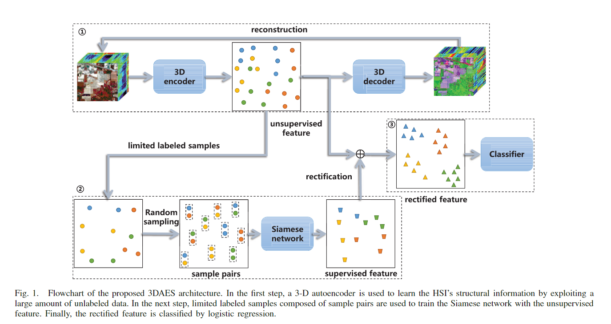
在这篇文章中，我们提出了一个名为 3DAES 的半监督孪生网络，它集成了自动编码器模块和孪生网络，以研究大量未标记数据中的信息，并分别用有限的标记样本集对其进行校正。 首先，自动编码器方法在大量未标记样本上进行训练以学习细化表示，创建所谓的无监督特征。其次，使用有限的标记样本训练孪生网络来纠正无监督特征，以提高不同类别之间的特征可分离性。 同时，为了加快训练过程，避免样本不平衡，还提出了随机抽样方案。所提出的 3DAES 架构的流程图如图 1 所示。使用三个基准 HSI 数据集进行的实验一致证明了所提出的具有有限标记样本的 3DAES 方法的有效性和稳健性。
**本文主要贡献：**

1. 我们提出了一个半监督孪生网络，称为 3DAES，用于 HSI 分类。 在孪生网络的训练阶段，样本对的构建可以增加训练数据，但会带来冗余性和多样性，尤其是在标记样本非常有限的情况下。 相反，未标记样本包含丰富的多样性，可以很好地弥补标记样本的不足。 **因此，提出了一个半监督孪生网络来整合双方。 具体来说，我们引入了一个自动编码器模块，它首先使用无监督方法直接从数据本身学习必要的数据表示。 虽然由此产生的无监督特征包含了数据的内部结构信息，但它可能缺乏类可分离性； 因此，我们使用孪生网络提取有限标记样本的关系特征，旨在纠正无监督特征，以减少类内距离，同时增加类间距离。**因此，所提出的 3DAES 方法可以分别充分利用大量未标记数据和有限标记样本中的无监督和监督信息，从而缓解小训练集导致的任何问题。 与现有的半监督方法不同，3DAES 不直接对无监督特征进行微调，而是用小标记样本间接校正。 据我们所知，这是第一次将孪生网络嵌入到 HSI 分类的半监督学习框架中。
2. **提出了一种随机抽样策略来加速模型训练并避免预测偏差。** 这种策略也可以被认为是一种数据增强过程，可以使所提出的 3DAES 模型对小训练样本有效。 对于朴素样本构建，负类的数量可能比正类的数量大得多。 在这种情况下，分由于样本在学习过程中的梯度贡献较大，分类模型一般倾向于给样本赋一个负类标签。另外，所提出的**随机抽样方案简单但有效地缓解了正类和负类之间的任何不平衡，并且不需要额外的超参数。** 在每次训练迭代中，正样本和负样本的数量也相等，这显着加快了训练过程。
3. 所提出的 3DAES 框架中每个模块的重要性已通过一系列消融实验得到验证，并且三个基准 HSI 数据集的实验一致证明了所提出方法优于其他方法的有效性。 所提出的 3DAES 框架中包含的超参数可以通过交叉验证确定，交叉验证在每个卷积层中保持不变； 因此，确保了所提出的 3DAES 框架的鲁棒性。 对于研究复制，可以在 https://github.com/ShuGuoJ/3DAES.git 上找到为本研究开发的代码。

<!--more-->

## 相关工作

### 自动编码器

自编码器的体系结构首先由 Hinton 和 Salakhutdinov [26] 提出，由两部分组成：编码器和解码器。 前者将输入$x$编码为隐藏表示$h$，后者将隐藏表示$h$解码为输出$\hat{x}$。通常，编码器和解码器模块是对称的，并且具有相同的连接模式。自动编码器的学习目标是使输入$x$和输出$\hat{x}$尽可能相似，其公式如下：
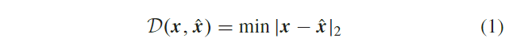
其中$\cal{D}$是相似度函数。 因此，隐藏表示$\cal{h}$将携带数据的内部结构信息。由于数据的对称构建，在整体架构中有很多参数。
为了减少训练参数的数量，Bengio 等人 [60] 使用贪婪的分层预训练方法来训练自动编码器。他们假设第一个编码器层的输入$x$等于最后一个解码器层的输出 $\hat{x}$。因此，第二个编码器层的输入$h_1$等于最后一个解码器层的输出$h_{n-1}$，其中$n$表示自动编码器的层数。基于以上假设，我们可以单独训练每个编码器层及其对应的解码器层。但是，如果隐藏状态$h$没有限制，则自动编码器可能等效于自映射函数。有两种自动编码器变体可以用来避免这种情况：稀疏自动编码器 [61] 和去噪自动编码器 [62]。对于稀疏自动编码器，将归一化或惩罚$\Omega(h)$添加到隐藏表示$h$，例如$L_1$范数，其中$\Omega(h)=\sum|h_i|$，以使最大值趋于零，使隐藏状态$h$更稀疏。与稀疏自动编码器不同，降噪自动编码器向输入$x$添加噪声$x_e$，其中实际输入$\bar{x}=x+x_e$，这允许编码器管理一定程度的噪声。在 HSI 分类中，Chen 等人[31]引入了自动编码器来提取特征。 为了将空间信息集成到模型中，自动编码器将中心像素的图像块展平[通过主成分分析 (PCA) 降低维数]，并将其与原始光谱矢量连接起来。然后使用编码器和解码器的参数来减少模型的可训练参数； 因此，解码器的参数$\Theta_d$是编码器$\Theta_e$的转置参数（例如，$\Theta_d=\Theta_e^T$其中$T$是转置操作)。此外，文献中提出了许多基于自动编码器的研究。Xing 等人[9]堆叠了一个多层去噪自动编码器来提取 HSI 特征，同时忽略了中心像素的空间特征。鉴于 CNN 提取空间信息的强大能力，后来的研究将 CNN 结合起来以提高模型性能。在岳等人[28]将自动编码器与 CNN 相结合，分别提取频谱和空间特征。自动编码器使用许多未标记的样本进行预训练，并使用具有空间金字塔池的标准 CNN 来生成固定长度的空间特征。然后分类器对结合光谱和空间特征的融合特征进行分类。然后，通过监督学习对整个模型进行微调。为了更准确地融合光谱和空间特征，Li 等人[63]使用 3-D Gabor 算子对 HSI 进行预处理以获得联合光谱空间特征。 然后，使用自动编码器将联合特征转换为更抽象和稳健的特征。 与上述自动编码器不同，Mei 等[34]使用 3-D CNN 构建了一个 3-D 卷积自动编码器。由于 3-D 卷积核的自然特性，3-D 卷积自动编码器可以同时提取联合光谱空间特征而不会丢失任何信息。

### 孪生网络

由特征模块和度量模块组成的孪生网络[64]-[66]，可以通过考虑样本对并确定它们的相似性来学习数据之间的差异。这个过程使得这种方法与其他学习范式有所区别。Hadsell等人[67]首次提出了一种对比损失函数，称为排序损失，该函数训练了一个CNN将高维数据映射到低维空间。然后使用对比损失函数在流形空间中将同一类别的样本聚集在一起，将不同类别的样本分散开来。对比损失函数公式如下：
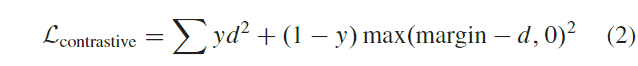
其中$y$表示样本对的标签。 如果两个样本属于同一类，则该对的标签为一。 相反，当两个样本不属于同一类时，样本对的标签为零。$d$表示两个样本之间的距离。在[67]中，这个函数是通过欧氏距离计算的，margin是指类间的最小距离。 对比损失函数缩小同一类样本之间的距离，扩大不同类样本之间的距离，直到大于margin。为了更准确地描述数据之间的区别，一些研究[64]、[65]试图找到一个更复杂的度量函数来代替欧氏距离。 在 [64] 中，Zagoruyko 和 Komodakis 使用对比损失函数的一种变体来训练孪生网络，而两个样本之间的度量是由一个全连接网络测量的。对于对比损失，确定适当的 margin 值也可能存在问题。 与上述方法不同，Han 等人[66]将度量问题转化为二元分类问题，度量模块也被二元分类器取代。 如果样本对的样本属于同一类，则样本对为正。 反之，当样本对的样本属于不同类别时，样本对为负，样本对的概率分布代表其匹配程度。 随着深度学习方法的发展，孪生网络已广泛应用于许多研究领域，包括面部识别[68]、[69]和视觉跟踪[70]、[71]。除了上述领域外，孪生网络也被用于 HSI 分类。 刘等人[72]构建了一个混合模型，集成了 CNN 和 RNN 来处理 HSI。孪生网络通过迁移学习使用源数据集进行训练，使模型在少量样本的情况下也能很好地工作。 然后，在目标数据集上对整体模型进行微调。 由于孪生网络不能直接对 HSI 进行分类，因此在训练孪生网络后通常需要一个分类器。为了将孪生网络和分类器的训练过程统一到一个单一的方案中，Zhao 等人[73] 使用孪生网络的多分类方法从端到端训练网络。在数据预处理过程中，该方法将由$y_m$表示的不匹配类添加到类别中。类别$y_m$表示样本对中属于不同类别的样本。如果两个样本属于同一类$y_i$，则它们的样本对的标签也是$y_i$。在推理中，中心像素及其相邻像素可以生成不同的样本对，最终的分类结果由每个样本对的最大投票获得。Rao 等 [74] 提出了一种带有空间金字塔池的 3-D CNN，它可以调整特征向量长度以减轻波段选择后的信息丢失。同时，为了提高模型的性能，引入了一个归一化项——铰链损失。Huang和Chen[75]采用了双分支架构作为孪生网络的特征模块。度量层也用于计算融合特征的相似度。 苗等 [76] 结合自动编码器和 Siamese 网络进行 HSI 分类。 然而，这项研究在几个关键方面与 [76] 不同。 首先，在[76]中，自动编码器和孪生网络通过对比和重建损失函数一起训练，而自动编码器和孪生网络在本研究中是分开训练的。 由于自动编码器和孪生网络的训练过程是统一的，因此排除了大量未标记数据中的结构信息。另外，在我们的研究中，自动编码器和孪生网络分别应用于利用未标记和标记数据，因此可以大大提高所提出的 3DAES 方法的泛化能力。 其次，我们研究中提出的数据增强策略可以降低预测偏差的风险，更适合标记样本有限的 HSI 分类。 最后，我们的 3DAES 方法引入了一个 3-D CNN 模块来从 HSI 数据中提取联合光谱空间特征，保证了学习特征的可辨别性。

## 本文提出的3DAES方法

### 基于 3-D 自动编码器的无监督特征提取

这里，3-D HSI 立方体表示为${\bf X}\in\mathbb{R}^{H×W×D}$，其中$H$和$W$表示高度和宽度，$D$表示光谱数。同时，$X$中空间位置$(i,j)$的中心像素的3-D相邻区域${\bf X'}\in\mathbb{R}^{H'×W'×D}$被裁剪以形成光谱-空间组合样本。$H'$和$W'$表示局部区域大小。因此，构建的邻近区域数据集为${\cal X}=\{\mathbf{X'}_{i,j}\}$，其中$i=1,...,H$，$j=1,...,W$。自编码器包括一个编码器$f_e({\bf X'})$和一个解码器$f_d(f_e({\bf X'})$模块。通过最小化重构误差，隐藏表示${\bf h}_u=f_e({\bf X'})$可以携带数据中的有用信息。为了同时从 HSI 创建联合光谱空间特征，引入了 3-D 自动编码器方式，如图 2 所示。
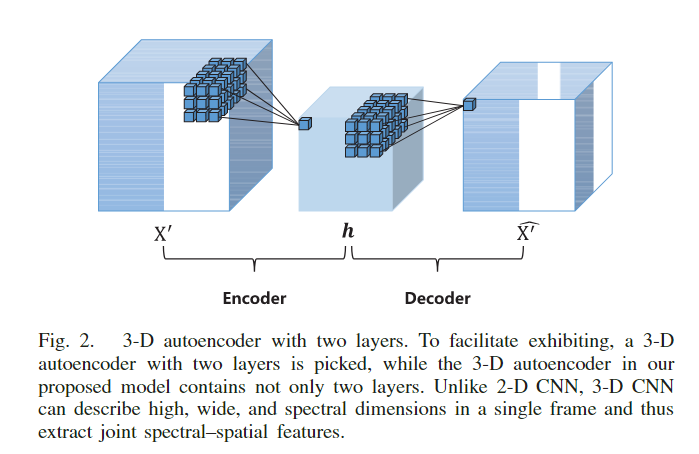
同时，为了避免自映射，考虑了服从标准正态分布的高斯噪声项${\bf X_e}\in\mathbb{R}^{H'×W'×D}$。因此，自编码器的真实输入是${\bf {\bar X}=X'+X_e}$。由于不同的样本表现出不同的噪声，并且每个样本都有不同的噪声，因此在不同的迭代过程中随机生成${\bf X}_e$以准确模拟真实噪声。另一方面，卷积核${\mathbb R}^{h_k×w_k×d_k×c_{in }×c_{out}}$，其中$h_k$ 、$w_k$和$d_k$表示核的高度、宽度和深度，$c_{in}$和$c_{out}$表示输入和输出通道，分别对模型性能有很大影响。如果$K$太大，CNN 可能会忽略对象的细粒度特征并获得较差的性能。 如果$K$太小，CNN 可能会在 3-D 立方体上缓慢滑动并需要更多计算时间。由于空间分辨率低和 HSI 图像块小，我们选择小的卷积核$K$。同时，选择输出特征通道$c_{out}$以尽可能减少超参数的影响。训练后可得到无监督特征${\cal h}_u\in\mathbb R^{h_{out}×w_{out}×d_{out}×c_{out}}$，其中$hout$、$w_{out}$、$d_{out}$分别为最终的高、宽、谱维数，依赖于$h_k$、$w_k$、$d_k$。

### 随机样本对生成

为了后面的描述方便，引入了一些关于训练集的符号。 对于HSI数据，我们假设它有$C$个地物和每个类别$N$个训练样本（值得指出的是，每个类别的训练样本数量设置相等只是为了让后面的讨论更容易理解。一般来说， 尽管各类间的训练样本数量可能不同，但仍可得出以下推导结论）。第$C(c=1,...,C)$类的训练数据用${\cal X}_c=\{x_{c,1},...,x_{c,N}\}$和相应的标签数据${\cal Y}_c=\{y_{c,1},...,y_{c, N}\}$表示。对于每一个${\cal x}_{c,n}\in\mathbb{R}^{H'×W'×D},n=1,...,N$，它对应于中心像素的局部区域。因此，整体训练数据集${\cal A=\{(X_1,Y_1),...,(X_C,Y_C)\}}$。同时，对于任意两个样本${\cal x}_i$和${\cal x}_j$，$i,j=1,...,C×N$，构造样本对$p_{ij}=\{\mathcal{x}_i,\mathcal{x}_j\}$。它的标签标签$(p_{ij})$公式如下：
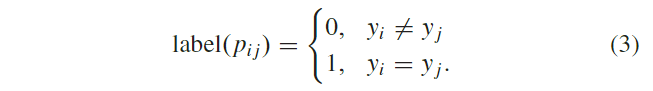
在这种朴素的样本构造方法（3）下，获得样本对的所有可能组合，表示为${\cal P}=\{p_{ij},label(p_{ij})\},i,j=1,...,C×N$。显然，$P$中的元素数可以计算为：
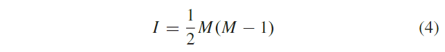
其中$M$是训练集$A$中的样本数。由于有$C$个类，每个类有$N$个样本，因此$I$可以进一步表示为：
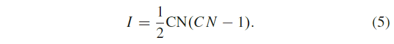
对于正样本对数据集${\cal P}_{pos}$，它只包含$label(p_{ij})=1$的样本对，${\cal P}_{pos}$中的元素数量可以计算为：
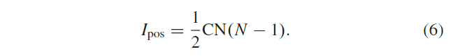
对于$label(p_{ij})=0$的负样本对数据集${\cal P}_{neg}$，对应的元素个数$I_{neg}$可以很容易推导出如下：
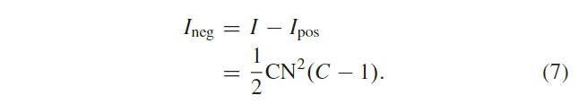
此外，
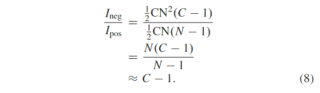
通过上述样本构建，可以清楚地看到$I_{neg}$的规模远大于$I_{pos}$。在训练过程中，如果模型没有约束，所提出的方法可以将样本对高概率地分类为负，从而增加梯度。此外，随着每个类内训练样本数量的增加，$N,I$也会严重扩大，并且大数据集会减慢每个 epoch 的模型训练。 针对上述问题，提出了一种随机样本对生成方法来平衡正负类之间的样本量，从而使得$I_{pos}=I_{neg}$，减少训练时间。如图 3 所示，对于训练集中的任意样本，从同一类和不同类中随机抽取一个样本，分别组成一对正对和一对负对。 这里采用均匀采样策略。因此，对于每次训练迭代，$|I_{pos}|=|I_{neg}|$，$|P|=2|A|$，其中$|·|$是集合中的元素数量。
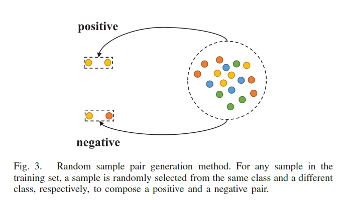

### 基于孪生网络的监督特征提取

孪生网络以样本对$p_{ij}$作为输入，样本${\cal x}_i$和${\cal x}_j$分别处理。 在下文中，我们将详细描述孪生网络在样本上${\cal x}_i$的特征提取过程，随后可以将相同的过程应用到${\cal x}_j$上。在对任何样本${\cal x}_i,i=1,...,C×N$应用 3-D 自动编码器后，得到的无监督特征${\cal h}_u^i=f_e({\cal x}_i)$是一种细化表示，但可能缺乏可分离性。 因此，使用具有有限标记数据集${\cal P}$的精心设计的孪生网络来提高特征可分离性。 在 3-D 编码器$f_e({\cal x}_i)$的后面，串联了一个修正模块$f_r({\cal h}_u^i)$，如图 4 所示。
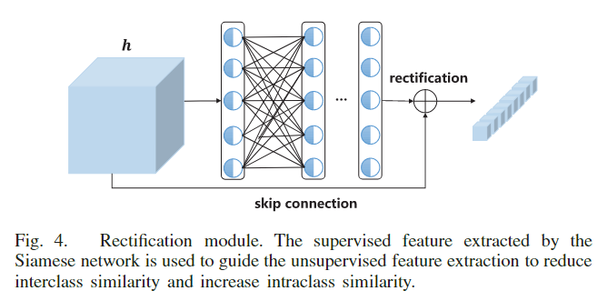
修正模块$f_r({\cal h}_u^i)$的输入${\cal h}_u^i$和输出${\cal h}_s^i$之间也存在跳跃连接，其中：
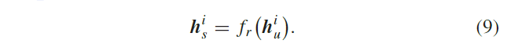
因此，孪生网络的特征模块$f_{\phi}(x_i)$由编码器$f_e(x_i)$、修正模块$f_r({\cal h}_u^i)$和跳跃连接组成。 值得注意的是，$f_e(x_i)$的参数${\bf \Theta}_e$经过无监督训练后是固定的。在这里，我们假设每个类都有一个隐含的中心点，监督特征$h_s^i$可以使样本靠近自己的中心点。 修正模块和跳跃连接之间的特征融合方式可以有不同的类型，在本研究中，我们考虑两种简单的类型：加法和乘法。
此外，特征模块$f_{\phi}(x_i)$的输出由下式表示：
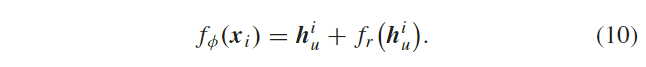
因此，修正模块$f_r({\cal h}_u^i)$成为残差模块，其中$f_r({\cal h}_u^i)=f_{\phi}(x_i)-h_u^i$。残差模块由 He 等人提出[23]，为了避免深度神经网络的退化，而跳跃连接修改了无监督特征$h_u^i$。
对于乘法，特征模块的输出$f_{\phi}(x_i)$表示为：
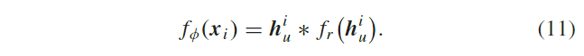
因此，修正模块$f_r({\cal h}_u^i)$成为一个注意力模块，类似于 Hu 等人提出的挤压和激发模块[77]。修正模块$f_r({\cal h}_u^i)$的输出是一个注意力向量，它是特征的一个重要系数，可以放大感兴趣特征的值或压缩无用特征的值。 注意力模块已经广泛应用于许多领域，许多研究证明了它的有效性。
在提取样本对特征之后，使用度量模块来计算它们的相似度。 为了增加模块超参数的鲁棒性，使用二元分类器代替度量模块来预测样本对$p_{ij}$的匹配概率，如图 5 所示。
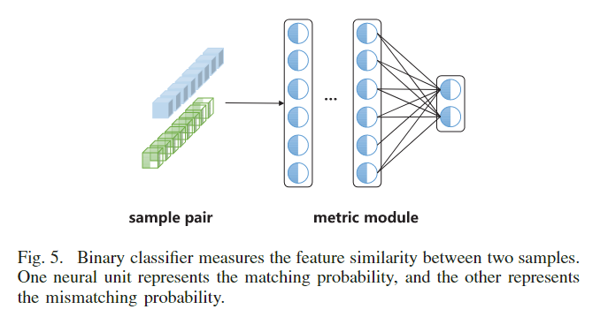
采用交叉熵损失函数来训练孪生网络，其描述如下[78]：
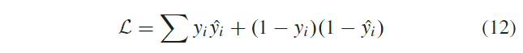
其中$\hat{y_i}$是属于正样本的概率。经过微调后，可以确定最终的整流特征$f_{\phi}(x_i)$，该特征由无监督特征${\cal h}_u^i$组成，由监督特征${\cal h}_s^i$整流。然后，利用逻辑回归分类器对最终的整流特征进行分类。

## 补充

1. 自动编码器(一下简称AE)属于**生成模型**的一种，目前主流的生成模型有AE及其变种和生成对抗网络（GANs）及其变种。随着深度学习的出现，AE可以通过网络层堆叠形成深度自动编码器来实现数据降维。通过编码过程减少隐藏层中的单元数量，可以以分层的方式实现降维，在更深的隐藏层中获得更高级的特征，从而在解码过程中更好的重建数据。自动编码器是通过无监督学习训练的神经网络，实际上是一个将数据的高维特征进行压缩降维编码，再经过相反的解码过程还原原始数据的一种学习方法。学习过程中通过解码得到的最终结果与原数据进行比较，通过修正权重偏置参数降低损失函数，不断提高对原数据的复原能力。自动编码器学习的前半段的编码过程得到的结果即可代表原数据的低维“特征值”。
2. 自动编码器利用未标记数据学习到数据中的非监督特征，孪生网络利用少量标记样本，基于孪生网络结构，对非监督特征进行改正。
3. 3D 自动编码器与孪生网络中的编码器相同，但是固定的是自动编码器的权重，训练的是修正模块的权重，实际上后半部分两个linear层的权重。修正单元是一个类似残差的结构：在encoder后加上两个linear层，然后将linear层的输出和encoder的输出相加或相乘（作者通过实验证明相加效果更好）。
4. 度量模块是三个Linear层，输出为2，然后再用一个交叉熵损失函数（因为只有两个输出所以就是二分类了）来预测概率。
5. 最后将影像块送入训练好的encoder+修正模块得到隐藏特征（hidden feature），将隐藏特征输入逻辑回归分类器得到结果。
