原文：《Hyperspectral Imagery Classification Based on Semi-Supervised Broad Learning System》

## 主要思路

### 深度学习

1. 方法需要复杂的结构调整和大量的网络训练计算。
2. 存在标记样本数量有限的问题。

针对这些问题，Chen和Liu[20]提出了一种新的广义学习系统(BLS)，提供一种可选的学习方法。该方法基于随机向量函数链接神经网络(RVFLNN)。首先，将原始数据通过随机权重映射为映射特征(MF)，并存储在特征节点中。接下来，同样通过随机权重映射MF，得到增强节点(EN)进行广泛展开。最后，用岭回归逼近法求解$L2$范数的归一化优化，得到最终网络权值。与DL相比，BLS具有以下优势:(1)BLS仅由三个部分组成，而深度学习需要由多个非线性单元叠加的深层结构。因此，BLS的结构更简单。(2) BLS采用岭回归法求解网络权值，DL采用梯度下降法求解。当权重没有很好地初始化时，DL需要更多的迭代。因此，BLS的训练过程更简单、更快。(3) BLS中从输入数据到MF和从MF到EN的连接权值随机生成，可训练参数仅包括从MF和EN到输出节点的连接权值。因此，与DL相比，BLS一般需要较少的网络参数训练，因此标记训练样本较少。

### 基于图的SSL方法

1. 算法性能受所构造图的影响较大。
2. 相邻参数具有较高的灵敏度。

考虑数据类结构，Shao, et al.[28]提出了一个类概率(CP)结构，它可以通过类概率矩阵来表示每个样本与每个类之间的关系。本文采用此方法。

## 本文方法

提出了一种基于半监督BLS(半监督BLS)的HSI分类方法。

1. 这是第一次尝试将BLS应用于HSI分类任务。所提出的SBLS可以获得更高的HSI分类精度和更快的训练速度。
2. 在扩展半监督BLS中引入类概率结构，既能利用有限数量的标记样本，又能利用大量的未标记样本。

<!--more-->

## 基于SBLS的HSI分类

基于SBLS的HSI分类流程图如图1所示，包括三个步骤：(1)对原始HSI数据进行分层制导滤波(HGF)处理，得到HSI的光谱-空间表示；(2)通过CP结构得到未标记样本的伪标签；(3)通过标记样本和相应的标签，以及未标记样本和相应的伪标签来训练SBLS。
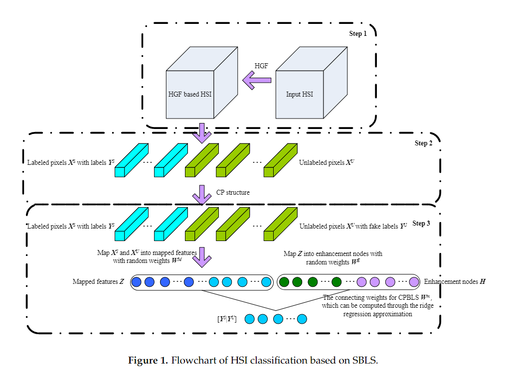

### 分层制导滤波

SBLS的第一步是得到HSI的HGF表示，如图1中的步骤1所示。原始高光谱图像以3D张量的形式表示。如果用张量来表示向量化，不仅数据维度大大增加，而且固有的数据结构也会被破坏。潘等人[29]提出了一种基于HGF的HSI数据的光谱空间表达方法。作为一种边缘保持滤波方法，HGF能够在保持图像整体结构的同时去除噪声和小细节，从而将原始HSI数据映射到具有更丰富特征表达的特征子空间。利用HGF的优越性，对原始HSI进行处理，得到HSI的光谱-空间表达。
作为制导滤波和滚动制导滤波的扩展，HGF可以生成一系列的联合光谱-空间特征。HGF最小化以下能量函数：
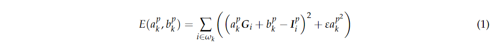
其中，$a_k^p$和$b_k^p$是基于输入HSI数$\widetilde{I}$和引导图像$G$的线性系数，$\omega_k$是大小为$(2r+1)×(2r+1)$的像素$k$周围的窗口，$r$是窗口半径，$i$是$\omega_k$中的像素之一，$p$表示第$p$频带，$ε$是控制参数。更大的$ε$将带来更平稳的产出。方程(1)是岭回归，可以通过以下方法求解：
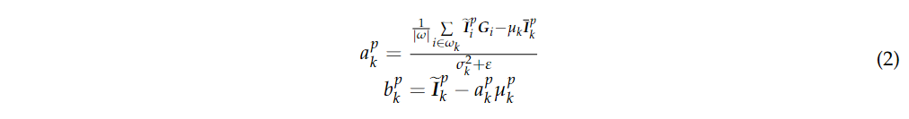
其中$\mu_k$和$\sigma_k$分别是$G$的平均值和标准方差；$\overline{I}_k^k$是$\widetilde{I}$在$\omega_k$中的平均值；$|\omega|$是$\omega_k$中的像素数。更多细节可以在[29]中找到。HGF是一种预处理技巧，在[19，29]中也使用了类似的策略。

### 类别概率结构

SBLS的第二步是通过CP结构得到未标记样本的伪标签，如图1中的步骤2所示。通过HGF表达式$X^S={x_1,...,x_n}\in R^{n^s×m}$给出已标记样本及其对应的标签$Y^S={y_1,...,y_{n_s}}\in R^{n^s×c}$，其中$n^s$是已标记样本的个数，$m$是维度数，$c$是类数，$y_{ij}$是二进制数，如果第$i$个样本属于第$j$类，则$y_{ij}=1$，否则$y_{ij}=0$。给定未标记样本$X^U={x_1,...,x_n}\in R^{n^U×m}$，其中$n^U$表示未标记样本的数量，则样本总数为$n=n^S+n^U$。因此，标记的$X^S$和未标记的样本$X^U$之间的相似度可以由以下表达式来表示：
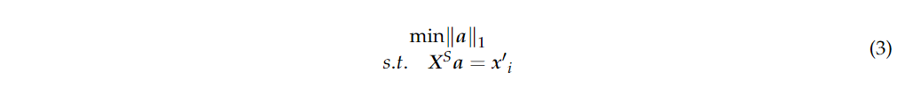
其中$a$是稀疏系数。方程(3)可以用具有自适应惩罚的乘法器(ADMAP)的交替方向方法来求解。更多细节可以参考[28]。$x_i$的类概率向量写成：
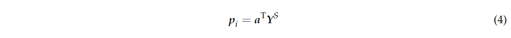
其中，$p_i=(p_{i1}，p_{i2},...,p_{ic})\in R^{1×c}$，$p_{ic}$表示第$i$个样本属于第$c$个类别的概率。对于未标记的样本，通过标签传播得到类概率矩阵$p^U\in R^{U×c}$。对于标记样本，定义类概率矩阵$p^S\in R^{S×c}$。因此，第$i$和第$j$个样本属于同一类的概率写为:
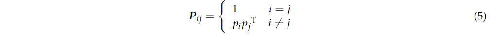
进一步，$P$可以表示为:

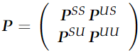
其中$P^{SS}$表示标记样本具有相同类别的概率，$P^{UU}$表示未标记样本具有相同类别的概率。$P^{US}$和$P^{SU}$分别表示未标记样本和标记样本具有相同类别的概率。通过在$P^{US}$中求每一行的最大概率指数，可以得到与每个未标记样本最相似的标记样本，以及未标记样本的伪标签$Y^U$。计算原理如下:
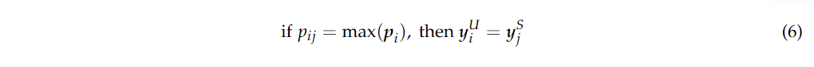

### SBLS

SBLS的第三步是训练SBLS模型，得到未标记样本的预测标签，如图1中的步骤3所示。基于RVFLNN提出的BLS包括三个部分：映射特征(由输入映射而来)、增强节点(由映射特征映射而来)和输出标签(由映射特征与增强节点联合映射而成)。学习参数为$W^m$，通过岭回归可以快速、近似地得到该参数。然而，BLS模型属于有监督方法，不能利用HSI中大量常见的未标记样本。因此，为了更好地将BLS应用于HSI分类，有必要对半监督BLS进行研究。本文将CP引入到BLS中，提出了SBLS来实现HSI的半监督分类。
HSI样本$X=[X^S;X^U]\in R^{n×m}$一般由HGF表示，以及由类概率结构得到的标签$Y^S$和$Y^U$。对于SBLS，首先通过随机权值$W^M=[W_1^M,...,W_{G^M}^M]$，偏置$\beta M=[\beta_1^M,...,\beta_{G^M}^M]$将输入映射到”映射特征“，即：
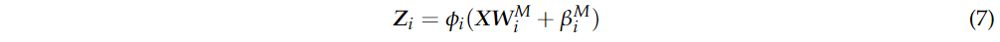
其中$G^M$是$MF$的组数。$\phi_i(·)$是一个非线性函数，对于不同的$MF$组可以选择不同的函数。为了简单起见，在所有$MF$中使用线性映射，即$Z_i=XW_i^M+\beta_i^M$。为了获得更好的特征，通常采用线性稀疏自动编码器对$W^M$进行微调。
在得到$MF$, $Z=[Z_1,Z_2,...,Z_{G^M}]$后，将$MF$的特征映射到具有随机权重$W^E$和偏置$\beta^E$的$EN$上，就可以实现SBLS的扩展。
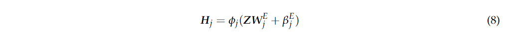
其中$G^E$为$ENs$的个数。进一步，SBLS模型表示为:
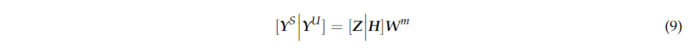
其中$W^m$是从$MF$和$EN$到输出节点的连接权重。它可以解决以下问题：
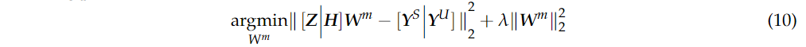

其中$\lambda$表示对$W^m$的和的进一步约束。方程(8)的解可以用岭回归求解：
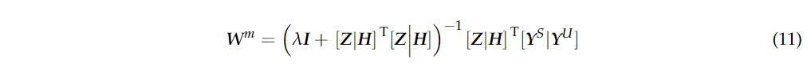
当$\lambda=0$时，式(8)退化为最小二乘问题。另一方面，如果$\lambda→∞$，则解受到严重约束并趋于0。因此，我们在这里设置$\lambda→0$，例如$2^{−30}$。通过对$[Z|H]$的Moore-Penrose广义逆进行近似，式(8)可以写成：
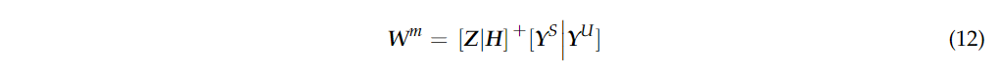
具体来说，我们有：
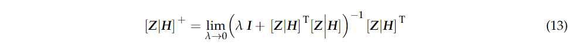
最后，预测标签可以通过以下方法获得：
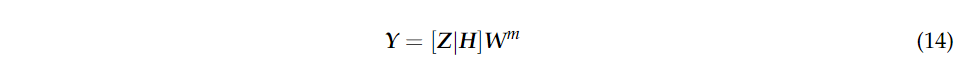
综上所述，基于SBLS的HSI分类算法步骤如表1所示。
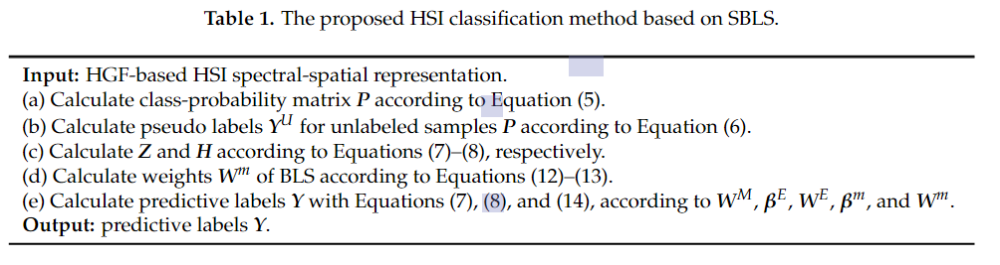
**输入：**基于HGF的HSI光谱-空间表示。
1. 根据公式(5)计算类别概率矩阵$P$。
2. 根据公式(6)计算未标记样本$P$的伪标签$Y^U$。
3. 分别根据公式(7)-(8)计算$Z$和$H$。
4. 根据公式(12)-(13)计算BLS的权重$W^m$。
5. 根据$W^m$、$\beta^E$、$W^E$、$\beta^m$和$W^m$，用公式(7)、(8)和(14)计算预测标签$Y$。
**输出：**预测标签$Y$。
