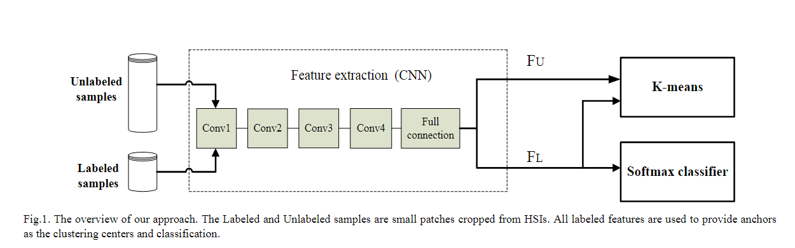
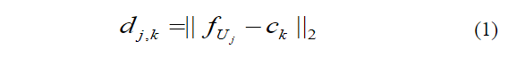
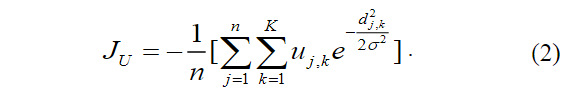
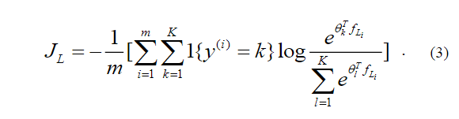
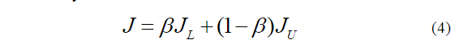
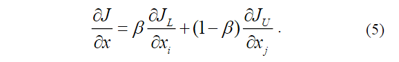
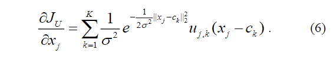
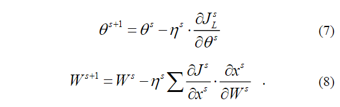
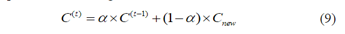

原文：《Semi-Supervised Learning via Convolutional Neural Network for Hyperspectral Image Classification》

## 摘要

为了利用高光谱图像 (HSI) 中的未标记数据，提出了一种基于卷积神经网络 (CNN) 的简单但有效的半监督学习方法用于 HSI 分类。 首先，我们通过将未标记数据的聚类损失函数与标记数据的 softmax 损失函数相结合来定义损失函数。 在这里，从 CNN 中提取的标记特征不仅用于训练分类器，还提供锚点以通过 K-means 方法初始化一组聚类中心。 然后，使用所有数据联合训练深度网络进行 HSI 分类。 实验结果表明，我们的方法可以取得与传统的基于 CNN 的监督学习方法相比的结果。 同时，我们的方法网络结构简单，易于训练。

## 本文方法

在本文中，提出了一种通过 CNN 进行 HSI 分类的简单但有效的半监督学习方法。 不同于传统的半监督深度网络方法先使用未标记数据预训练网络，然后采用标记数据微调网络，我们的方法同时使用标记样本和未标记样本训练深度网络。
本文的主要贡献可归纳如下：

1. 我们开发了一个损失函数，其中包括分别针对未标记和标记样本的聚类损失项和 softmax 损失项，聚类损失项有助于提供类判别函数。
2. 我们采用从标记样本中提取的一些有限特征作为锚来初始化聚类中心，并使用所有样本优化这个深度网络。 因此，我们的方法可以有效地提取强大的特征，并利用有限的标记样本对高光谱图像进行分类。

## 提出的方法

### 网络结构

我们方法的网络结构如图1所示，网络输入包括标记和未标记样本，这些样本是从大小为$N×N×B$的HSI中裁剪而来的，其中$B$是光谱带的数目，本文将$N$设为9。在卷积过程中，我们可以使用大小为$3×3×T$的核作为卷积核，其中$T$是来自最后一层的输出特征地图的数量。设计的CNN结构包括4个卷积层和一个全连通层，每个卷积层后面都有一个整流线性单元 (ReLU) 层作为激活函数。CNN的输出相应地包含已标记和未标记的特征向量。分类步骤采用Softmax分类器，使用K-means完成半监督聚类过程。

<!--more-->

### 半监督学习

假设全连接层后的输出特征向量表示为$F=F_L+F_U$，此处$F_L=\{f_{L_1},f_{L_2},...,f_{L_m}\}$和$F_U=\{f_{U_1},f_{U_2},...,f_{U_n}\}$分别表示CNN提取的已标记特征向量和未标记特征向量，$m$和$n$分别是标记样本和未标记样本的数量。首先，$F_L$用作锚点通过平均每个类的$F_L$来确定初始中心$C=\{c_1,c_2,...,c_k\}$。然后，我们可以测量$F_U$中的每个向量$f_{U_j}$与所有聚类中心$C$之间的距离，如下所示：

其中，$d_{j,k}$表示第$j$个未标记特征向量$f_{U_j}$与第$k$个聚类中心的距离。一般而言，$f_{U_j}$属于第$k$类时，有着最小的距离$d_{j,k}$。因此，未标记样本的聚类损失函数定义如下：

此处，$u_{j,k}$是一个二进制参数，当$f_{U_j}$接近类别$k$时等于1，否则为0，$\sigma=s/\sqrt{2K}$，其中$s=(\sum_{k=1}^K \left \| c_k-\bar{c} \right \|_2)/K$。因此，随着类间距离的增大，σ也随之增大。显然，当所有未标记的样本都被精确分类时，$J_U$达到最小值，因为所有未标记的样本都靠近它们的中心。
同时，利用CNN从标记数据中提取的特征向量$F_L$进行分类。采用 softmax 分类器解决多分类问题，并通过 softmax 定义监督损失函数如下：

这里的$1\{·\}$是指示函数，因此1{真命题} = 1，1{假命题} = 0。$y^{(i)}$是 softmax 分类器得到的预测标签。
最后将两个损失函数组合如下：

其中$\beta\in(0,1)$是一个正则化参数，用来控制两个损失函数的影响。显然，当$\beta=1$时，所提出的方法就变成了传统的带有softmax分类器的CNN方法，当$\beta$等于0时就变成了聚类问题。我们最小化总损失函数$J$来训练我们的网络。 在测试过程中，只采用softmax分类器进行分类。

### 网络优化

本文使用小批量随机梯度下降法通过计算损失函数对$x\in F$的偏导数来优化我们网络的参数，并用于更新网络。计算公式如下：

这里$i\in\{1,2,...m\}$，$j\in\{m+1,m+2,...m+n\}$和$\partial{J_L}/\partial{x_i}$表示 softmax 损失函数的传统反向传播误差。
损失函数$J_U$对$x$的偏导数公式如下：

softmaxloss中参数$\theta$和卷积层初始化参数$W$的更新过程如下所示：

这里$\eta$代表网络的学习率，$s$代表迭代次数。

### 更新聚类中心

网络优化过程中需要更新聚类中心。 首先，所有未标记的特征向量$F_U$将通过公式（1）所示的距离测量得到自己的标签。 然后通过对具有相同标签的特征向量进行平均来获得新的中心值$C_{new}$。为了避免未标记数据中可能存在噪声对聚类中心产生较大扰动，使用$C_{new}$更新聚类中心如下：

其中$C^{(0)}$表示初始聚类中心，$t$提供第$t$次迭代，$\alpha\in(0,1)$是更新参数。 在本文中，$\alpha\in(0,1)$设置为 0.8。