原文：《Classification of Hyperspectral Image Based on Double-Branch Dual-Attention Mechanism Network》

##  摘要

近年来，研究人员越来越关注使用深度学习方法进行高光谱图像 (HSI) 分类。 为了提高准确性并减少训练样本，我们在本文中提出了一种用于 HSI 分类的双分支双注意力机制网络 (DBDA)。 DBDA 中设计了两个分支来捕获 HSI 中包含的大量光谱和空间特征。 此外，通道注意力块和空间注意力块分别应用于这两个分支，这使得 DBDA 能够细化和优化提取的特征图。 在四个高光谱数据集上进行的一系列实验表明，所提出的框架具有优于最先进算法的性能，尤其是在训练样本明显缺乏的情况下。

## 主要贡献

在本文中，受最先进的 DBMA 算法和自适应自注意机制双重注意网络（DANet）[44] 的启发，我们设计了用于 HSI 分类的双分支双重注意机制网络（DBDA） 。所提出的框架包含两个分支，分别称为光谱分支和空间分支，分别捕获光谱和空间特征。 采用通道注意机制和空间注意机制来细化特征图。 通过连接两个分支的输出，我们获得了融合的光谱空间特征。 最后，使用 softmax 函数确定分类结果。 本文的三个重要贡献可列举如下：

1. 基于 DenseNet 和 3D-CNN，我们提出了一个端到端框架双分支双注意力机制网络 (DBDA)。 所提出框架的光谱分支和空间分支可以分别利用特征而无需任何特征工程。
2. 在光谱和空间维度上引入了一种灵活且自适应的自注意力机制。通道注意块主要关注信息丰富的光谱波段，空间注意块主要关注信息丰富的像素点。
3. DBDA 在训练数据有限的四个数据集中获得了最先进的分类精度。 此外，我们提出的网络的时间消耗少于两个比较的深度学习算法。

## 注意力机制

3D-CNN 的一个缺点是所有空间像素和光谱带在空间和光谱域中具有等效的权重。 显然，不同的光谱波段和空间像素对提取特征的贡献不同。 注意力机制是处理这个问题的强大技术。 受人类视觉感知过程 [46] 的启发，注意力机制旨在更多地关注信息区域，而较少考虑非必要区域。 注意机制已被用于图像分类[47]，后来被证明在其他领域表现出色，包括图像描述[48]、文本到图像合成[49]和场景分割[44]等。在DANet[44]中 ，可以采用通道注意块和空间注意块来增加引人注目的通道和像素的权重。 下面将对这两个块进行详细介绍。

### 光谱注意块

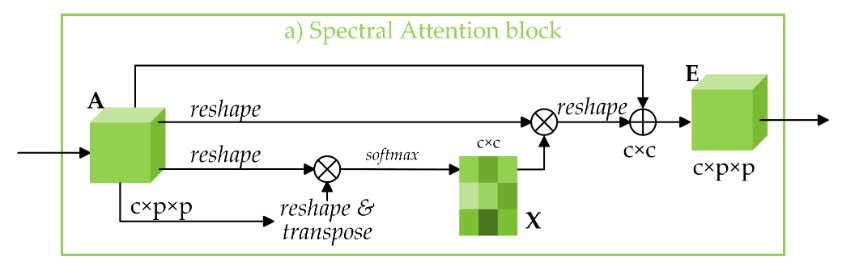
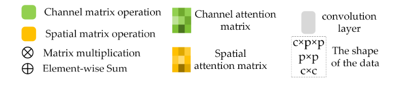
如图 4a 所示，通道注意力图$X\in\mathbb{R}^{c×c}$直接从初始输入$A\in\mathbb{R}^{c×p×p}$计算，其中$p\times p$是输入的patch大小，$c$表示输入通道数。 具体来说，$A$和$A^\mathbf{T}$之间进行矩阵乘法运算，得到通道注意力图$X\in\mathbb{R}^{c×c}$，连接一个softmax层为：
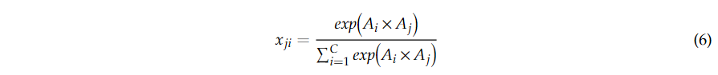
其中$x_{ji}$表示第$i$个通道对第$j$个通道的影响。 然后，将$X^\mathbf{T}$和$A$的矩阵乘法结果重塑为$\mathbb{R}^{c×p×p}$。最后，重塑后的结果通过尺度参数$\alpha$进行加权，并添加输入$A$以获得最终的光谱注意力图$E\in\mathbb{R}^{c×p×p}$：
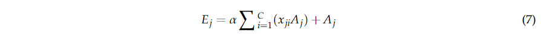
其中$\alpha$被初始化为零并且可以逐渐学习。 最终的图$E$包含所有通道特征的加权和，它可以描述远程依赖关系并提高特征的可判别性。

<!--more-->

### 空间注意块

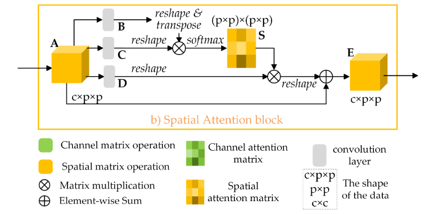
如图 4b 所示，给定输入特征图$A\in\mathbb{R}^{c×p×p}$，采用两个卷积层分别生成新的特征图$B$和$C$，其中$\{B,C\}\in\mathbb{R}^{c×p×p}$。接下来，$B$和$C$重塑为 $\mathbb{R}^{c×n}$，其中$n=p×p$是像素数。 然后在$B$和$C$之间执行矩阵乘法，随后附加一个 softmax 层来计算空间注意力特征映射$S\in\mathbb{R}^{n×n}$：
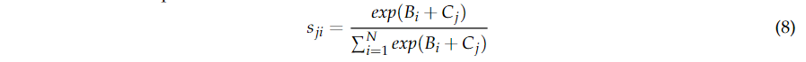
其中$s_{ji}$测量第$i$个像素对第$j$个像素的影响。 两个像素的特征表示越接近，表示它们之间的相关性越强。
初始输入特征$A$被同时送入卷积层得到新的特征图$D\in\mathbb{R}^{c×p×p}$，随后被重塑为$\mathbb{R}^{c×n}$。 然后在$D$和$S^\mathbf{T}$之间执行矩阵乘法，并将结果重塑为$\mathbb{R}^{c×p×p}$为：
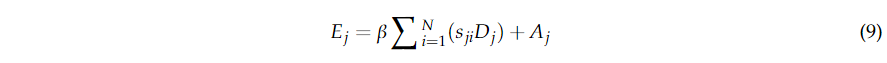
其中初始值为零的$\beta$可以逐渐学习分配更多的权重。由式(9)可知，对所有位置和原始特征进行一定的权重相加，得到最终的特征$E\in\mathbb{R}^{c×p×p}$。因此，空间维度上的远程上下文信息建模为$E$。

## 本文方法

DBDA 框架的过程包含三个步骤：数据集生成、训练和验证以及预测。 图 5 说明了我们方法的整个框架。
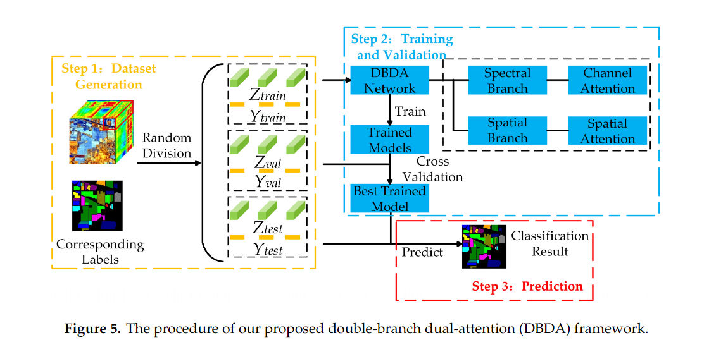
一个 HSI 数据集$X$应该由$N$个标记的像素$\{x_1,x_2,...,x_n\}\in\mathbb{R}^{1×1×b}$，其中$b$表示波段，对应的类别标签集为$\mathcal{Y}=\{y_1,y_2,...,y_n\}\in\mathbb{R}^{1×1×c}$，其中$c$表示土地覆盖类别的数量。
在数据集生成步骤中，从原始数据中选择中心像素$x_i$的$p×p$个相邻像素以生成 3D 立方体集$\{z_1,z_2,...,z_n\}\in\mathbb{R}^{p×p×b}$。如果目标像素位于图像的边缘，则缺失的相邻像素的值设置为零。$p$，即 patch 大小，在我们的框架中设置为9。 然后，将 3D 立方体集随机分为训练集$Z_{train}$、验证集$Z_{val}$和测试集$Z_{test}$。 据此，将它们对应的标签向量分为$Y_{train}$、$Y_{val}$、$Y_{test}$。 当然，相邻像素的标签对网络不可见，我们仅使用目标像素周围的空间信息。
在训练和验证步骤中，训练集用于多次更新参数，而验证集用于监控模型的性能并选择训练最好的模型。
在预测步骤中，选择测试集来验证训练模型的有效性。
HSI分类常用的衡量预测结果与真实值差异的量化指标是交叉熵损失函数，定义为：
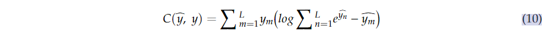
其中$\hat{y}=[\hat{y_1},\hat{y_2},...,\hat{y_L}]$表示模型预测的标签向量，$y=[y_1,y_2,...,y_L]$表示地物真实标签向量。

### DBDA 网络的框架

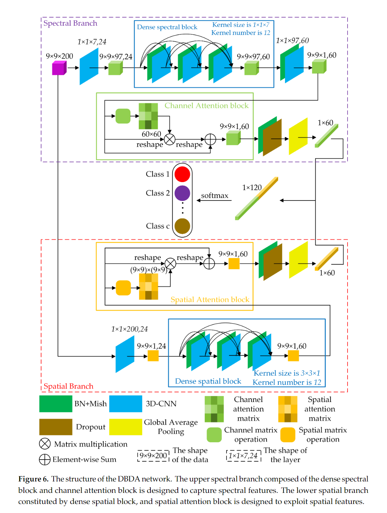
DBDA 网络的整体结构如图 6 所示。为方便起见，我们将顶部分支称为光谱分支，将底部分支命名为空间分支。输入分别送入光谱分支和空间分支，得到光谱特征图和空间特征图。 然后采用光谱和空间特征图之间的融合操作得到分类结果。
以下部分以Indian Pines (IP)数据集为例，介绍光谱分支、空间分支和光谱空间融合操作；patch大小指定为$9×9×200$。为了便于理解下面提到的矩阵，例如$(9×9×97,24)$，$9×9×97$表示3D立方体的高度，宽度和深度，$24$表示 3D-CNN 生成的 3D 立方体的数量。
IP数据集包含$145×145$个像素，$200$个光谱带，即 IP 的大小为$145×145×200$。 IP 的详细信息见表3。只有$10249$个像素有对应的标签，其他像素为背景。

#### 具有通道注意块的频谱分支

首先，使用$1×1×7$内核大小的 3D-CNN 层。下采样步幅设置为$(1, 1, 2)$，这样可以减少波段数。 然后，捕获形状为$(9 × 9 × 97, 24)$的特征图。 之后，附上3D-CNN与BN结合的密集光谱块。密集光谱块的每个 3D-CNN 都有 12 个通道，内核大小为$1×1×7$。附加密集光谱块后，由式（5）计算特征图的通道增加到 60。因此，我们获得了大小为$(9×9×97,60)$的特征图。接下来，在最后一个内核大小为$1 × 1 × 97$的 3D-CNN 之后，生成一个 (9 × 9 × 1, 60) 的特征图。 然而，这 60 个通道对分类做出了不同的贡献。 为了细化光谱特征，采用了图 4a 中所示并在第 2.4.1 节中解释的通道注意块。 通道注意块加强了信息通道并削弱了信息缺乏通道。 通过通道注意力获得加权光谱特征图后，应用 BN 层和 dropout 层来增强数值稳定性并消除过度拟合。 最后，通过全局平均池化层，得到形状为$1×60$的特征图。 表 1 中提供了频谱分支的实现。
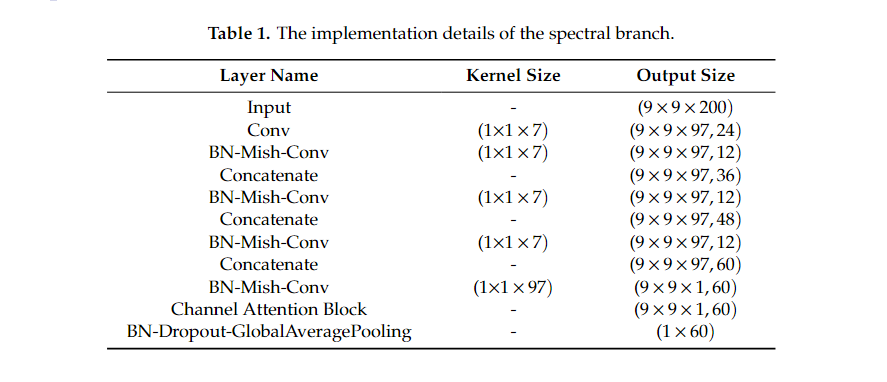

#### 具有空间注意块的空间分支

同时，将$9×9×200$形状的输入数据传递到空间分支，初始 3D-CNN 层的大小设置为$1×1×200$，可以将光谱带压缩为一维。 之后得到形状为$(9×9×1,24)$的特征图。 然后，附加由 3D-CNN 与 BN 组合的密集空间块。密集光谱块中的每个 3D-CNN 都有 12 个通道，内核大小为$3×3×1$。接下来，提取的形状为$(9×9×1,60)$的特征图被送入空间注意块，如图 4b 所示，并在第 2.4.2 节中进行了阐述。使用注意力块，对每个像素的系数进行加权以获得更具辨别力的空间特征。
在捕获加权空间特征图后，应用带有 dropout 层的 BN 层。最后，通过全局平均池化层获得 1×60 形状的空间特征图。表 2 给出了空间分支的实现。
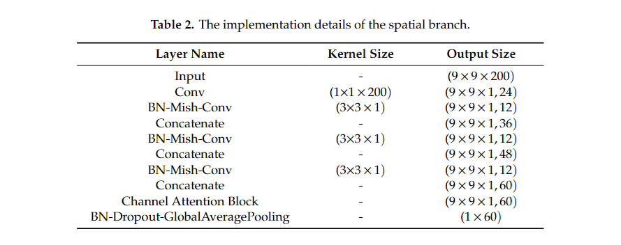

#### HSI 分类的光谱和空间融合

利用光谱分支和空间分支，得到多个光谱特征图和空间特征图。然后，我们在两个特征之间进行连接以进行分类。之所以应用级联运算而不是加法运算，是因为光谱和空间特征处于不相关的域中，级联运算可以保持他们的独立性，而加法运算会将它们混合在一起。最后通过全连接层和softmax激活函数得到分类结果。
对于其他数据集，网络实现是相同的，唯一的区别是光谱波段的数量。DBDA的整个方法流程图如图7所示。
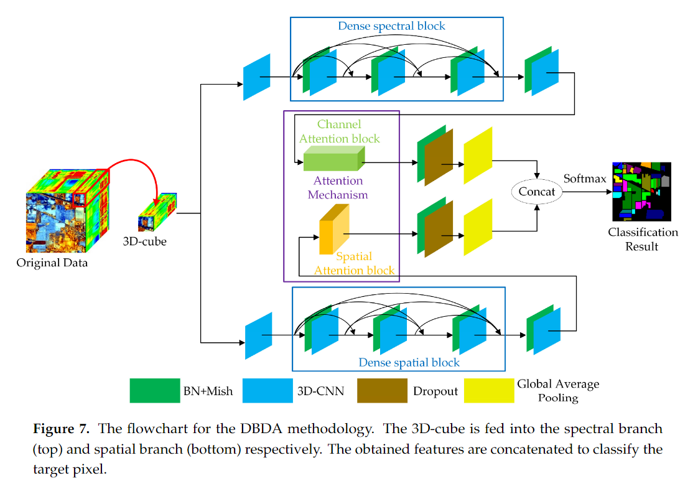

### 防止过拟合的措施

大量的训练参数和有限的训练样本导致网络容易出现过拟合。因此，我们采取了一些措施来防止过拟合。

#### 一个强大而适当的激活函数

激活函数将非线性的概念引入神经网络。合适的激活函数可以加快网络反向传播和收敛的速度。我们采用的激活函数是自正则化非单调激活函数Mish[50]，而不是传统的ReLU(x) = max(0, x)[51]。Mish的公式是：
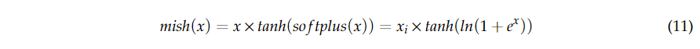
其中$x$表示激活的输入。Mish 和 ReLU 的对比见图 8。Mish 上无界，下界为$[\approx −0.31, \infty)$。Mish 的微分系数定义为：
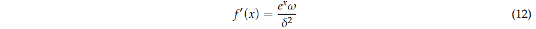

其中$\omega=4(x+1)+4e^x+e^{3x}+e^x(4x+6)$，$\delta=2e^x+e^2x+2$。
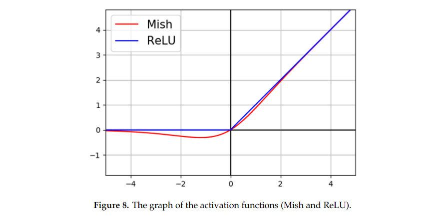
ReLU 是一个分段线性函数，可以剔除所有负输入。因此，如果输入是非正的，那么神经元将”死亡“并且不能再被激活，即使负输入可能包含有用的信息。相反，Mish 将负输入保留为负输出，从而更好地交换输入信息和网络稀疏性。

#### Dropout层，早停策略和动态学习率调整

在最后一个 BN 层和空间分支和光谱分支中的全局平均池化层之间分别采用了 dropout 层 [52]。Dropout 是一种简单但有效的方法，通过在训练阶段丢弃给定百分比$p$上的单元（隐藏或可见）来防止过度拟合。在我们的框架中$p$选择为0.5。Dropout 的存在使得其他单元的存在变得不可靠，从而阻止了单元之间的共同适应。
此外，我们的模型还引入了两种训练技巧，早期停止策略和动态学习率调整方法。早停表示如果损失函数在一定数量的 epoch 后不再减少（在我们的模型中为 20），那么我们将提前停止训练过程以防止过度拟合并减少训练时间。
学习率是训练网络的关键超参数，动态学习率可以帮助网络避免一些局部极小值。采用余弦退火[53]方法动态调整学习率如下式：
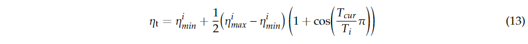
其中$\eta_t$是第$i$次运行中的学习率，$[\eta_{min}^i,\eta_{max}^i]$是学习率的范围。$T_{cur}$表示已经执行的 epoch 的计数，而$T_i$控制将在一个调整周期中执行的 epoch 的计数。
