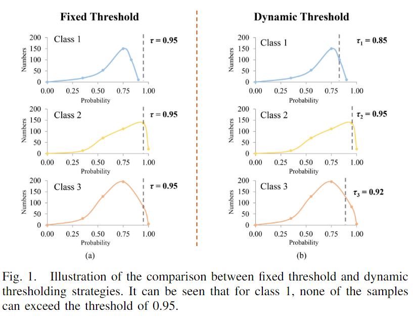
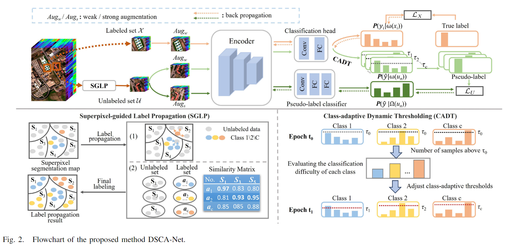
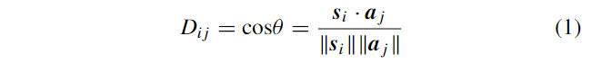
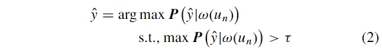
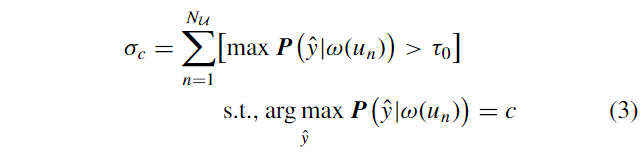
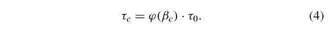
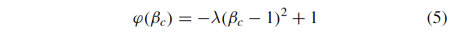
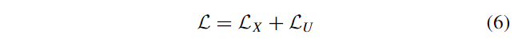
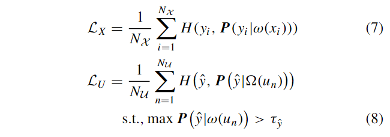

原文：《Dual-Stream Class-Adaptive Network for Semi-Supervised Hyperspectral Image Classification》

## 摘要

半监督遥感高光谱图像（HSI）分类旨在利用有标签和无标签样本进行准确的土地覆盖识别。然而，数据分布不平衡和不同的分类难度会对分类性能产生负面影响。针对这个问题，本文提出了一种用于半监督HSI分类的新型双流类自适应网络（DSCA-Net）。首先，引入了一个超像素引导有标签传播（superpixel-guided label propagation, SGLP）模块来减轻数据分布不平衡的负面影响。具体来说，通过超像素级别的相似性度量和有标签传播来实现对无标签样本有标签的近似估计，从而对每个类别应用相同的采样。然后，构建了一个基于一致性正则化的双流网络，该网络共享相同的编码器来表示有标签或无标签样本的特征。在此基础上，设计了两个不同的分类器来强制对同一无标签样本的不同增强版本进行类似的预测，从而允许无标签样本以监督方式训练模型。最后，由于不同的类别总是有着不同的学习难度，相同的处理方式可能会导致“易”类过拟合和“难”类预测偏差。与传统使用固定阈值选择无标签样本不同，本文根据模型的学习状态计算动态的类自适应阈值。通过这种方式，为“易”类分配更高的阈值以减少样本冗余，并为“难”类设置更低的阈值以选择更多样本。实验结果证明了所提出方法的有效性和优越性。代码可在https://github.com/luting-hnu/DSCA-Net上获得。

## 主要思路

当训练样本不足时，监督学习的性能会受到负面影响。为了减少对有标签样本的依赖，一些深度学习方法开始探索在高光谱图像 (HSI) 分类任务中使用半监督学习（SSL）策略 [23, 24, 25, 26]。具体来说，SSL 方法通过同时利用有标签和无标签样本，来提升性能 [27]。SSL 方法可以大致分为三大类：基于生成式模型、基于图论方法和自训练方法。其中，生成式模型旨在通过自编码器（AE）模型获取无标签样本的上下文信息。例如，Zhou 等人 [28] 分别使用两个堆叠的自编码器对 HSI 的光谱和空间特征进行预训练，然后使用 SSL 共训练的方式扩大了初始训练集。Jia 等人 [29] 分别集成了一个自编码器模块和一个孪生网络，用于挖掘大量无标签数据中的信息，然后利用有限的有标签样本集进行微调。基于图的方法通过捕获有标签和无标签样本共同揭示的内在结构来实现分类目标。Kotzagiannidis 和 Schönlieb [30] 提出了一种用于高光谱图像分类的多级边缘高效 SSL 图形网络，该网络通过在图构建中嵌入伪标签特征来利用有标签样本。Xi 等人 [31] 提出了一种新的跨尺度图原型层，以增强半监督高光谱图像分类的节点特征和原型的判别力和代表性。自训练方法则需要迭代更新高可信度的无标签样本（即伪标签），并与少量有标签样本结合来训练分类器 [32]。Feng 等人 [33] 提出了一种半监督长尾学习方法，该方法基于空间邻域信息确定无标签样本的有标签，并使用新的标准重新确定它们以提高伪标签的准确性。然而，生成式模型需要适当的约束来生成高度可信的伪标签样本，这在实践中很难满足。基于图的方法可以很好地构建有标签和无标签样本之间的连接用于有标签传播，但这通常需要大量计算。相比之下，自训练方法由于其简单原理和良好的性能而被广泛研究。
基于以上分析，我们本文尝试设计一种基于 CNN 模型和自训练方法的新型半监督深度学习方法。**本文旨在解决两个主要问题，即数据分布不平衡和不同类别学习难度差异。**在自训练方法中，需要随机选择一部分数据作为无标签样本集（ULS）。然而，由于数据分布总是存在不平衡性 [34]，数量较少的类别可能不会被选中，从而导致分类的偏差估计。此外，自训练格式为了选择高可信度的伪标签样本，需要设置一个较高的阈值，通常会设置为 0.95 等高值 [35]。然而，事实上，不同类别应该具有不同的学习难度 [36]。如下图 1(a) 所示，对所有伪标签样本设置相同的阈值，会导致对于学习难度高的类别，只有少量样本甚至没有样本能够超过如此高的阈值。相比之下，正如示意图 1(b) 所示，不同的类别需要具有动态的类适应型阈值。

针对数据分布不平衡和不同类别学习难度带来的负面影响，我们提出了一种用于半监督高光谱图像分类的新型双流类适应型网络（DSCA-Net）。首先，为了缓解数据分布不平衡的问题，我们提出了一种**超像素引导有标签传播 (SGLP) 模块**，该模块通过基于超像素的相似性测量和标签传播来传播已知标签，为后续训练提供类别平衡的无标签训练集。在过去的遥感图像分类研究中，基于超像素的技术被证明是非常有用的。例如，Zhao 等人 [37] 提出了一种超像素引导的可变形卷积方法，可以根据高光谱图像的空间结构自适应地提取特征。Jia 等人 [38] 则提出了一种无需任何参数调优的超像素级加权标签传播方法。之前的方法旨在在超像素层面实现连续迭代的特征学习或标签更新，但这需要大量的计算。与这些工作不同，我们提出的模块在网络训练之前只进行一次余弦相似度测量和标签传播，因此计算量较低。然后，通过一致性正则化，我们设计了两个不同的分类器，以强制对同一无标签样本的不同增强版本做出相似的预测，从而使无标签样本能够以监督方式训练模型。最重要的是，传统固定阈值方法（即为每个类别设置相同的阈值）存在不足之处 [39]。为此，我们提出了一种类别自适应动态阈值（CADT）策略。该策略根据模型的学习状态计算难度估计，并由此获得每个类别的对应阈值。此外，我们设计了一个非线性映射函数，将难度估计值映射到每个类别的最终自适应阈值。综上所述，我们方法的主要贡献如下：

1. 我们提出了一种用于高光谱图像分类的新型双流半监督深度学习网络。具体来说，该网络中的两个流共享相同的编码器以获取相似的特征表示，并采用两个分类器进行不同的标签估计。通过联合优化监督和非监督交叉熵损失，网络模型可以学习来自有标签和无标签样本的更具判别性的特征。
2. 为了减轻数据分布不平衡的负面影响，我们设计了一个 SGLP 模块，用于快速生成所有无标签像素的可能标签的近似估计。基于相似度测量，将有限的已知标签逐个超像素地进行传播。根据这一点，我们可以从每个类别中选择相同数量的无标签样本构建平衡的 ULS。
3. 为了自适应地确定阈值以更好地选择具有高置信度的伪标签样本，这里提出了一种 CADT 策略。考虑到不同类别具有不同的学习难易度，我们评估它们的分类难度，并利用评估值来调整阈值。这有助于缓解“容易”类别的过度拟合和“困难”类别的偏差预测。

<!--more-->

## 本文方法

首先，首先，DSCA-Net 通过精心设计的 SGLP 模块挑选无标签样本，以减轻数据分布不平衡带来的负面影响。其次，我们利用一致性正则化 [40] 的概念构建了一个双流结构，该结构可以为同一无标签样本的不同增强版本生成相似的预测。最后，考虑到不同类别具有不同的学习难度，我们设计了 CADT 策略来自适应地调整阈值，以实现可靠的样本选择。也就是说，为“简单”类分配更高的阈值，反之亦然。最终的分类网络通过使用混合损失函数对无标签样本进行迭代学习来优化。所提出方法的流程图如图 2 所示。详细描述如下。

### 超像素引导有标签传播（SGLP）

由于数据分布不平衡，随机选择无标签样本会导致非平衡采样，因此对于 SSL 来说，合理选择无标签样本非常重要。为了减轻不平衡分布的负面影响，本节介绍了 SGLP 模块。即，我们在基于光谱-空间相似性的超像素分割的指导下，将有限的已知标签样本传播到整个高光谱图像（HSI）。利用这些传播的标签，可以实现不同类别的均衡采样。本文中，我们使用简单线性迭代聚类（SLIC）[41] 将高光谱图像（HSI）分割成一组超像素。这些超像素是非重叠的同质区域，形状和大小各异。然后，根据超像素内是否包含有标签样本，可以将它们分为两组。如图 2 所示，一组包含带有已知标签样本的超像素，例如 $S_2$ 和 $S_4$。超像素的特性是同一超像素内的像素高度相似，可能属于同一类别。因此，我们计算具有已知标签的样本数量，并将数量最多的类别标签传播给同一超像素中的其他无标签样本。另一组则仅包含没有已知标签的超像素，例如图 2 中的 $S_1$、$S_3$ 和 $S_5$。我们使用超像素级别的最近邻算法为这些超像素分配标签。具体来说，通过计算每个超像素与其平均光谱 (分别记为 $\boldsymbol{s}_i$ 和 $\boldsymbol{a}_j$ ) 与每个有标签样本类别之间的距离。公式如下：

其中$\parallel\cdot\parallel$表示平均光谱的模长。对于没有已知标签的超像素集合 $\{\boldsymbol{S}_i\}_{i=1,3,5}$，我们可以得到距离集合$\{D_{ij}\}_{j=1,2,...,C}$，其中 $C$ 是类别数量。$D_{ij}$越大，则 $\boldsymbol{s}_i$ 和 $\boldsymbol{a}_j$ 越相似，反之亦然。因此，我们将距离 $D_{ij}$ 最大值对应的类别 $c$ 分配给超像素 $\boldsymbol{S}_i$，并将其传播到其中的所有像素。

**补充：**

**超像素 (Superpixel)：** 图像中具有相似颜色和纹理的像素组

**超像素引导标签传播算法**

超像素引导标签传播算法是一种结合超像素和标签传播的半监督学习算法。该算法的步骤如下：

1. 将图像分割成超像素。
2. 对每个超像素分配一个初始标签。
3. 计算每个超像素与相邻超像素的相似度。
4. 根据相似度传播标签。
5. 重复步骤 3 和 4，直到标签收敛。

**超像素引导标签传播算法的优点**

- 可以有效地利用超像素信息来提高标签传播的准确性。
- 可以减少图像的复杂性，提高算法的效率。
- 可以应用于各种图像分类任务。

### 基于一致性正则化的双流结构

一致性正则化 [42] 是一种用于训练无标签样本的灵活策略，其核心思想是对于同一个无标签样本的不同增强版本，模型应该输出相似的预测结果。为了充分利用无标签样本进行训练，我们构建了一个具有一致性正则化的双流结构。其中之一是监督流，另一个是非监督流。这两个流分别使用弱增强函数 $\omega(\cdot)$ 和强增强函数 $\Omega(\cdot)$ 来为无标签样本生成不同程度的版本增强。然后，强制它们的预测结果相似，这可以利用监督流的伪标签来辅助非监督流的训练。详细信息如下。
监督流包含一个弱增强操作、一个编码器和一个分类头。编码器由三个 2-D 卷积层组成，内核大小为 $3×3$，通道数依次为 64、128 和 256。每个卷积层后面还接续一个批归一化层和一个 ReLU 激活函数层。分类头则由一个内核大小为 $1×1$ 的 2-D 卷积层和一个全连接层组成。首先，该流通过优化在有标签集 $\mathcal{X}$ 的监督交叉熵损失 $\mathcal{L}_X$ 进行训练。然后，经过弱增强后的无标签样本 $u_n\in\mathcal{U}$ 被送入编码器和分类头，以预测估计概率 $\boldsymbol{P}(\hat{y}|\omega(u_n))$。这里，$\hat{y}$ 是一个人工标签（即伪标签）。高概率表明伪标签对于无标签样本是可靠的 [43]，反之亦然。基于此，我们将伪标签分配给具有高预测概率的无标签样本。因此，使用阈值操作通过以下方式生成伪标签：

其中，$\tau$ 是预定义的阈值。显然，$\tau$ 值越高，具有伪标签的样本就越少，反之亦然。因此，$\tau$ 对于伪标签的生成至关重要。特别地，我们在下一节 (II-C) 中将介绍一种 CADT 策略，该策略可以自动为不同类别确定阈值。
非监督流专为具有伪标签的无标签样本而设计，它包含一个强增强操作、一个编码器和一个分类器。伪标签分类器 (PLC) 由一个内核大小为 $1×1$ 的 2-D 卷积层和两个全连接层组成。此外，这两个流的编码器共享相同的参数。输入无标签样本后，分类器输出分类概率 $\boldsymbol{P}(\hat{y}|\Omega(u_n))$, 其中 $\Omega(u_n)$ 是 $u_n$ 的强增强版本。由于没有监督信息可用，因此该流的训练很困难。基于一致性正则化的思想，伪标签可以作为可靠的监督信息来指导该流的训练。为此，构建了一个交叉熵损失函数 $\mathcal{L}_U$。最后，两个流的交替训练会导致共享编码器和分类头的增量优化。因此，可以充分利用无标签集 $U$ 的隐式分类信息来提高分类性能。

### 类别自适应动态阈值

正如上一节所述，阈值 $\tau$ 对于利用非标记样本至关重要，尤其是在 SSL 领域。实际情况下，一些类别更容易分类，具有较高的分类概率，反之亦然 [44]。给定一个固定的阈值 $\tau$，网络会更多地关注来自“简单”类别的样本，而忽略来自“困难”类别的样本。因此，网络的训练可能会出现针对“简单”类别过度拟合以及对“困难”类别产生偏差预测的问题，如图 1 所示。
为了解决这个问题，我们设计了一种新的 CADT（类别自适应动态阈值） 策略，为不同的类别估计不同的阈值 $\{\tau_c\}_{c=1,2,...,C}$。也就是说，样本数量较多的“简单”类别被分配以较大的阈值，反之亦然。为此，我们首先使用分类概率大于类别自适应阈值 $\tau\in\{\tau_c\}_{c=1,2,...,C}$ 的样本数量来评估第 $c$ 个类别的分类难度 $\sigma_c$ [45]。在给定一个非常高的初始阈值 $\tau_0$ 的情况下，$\sigma_c$ 可以通过以下方式获得：

其中，$[\cdot]$ 是艾弗森括号，如果方括号中的条件成立则值为 1，否则为 0。$N_{\mathcal{U}}$ 是非标记样本总数。然后，我们将 $\sigma_c$ 归一化到范围 [0, 1]，方法是 $\beta_c=(\sigma_c/max_c\sigma_c)$。可以看出，样本较少的类别对应于较低的 $\beta_c$，反之亦然。为了确保每个类别都能获得足够的可学习样本，我们需要增加样本数量较少的类别的样本数量，并减少样本数量较多的类别的信息冗余。这样，我们可以缓解样本数量较多类别的过拟合和样本数量较少类别的偏差预测问题，使每个类别的样本数量保持平衡状态，并促进模型的可区分性和鲁棒性。
接下来，我们通过映射函数 $\varphi(\beta_c)$ 构建权重，用于缩放初始阈值 $\tau_0$。因此，类别自适应阈值 $\tau_c$ 可以通过以下公式获得：

根据公式 (4)，阈值  $\tau_c$ 与权重 $\varphi(\beta_c)$ 成正相关。由于“简单”类别（样本数量较多）具有较大的阈值，而“困难”类别（样本数量较少）具有较小的阈值，因此映射函数 $\varphi(\cdot)$ 对于 $\beta_c\in[0,1]$ 应该是一个单调递增函数。此外，对于“困难”类别，随着 $\beta_c$ 的减小，权重 $\varphi(\beta_c)$ 的下降速度应该越来越快，以便为其分配更多的伪标签用于学习。对于“简单”类别，$\varphi(\beta_c)$ 的值都非常接近最大值 1，这意味着随着 $\beta_c$ 的升高，权重缓慢增加。因此，映射函数 $\varphi(\cdot)$ 对于 $\beta_c\in[0,1]$ 应该是一个非线性的凸函数。基于上述考虑，我们可以使用一个简单的抛物线函数作为映射函数，该函数在变量 $\beta_c=1$ 时取最大值 1。公式如下：

其中，$\lambda\in(0,1]$ 用于确定 $\beta_c=0$ 时的情况（由于 $\beta_c$ 的范围是 [0,1]，不会出现 $\beta_c$ 小于 0 的情况)，具体的取值将在消融实验中进行讨论。通过以上步骤，我们实现了为不同类别设置不同阈值的目的，同时获得了高质量的伪标签。因此，模型的泛化能力和鲁棒性得到提升，最终的分类性能也得到了改善。

### 总体损失

DSCA-Net 的损失函数由两部分组成：有标签样本的监督交叉熵损失 $\mathcal{L}_X$ 和无标签样本的非监督交叉熵损失 $\mathcal{L}_U$。数学公式如下所示：

$\mathcal{L}_X$ 和 $\mathcal{L}_U$ 分别表示为：

其中，$H(\cdot)$ 代表交叉熵函数。$N_{\mathcal{X}}$ 和 $N_{\mathcal{U}}$ 分别表示有标签样本总数和无标签样本总数。
