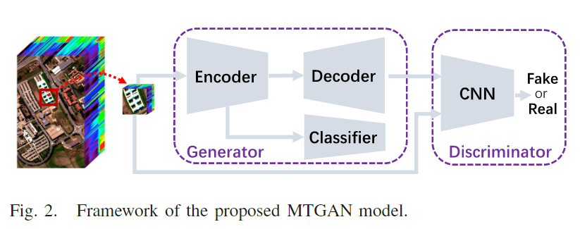
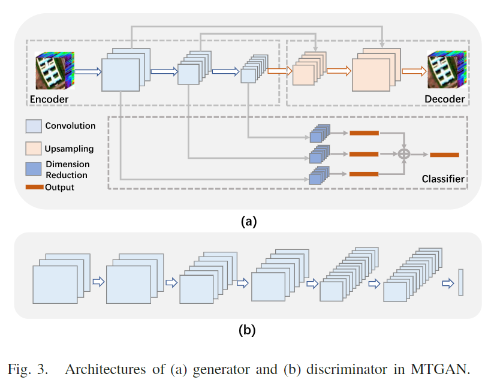

原文：《Classification of Hyperspectral Images via Multitask Generative Adversarial Networks》

## 摘要

深度学习在高光谱图像（HSI）分类领域显示出巨大的潜力。然而，大多数深度学习模型严重依赖于可用训练样本的数量。在本文中，我们提出了一种多任务生成对抗网络（MTGAN），通过利用未标记样本的丰富信息来缓解这个问题。具体来说，我们设计了一个生成器网络来同时执行两个任务：重建任务和分类任务。前者旨在重建输入高光谱立方体，包括标记和未标记的立方体，而后者的任务试图识别立方体的类别。同时，我们构建了一个鉴别器网络来区分来自真实分布或重构样本的输入样本。通过对抗性学习方法，生成器网络将产生类似真实的立方体，从而间接提高分类任务的辨别能力和泛化能力。更重要的是，为了充分探索浅层的有用信息，我们在重建和分类任务中采用了跳跃连接。所提出的 MTGAN 模型在三个标准 HSI 上实现，实验结果表明它能够实现比其他最先进的深度学习模型更高的性能。

## 研究思路

在本文中，我们提出了一种用于HSI光谱空间分类的多任务GAN（MTGAN）。在MTGAN中，生成器同时承担两个不同的任务：重构任务和分类任务。重构任务的目标是利用编码器子网和解码器子网重构输入HSI多维数据集，分类任务的目标是通过CNN识别输入多维数据集的类别。分类任务中CNN的第一层卷积层与重构任务中的编码器子网共享相同的结构。MTGAN的鉴别器由另一个CNN构建，该CNN的输入是真实的HSI立方体或由生成器重建的HSI立方体。在训练过程中，鉴别器试图准确区分真实的HSI立方体和重建的HSI立方体，而生成器则试图通过重建尽可能真实的立方体来欺骗鉴别器。经过这种对抗性训练，生成器能够重建类似真实的立方体，这表明编码器子网捕获了HSI立方体的内在表示。由于分类任务共享编码器子网的结构，其分类能力也将得到提高。
与现有的基于GAN的HSI分类模型相比，我们提出的MTGAN模型至少有两个优点。首先，与[36]和[37]不同的是，MTGAN中的生成器可以在对抗性训练后直接应用于HSI分类，而不需要训练额外的分类器，这也可能花费大量时间。其次，MTGAN能够从输入的HSI立方体中同时充分学习光谱和空间特征，这对于HSI光谱-空间分类至关重要。
本文贡献如下：

1. 我们提出了一种用于HSI光谱空间分类的MTGAN。MTGAN中的生成器和鉴别器都是基于CNN的。该生成器可以同时对输入数据集进行重构和分类。得益于重构过程，未标记样本被充分利用来提高CNN的分类性能。
2. 我们在重构任务和分类任务中都采用了跨层连接。通过这些连接，可以传递空间信息和浅层的判别信息，分别辅助重建和分类任务。
3. 我们在三个具有挑战性的HSI数据集上测试了提出的MTGAN模型：Indian Pines 2010、Houston 2013和Houston 2018。在所有这些模型上，MTGAN都能够获得比所比较的深度学习模型更高的性能，这充分验证了其有效性。

## 本文方法

### MTGAN的结构

我们提出的MTGAN模型尝试在GAN中加入多任务学习框架，可以充分利用未标记的样本来提高CNN的分类性能。如图2所示，MTGAN的生成器包含三个模块：编码器模块、解码器模块和分类器模块。生成器的输入是每个像素周围裁剪的小立方体，而不是随机噪声。将编码器和解码器模块组合在一起重建输入立方体，而编码器和分类器模块用于对输入立方体进行分类。这两个任务共享编码器模块，使它们相互促进。MTGAN的鉴别器由一个CNN构成，期望能区分真实立方体和重建立方体。下面，我们将详细介绍产生器和鉴别器的结构。

<!--more-->

#### 编码器模块

图3(a)显示了生成器网络的架构。对于给定的HSI立方体$\mathbf{X}\in\mathbb{R}^{w\times w \times d}$，其中$w$和$d$分别表示立方体的空间大小和HSI中光谱带的数量，编码器模块旨在通过三个二维卷积层学习$\mathbf{X}$的潜在表示。这三个卷积层的核大小相同（即3 × 3），核数分别为32、64、128。假设$\mathbf{X}^{[L]}$，其中$L\in\{1,2,3\}$是第 $L$ 层的输出，计算过程可以写成：

$$
\mathbf{X}^{[L]}=\mathrm{ReLU}(\mathbf{W}^{[L]}*\mathbf{X}^{[L-1]}+\mathbf{b}^{[L]})
\tag{2}
$$

其中$\mathbf{X}^{[0]}=\mathbf{X},\mathbf{W}^{[L]}$为第 $L$ 个卷积核，“$*$”为卷积算子，$\mathbf{b}^{[L]}$为偏置，$\mathrm{ReLU}(\cdot)$为广泛使用的非线性激活函数

$$
\text{ReLU}(x)=\begin{cases}x,&\text{if}\quad x>0,\\0,&\text{otherwise.}\end{cases}
\tag{3}
$$

注意，每个卷积层都使用填充运算来使输出空间大小保持不变。在每个卷积运算之后，增加一个最大池化运算，将空间大小减少两倍。

#### 解码器模块

与编码器模块相反，解码器模块的目标是用三个上采样层和跳层连接重建$\mathbf{X}$。对于第一个上采样层，首先在空间域中对$\mathbf{X}^{[3]}$进行两次上采样，然后对其进行二维卷积运算。卷积运算的计算过程与式$(2)$相同，核大小设置为3 × 3，核数设置为64。假设第一个上采样层的输出为$\mathbf{X}^{[2]}$，跳层连接会将$\widehat{\mathbf{X}}^{[2]}$和$\mathbf{X}^{[2]}$连接在一起，即$[\widehat{\mathbf{X}}^{[2]},\mathbf{X}^{[2]}]$。与第一个上采样层类似，第二层在$[\widehat{\mathbf{X}}^{[2]},\mathbf{X}^{[2]}]$上依次进行一个上采样运算和一个二维卷积运算（32个卷积核），生成一个输出映射$\widehat{\mathbf{X}}^{[1]}$。同样，通过跳层连接将$\widehat{\mathbf{X}}^{[1]}$和$\mathbf{X}^{[1]}$连接在一起，并馈送到第三上采样层，该上采样层使用$d$卷积核将$\mathbf{X}$重构为$\widehat{\mathbf{X}}$。

#### 分类器模块

编码器模块中的潜在表示可以看作是$\mathbf{X}$的一个光谱空间特征，将这种表示用于分类任务是合理的。此外，[37]和[40]的研究表明，不同卷积层的表示具有一定的互补信息，如果充分挖掘，将提高分类性能。在它们的激励下，分类器模块利用三个跨层连接来整合来自三个卷积层的特征进行光谱空间分类。具体来说，对于第 $L$ 个卷积层，分类器模块首先将$\mathbf{X}^{[L]}$输入到降维层中，该降维层由一个256核的1 × 1卷积层和一个自适应平均池化层组成。因此，特征的维数降为256。然后，使用输出层通过全连接层导出分类结果$\mathbf{O}^{[L]}$。最后，将三个输出结果$\mathbf{O}^{[L]},L\in\{1,2,3\}$以自适应求和的方式组合在一起，可以表示为：

$$
\mathbf{O}=\alpha_1\mathbf{O}^{[1]}+\alpha_2\mathbf{O}^{[2]}+\alpha_3\mathbf{O}^{[3]}
\tag{4}
$$

其中$\alpha_i,i\in\{1,2,3\}$表示融合权值，并与网络参数进行端到端优化。

#### 鉴别器网络

图3(b)显示了鉴别器网络的结构，该网络由六个卷积层和一个输出层组成。与编码器模块一样，所有卷积层都采用3 × 3卷积核，并带有填充运算。从第一层到第六层卷积的核数相应地设计为32、32、64、64、128、128。与编码器模块不同的是，在第二层、第四层和第六层设置了卷积步长，而不是采用最大池化，以实现两次空间下采样。此外，文献[27]的研究发现，使用Leaky ReLU（LReLU）可以获得比ReLU更好的效果。因此，我们也采用LReLU作为每个卷积层的激活函数，其计算公式为

$$
\text{LReLU}(x)=\begin{cases}x,&\text{if}\quad x>0,\\ax,&\text{otherwise}\end{cases}
\tag{5}
$$

在本文中，参数$a$经验性地设定为0.2。在最后一个卷积层之后，应用了平均池化层将特征维度降低到128。输出层的神经元数量为1，这表示输入$\mathbf{X}$或者$\widehat{\mathbf{X}}$属于真实立方体的概率。

### 总体损失

除了网络结构之外，适当设计损失函数对于深度学习模型也是至关重要的。根据生成器和鉴别器网络的目标，我们为MTGAN模型提出了三种不同的损失函数，包括重构损失、分类损失和GAN损失。接下来将讨论这些损失函数。

#### 重构损失

对于重构任务的直观想法是最小化输入立方体和重构立方体之间的像素级损失[29]，可以建模为

$$
\mathcal{L}_{\mathrm{rec}}=\frac{1}{N}\sum_{i=1}^N\|\mathbf{X}_i-G_{\theta_1}(\mathbf{X}_i)\|^2
\tag{6}
$$

其中，$N$表示样本的总数，$\theta_1$表示存在于编码器模块和解码器模块中的参数，$\mathbf{X}_i$和$G_{\theta_1}(\mathbf{X}_i)$分别表示第$i$个输入立方体和对应的重构立方体。重构损失在本文中起到两个作用。首先，它引导生成器完成重构任务。其次，它有助于提高分类器模块的判别和泛化能力。

#### 分类损失

作为广泛采用的方法，交叉熵损失被用来构建分类损失函数，可以表示为：

$$
\mathcal{L}_{\mathrm{cls}}=\frac{1}{M}\sum_{i=1}^{M}[y_{i}\log(G_{\theta_{2}}(\mathbf{X}_{i}))+(1-y_{i})\log(1-G_{\theta_{2}}(\mathbf{X}_{i}))]
\tag{7}
$$

其中$M$表示标记立方体的数量，$y_i$表示第$i$个输入立方体的类别标签，而$\theta_2$则代表编码器模块和分类器模块中的参数。需要注意的是，$\theta_1$和$\theta_2$在编码器模块中共享参数，使得重建任务和分类任务可以相互促进。

#### GAN损失

众所周知，式(6)中的损失函数容易导致高频信息的丢失，从而导致模糊的重建结果[31]、[41]。为了生成更加真实的结果，引入了基于Wasserstein距离的GAN损失，可以定义为

$$
\mathcal{L}_{\mathrm{gan}}=\frac{1}{N}\sum_{i=1}^{N}D_{\beta}(\mathbf{X}_{i})-D_{\beta}(G_{\theta_{1}}(\mathbf{X}_{i}))
\tag{8}
$$

其中$\beta$表示鉴别器中的网络参数。

#### 目标函数

MTGAN模型的最终目标函数$\mathcal{L}$是由式(6)中的重构损失、式(7)中的分类损失和式(8)中的GAN损失组合而成的：

$$
\mathcal{L}=\arg\min_{(\theta_1,\theta_2)}\max_{\beta}\quad\mathcal{L}_{\mathrm{cls}}+\lambda_1\mathcal{L}_{\mathrm{rec}}+\lambda_2\mathcal{L}_{\mathrm{gan}}
\tag{9}
$$

其中，$\lambda_1$和$\lambda_2$是用来权衡不同损失项的正则化参数。

与文献[25]中的原始GAN工作相同，我们也采用了一种替代优化方法来优化式(9)。因此，式(9)可以分解为两个子问题。

$$
\arg\max_\beta\frac{1}{N}\sum_{i=1}^ND_\beta(\mathbf{X}_i)-D_\beta(G_{\theta_1}(\mathbf{X}_i))
\tag{10}
$$

和

$$
\arg\min_{(\theta_1,\theta_2)}\mathcal{L}_{\mathrm{cls}}+\lambda_1\mathcal{L}_{\mathrm{rec}}-\lambda_2\frac{1}{N}\sum_{i=1}^ND_\beta(G_{\theta_1}(\mathbf{X}_i)).
\tag{11}
$$

在训练阶段获取了$\theta_1$、$\theta_2$和$\beta$的最优解后，我们可以利用编码器模块和分类器模块对任何输入的高光谱立方体数据进行分类。

### 总结

在本文中，我们提出了一种用于高光谱图像分类的MTGAN模型。与其他基于GAN的模型不同，我们的MTGAN模型直接解决分类任务，并借助重构任务充分利用未标记样本。为了提高重构性能，MTGAN采用了对抗学习和跳层连接。在分类任务中，我们还采用了跳层连接，以利用不同卷积层之间的互补信息。为了测试提出模型的性能，我们在三种不同的高光谱数据集上进行了实验，并将其与多个深度模型进行了比较，包括重构型、CNN型和GAN相关的模型。通过定量和定性比较，我们验证了MTGAN的有效性。此外，我们还试图对提出的MTGAN模型进行全面分析。具体而言，我们测试了不同超参数（包括两个正则化参数和输入立方体的空间尺寸）对分类性能的影响，并评估了嵌入在重构和分类任务中的跳层连接以及对抗损失的贡献。
