原文：《Hyperspectral Image Classification Using Attention-Based Bidirectional Long Short-Term Memory Network》

## 摘要

深度神经网络已广泛应用于高光谱图像（HSI）分类领域，其中递归神经网络（RNN）是最典型的网络之一。 大多数现有的基于 RNN 的分类器将像素的光谱特征视为有序序列，其中仅考虑沿相邻波段波长方向的单向相关性。 然而，每个波段图像不仅与其之前的波段图像相关，而且与其连续的波段图像相关。 为了充分探索 HSI 中的这种双向光谱相关性，在本文中，为 HSI 分类设计了一个基于双向长短期记忆 (Bi-LSTM) 的网络。 此外，在所提出的 Bi-LSTM 网络中设计并实现了一种空间-光谱注意机制，以强调有效信息并减少像素空间-光谱上下文中的冗余信息，从而大大提高分类性能。 三个基准 HSI（即Salinas Valley、Pavia Centre和Pavia University）的实验结果表明，我们提出的 Bi-LSTM 明显优于几种最先进的基于单向 RNN 的分类算法。 此外，所提出的空间-光谱注意机制可以通过有效地加权像素的空间和光谱上下文来进一步提高我们提出的 Bi-LSTM 算法的分类精度。 拟议的 Bi-LSTM 算法的源代码可在 https://github.com/MeiShaohui/Attention-basedBidirectional-LSTM-Network 获得。

## 主要问题

1. 现有的基于rnn的工作主要是将一个HSI的每个像素作为沿光谱方向的有序序列，无法充分探索一个HSI内的光谱相似性。
2. 分类任务中至关重要的像素空间上下文不能直接用于传统的 RNN。尽管已经使用双向卷积 LSTM 进行空间-光谱特征学习以对 HSI 进行分类 [53]，但由于空间特征和光谱特征是单独探索并连接起来进行分类的，因此没有得到很好的探索。

## 解决方法

1. 使用Bi-LSTM网络来考虑波段图像的双向相关性，其中同时考虑前向和后向相关性来对 HSI 进行分类。
2. 设计了一种空间-光谱注意机制，以强调像素的空间-光谱上下文之间的有效信息，削弱冗余信息，通过该机制对像素的空间和光谱上下文进行加权，以缓解光谱变化。

## 本文方法

### Bi-LSTM的体系结构

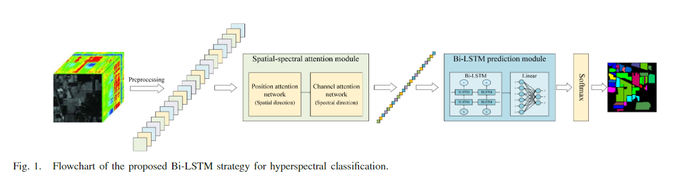
如图 1 所示，在所提出的基于 Bi-LSTM 的 HSI 分类策略中，原始高光谱数据首先使用分块和归一化进行预处理，然后依次馈送到空间光谱注意模块和 Bi-LSTM 预测模块。 在注意力模块中，融合了空间-光谱信息，通过注意力机制对像素的空间和光谱上下文进行加权，以减轻光谱变化。 同时，它允许网络处理 3-D 输入，从而在仅支持 2-D 数据输入的传统 LSTM 和具有 3 个维度的 HSI 数据之间建立了桥梁。 在 Bi-LSTM 预测模块中，通过同时探索沿谱维度的前向和后向相关性来进行特征提取。 最后，提取的空间-光谱联合特征使用经典的 softmax 分类器进行分类。

<!--more-->

### 空间-光谱注意力模块

尽管 HSI 以其高光谱分辨率而闻名，但空间背景信息也起着重要作用。 然而，HSI 的 3-D 信息不能在传统的 RNN 中直接处理。 此外，由于 HSI 通常拥有大量的光谱波段，因此需要许多循环单元来处理光谱信息，从而导致梯度消失的问题。 因此，在本文中，提出了一种用于空间和光谱信息提取的注意机制，通过该机制可以减少 HSI 的 3-D 信息以满足 RNN 的输入要求。
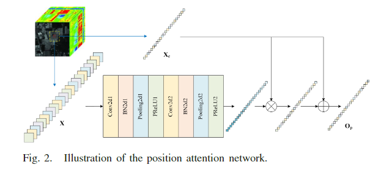
通常，注意力机制可以通过强调输入的主导信息和抑制输入的无关紧要信息来提高网络的表达能力。 在这篇文章中，空间-光谱注意力模块被设计并按顺序进行，以选择性地强调 HSI 的重要空间背景和光谱信息，从而避免梯度消失或爆炸。具体来说，如图2所示，在HSIs的空间上下文方面，设计了一个位置注意网络来选择性地提取有助于目标位置类别确定的特征。
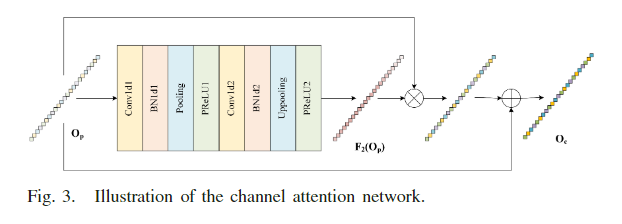
另一方面，在光谱波段关系方面，如图3所示，设计了一个通道注意力网络，选择性地强调具有突出特征的光谱波段信息，同时抑制具有相对不显着特征的波段。
一般来说，注意机制的模型如下：
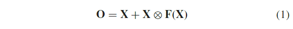
其中$\mathbf{X}$是输入，$\mathbf{F(\cdot)}$表示设计的注意力模型中的权重，“$\bigotimes$”表示逐元素乘积，$\mathbf{O}$是输出。 在注意力机制$\mathbf{F(\cdot)}$中，对其输入进行加权求和，突出关键点，减少冗余。 为了对像素$\mathbf{X_c}\in R^{1\times 1\times C}$进行分类，其空间相邻像素(表示为$\mathbf{X_c}\in R^{H\times W\times C}$)被视为空间光谱特征提取网络的输入，其中$H$、$W$和$C$分别是带的长度、宽度和数量。如图1所示，首先将输入数据输入在空间方向上拥有两个卷积块的位置注意模型，该模型表示为：
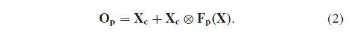
这里，$\mathbf{O_p}\in1\times1 \times C$是位置注意模型的结果，该空间注意机制中的权重$\mathbf{F_p(\cdot)}$获得为：
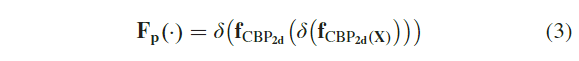
其中$\mathbf{f_{CBP_{2d}}}(\cdot)$表示由二维卷积层、二维批量归一化层和二维池化层处理的一组网络，$\delta(\cdot)$表示参数整流线性单元(PRelu)激活功能。
然后通过通道注意模型将空间强调的数据$\mathbf{O_p}$输入到光谱方向的注意机制中，公式为：
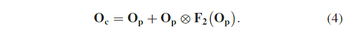

这里，$\mathbf{O_c}\in1\times 1\times C$是光谱注意模型的结果，即所提出的空间-光谱注意机制的输出，并且该光谱注意机制中的权重$\mathbf{F_c(\cdot)}$为：
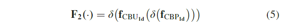
其中$\mathbf{f}_{CBP_{1d}}(\cdot)$表示由一维卷积层、一维批量归一化层和一维池化层处理的一组网络。
综上所述，本文提出的空间-光谱模块依次进行空间注意力和光谱注意力。所提出的位置注意网络和通道注意网络的参数分别如表1和表2所示。

### Bi-LSTM预测模块

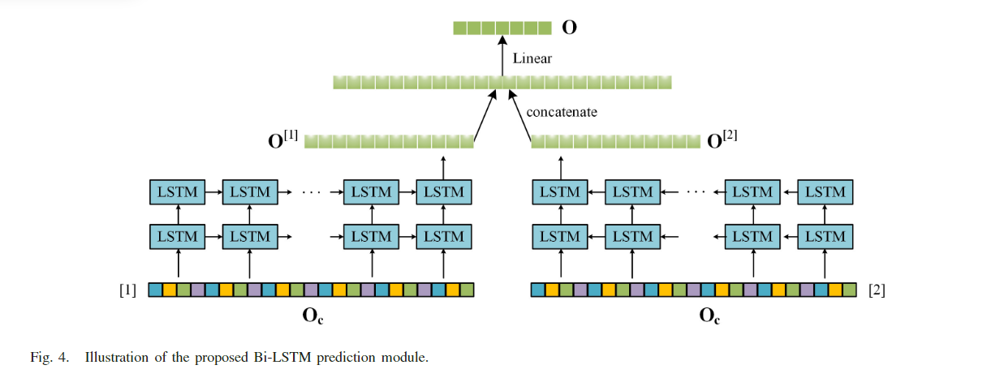
如图4所示，本文提出的Bi-LSTM预测模块由LSTM、连接层和线性层组成。具体来说，由空间-光谱注意模块产生的向量，即$\mathbf{O_c}$，在两个方向上被馈送到几个 LSTM 单元：从前到后(图 4 中的[1])和从后到前([2]在图4)。 这两层 LSTM 分别对提供的特征$\mathbf{O_c}$内的前向和后向相关性进行建模，并生成两个特征向量：$\mathbf{O^{[1]}}$和 $\mathbf{O^{[2]}}$。这两个特征向量进一步连接到一个线性层进行特征集成。最后将集成的双向特征馈送到softmax层进行分类。因此，Bi-LSTM预测模块的计算过程可以表示为：
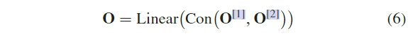
其中$\varphi$是隐藏层的激活函数，$\delta$是输出层的激活函数，$U$和$W$是权重系数，$b$是偏置系数，$c$是常数系数。$\mathbf{O}$为网络输出，$[1]$代表正向RNN，$[2]$为反向RNN，$\otimes$代表矩阵拼接，$\mathbf{O^{[1]}}$和$\mathbf{O^{[2]}}$为隐藏层输出，由下式给出：
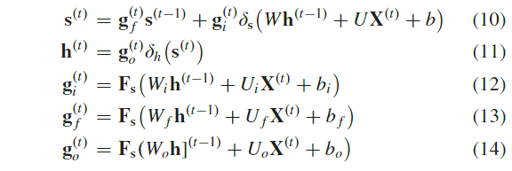
其中下标$i$、$f$、$o$分别代表LSTM单元的输入门、遗忘门、输出门，$\mathbf{h}$为系统状态，$\delta_h$、$\delta_s$为系统状态和隐藏层状态的激活函数， 分别设为“tanh”函数，$b$为偏置系数，$c$为常数系数，$\mathbf{g}$为随时间更新的门单元，$W$和$U$为权重系数，$b$为偏置，$\mathbf{F_s}$是 sigmoid 函数。
综上所述，Bi-LSTM模块的参数如表3所示。
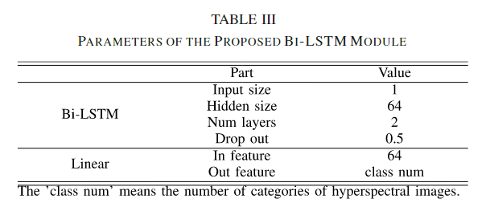
