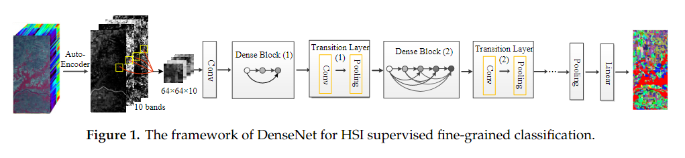
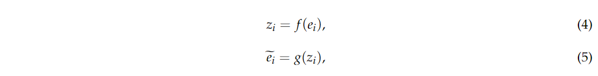
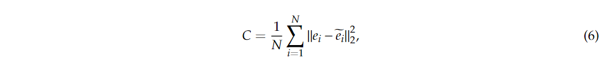
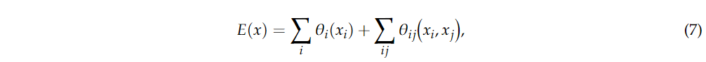
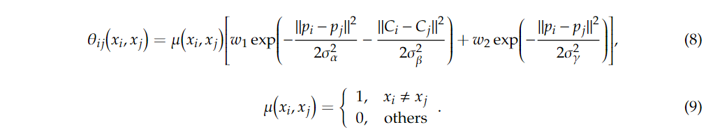
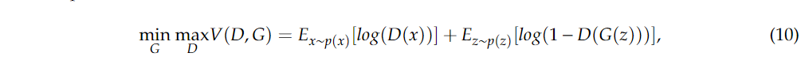
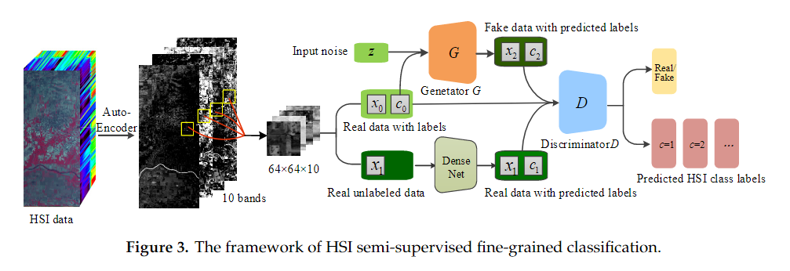
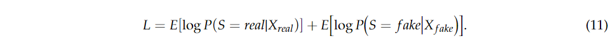
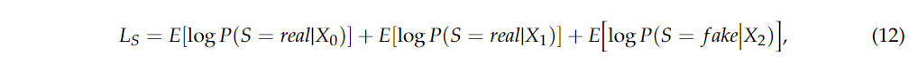
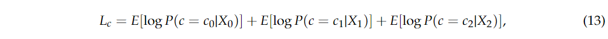

原文：《Fine-Grained Classification of Hyperspectral Imagery Based on Deep Learning》

# 主要问题

1. 传统的分类方法不能很好地处理HSI的细粒度分类。细粒度分类是对类别数量相对较多、差异较小的数据进行分类。
2. 由于标记样本的难度和耗时，标记的训练样本通常是有限的。有必要使用未标记的样本，这可以用来提高分类性能。

## 解决方法

1. 将密集连接卷积神经网络(DenseNet)应用于HSI的监督分类。此外，将预处理(即PCA和AE)和后处理(即CRF)技术与DenseNet相结合，进一步提高分类性能。
2. 提出了一种用于HSI半监督分类的半监督深度模型semi-GAN。Semi-GAN有效地利用了未标记的样品，提高了分类性能。

<!--more-->

## 基于密集连接CNN的HSI监督细粒度分类

### 基于密集连接CNN的HSI监督细粒度分类

在本小节中，为HSI细粒度分类提出的DenseNet框架如图1所示。从图1可以看出，有三部分:数据准备、特征提取和分类。在数据准备部分，采用Auto-Encoder对谱域信息进行压缩，然后选择待分类像素的邻域作为输入。DenseNet是该框架的核心部分，用于特征提取。最后，采用softmax分类器得到最终的分类结果。

### 基于DenseNet的HSI细粒度分类降维

白化 PCA 是一种具有恒等协方差矩阵的修改 PCA，是降维的常用方法。PCA 通过将维度减少到合适的尺度来压缩数据。在 HSI 降维中，执行白化 PCA 来提取光谱维度上的主要信息，然后将缩减后的图像视为深度模型的输入。由于 PCA，计算复杂度大大降低，缓解了过拟合问题，提高了分类性能。
Auto-Encoder 是降维的另一种方式。Auto-Encoder 可以将数据非线性转换为潜在空间。当这个潜在空间的维度低于原始空间时，这可以看作是非线性降维的一种形式。Auto-Encoder 通常由编码器和解码器组成，以定义数据重建成本。编码器映射$f$采用神经网络的前馈过程来获得嵌入的特征。但是，解码器映射$g$旨在重建原始输入。该过程可以表述为：

其中$e_i$表示输入像素向量，$\widetilde{e_i}$表示重构向量，$z_i$表示用于分类的相应潜在向量。通过最小化成本函数来减少原始输入向量和重建向量之间的差异：

其中$N$是 HSI 的像素数。
上述用作预处理技术的白化 PCA 或自动编码器可以与 DenseNet 结合以构建端到端系统以完成 HSI 细粒度分类任务。

### 基于DenseNet的HSI细粒度分类CRF

与DenseNet用于HSI细粒度分类的降维不同，还有另一种方法(DenseNet后处理)来提高分类性能。因此，本研究将条件随机场(CRF)与DenseNet相结合，进一步提高HSI的分类精度。一般而言，CRF已被广泛用于基于初始粗像素级类别标签的语义分割，该初始粗像素级类别标签是通过像素和边缘的局部交互来预测的。CRF的目标是使局部邻域中的像素具有相同的类别标签，特别是它们已被应用于平滑有噪声的分割地图。
为了克服短程 CRF 的这些限制，我们使用 [57] 中提出的全连接成对 CRF 进行有效的计算，以及基于长期依赖关系捕获精细细节的能力。具体来说，我们在卷积网络之上执行 CRF 作为后处理方法，它将每个像素视为一个 CRF 节点，接收 CNN 和 Auto-Encoder-DenseNet 的一元势。|
全连接 CRF 执行能量函数：

其中$x$是像素标签分配。一元势 $θ_i(x_i)=−logP(x_i)$，其中$P(xi)$是卷积网络计算的像素$i$处的标签预测概率。成对势使用全连接图，当我们连接所有图像对$i,j$ 时，我们得到能量函数。

在这个函数中，可以看到它包括两个高斯核，它们代表不同的特征空间，第一个基于像素位置$p$和光谱波段$C$的核，第二个核只依赖于像素位置。高斯核的尺度是根据超参数$σ_α,σ_β$和$σ_γ$决定的。我们采用的[57]中全连接CRF模型中的高斯CRF势可以捕获长期依赖关系，同时该模型适用于快速平均场推断。第一个核函数将位置相似且光谱波段相同的区域中的体素配置为相似的标记，第二个核函数仅考虑空间邻近性。

## 基于HSI半监督细粒度分类的生成对抗网络

### 生成对抗网络 (GAN)

通常 GAN 由两部分组成：生成网络$G$和判别模型$D$。生成器$G$可以获得真实数据的潜在分布并生成一个新的相似数据样本，而判别器$D$是一个二元分类器，可以将真实输入样本与假样本区分开来。
假设输入噪声变量具有先验$p(z)$，且实际样本具有数据分布$p(x)$。在接受随机噪声$z$作为输入之后，生成器可以产生到数据空间$G(z)$的映射，其中$G$表示生成模型的函数。类似地，我们可以定义$D$代表判别模型的映射函数。
在优化过程中，判别器$D$的目标是最大化$log(D(x))$，即将正确的标签分配给正确的源的概率，生成器$G$试图使生成的样本具有与真实数据更相似的分布，因此我们可以训练生成器$G$以最小化$log(1−D(G(z)))$。因此，训练过程的最终目的是解决极大极小问题：

$E$是期望算子。然而，在处理复杂数据时，浅乘感知器通常不如深度模型。考虑到基于深度学习的方法在各方面都取得了许多新颖的实现，本文采用深度网络(CNN)来组成模型G和D。

### 基于HSI半监督细粒度分类的生成对抗网络

尽管GAN在图像合成和其他许多方面都有很好的应用前景，但是传统GAN的判别模型$D$只能用于区分真实样本和生成样本，这不适合于多类图像分类。最近，GAN的概念被扩展为具有半监督方法的条件模型，其中真实训练数据的标签被引入到鉴别器$D$。
为了使GAN适应多类HSI分类问题，我们需要为$G$和$D$提供一些额外的信息。引入的信息通常是用于训练条件GAN的类别标签。在本研究中，所提出的Semi-GAN分类器将其鉴别器$D$修改为可输出多类别标签概率的Softmax分类器，可用于HSI分类。此外，还将带有真实类别标签的训练数据和带有预测标签的训练数据中的附加信息引入到鉴别器网络中。用于HSI细粒度分类的Semi-GAN的主要框架如图3所示。

从图3可以看出，该网络可以同时提取光谱和空间特征。首先，将HSI数据送入自动编码器，得到降维数据。在整个训练过程中，降维后的真实数据分为两部分：一部分是由已标记样本组成，另一部分是未标记部分。已标记样本被引入到模型$G$和$D$中，而未标记样本被输入到DenseNet中以获得相应的预测标签。鉴别器$D$的输入由真实的有标签的训练数据、生成器$G$生成的伪数据和带有预测标签的真实的无标签的训练数据组成，$D$将输出概率分布$P(S|X)=D(X)$。因此，鉴别器$D$的最终目的是最大化正确来源的对数似然：

同样，$G$网络的目标是最小化正确信号源的对数似然。
在网络中，人们可以看到真实的训练数据由两部分组成：一部分是标记的真实数据，另一部分是由训练的DenseNet预测的带有标签的未标记的真实数据。生成器$G$还接受两部分：高光谱图像类别标签$c∼p_c$和噪声$z$，$G$的输出可以定义为$X_{fake}=G(z)$。$源P(S|X)$的概率分布和类别标签$P(C|X)$的概率分布被馈送到网络$D$。考虑到不同的数据源和标签，目标函数可以分为两部分：正确的输入数据源$L_S$的对数似然和正确类别标签$L_C$的对数似然：

其中$X_0$和$c0$分别表示真实的带标签的训练样本及其真实标签。$X_1$和$c_1$表示实际的未标记训练样本和DenseNet得到的预测标签，$X_2$和$c_2$表示从模型$G$和模型$D$估计的对应标签生成的样本。在整个训练过程中，$D$被训练以最大化$L_S+L_C$，而$G$被优化以最大化$L_C−L_S$。
