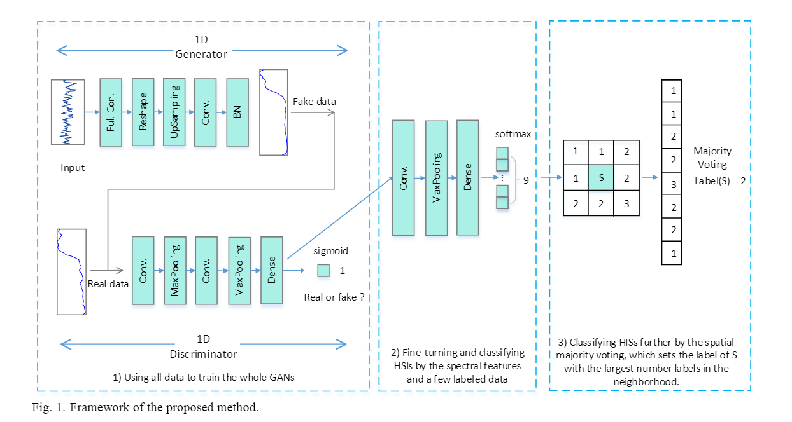
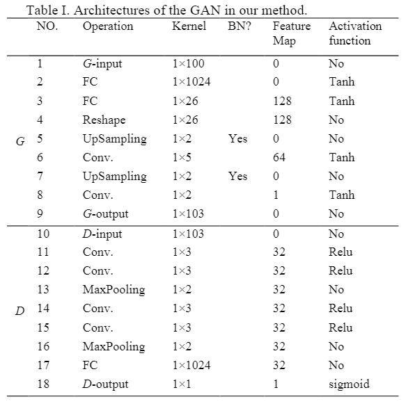

原文：《Semi-Supervised Classification of Hyperspectral Data Based on Generative Adversarial Networks and Neighborhood Majority Voting》

## 本文思路

GAN 最近已成为一种流行的深度学习方法，并在许多视觉生成任务中取得了更多成功。因为它可以同时利用未标记的数据和标记数据，它在半监督学习方面取得了巨大突破。然而，GANs通常是为二维图像定制的。在文[7]中，设计了一维GAN来训练高光谱像素的光谱信息，可用于半监督HSIs分类。

<!--more-->

## 高光谱生成对抗网络

如图 1 所示，我们通过采用和修改 CNN 架构来设计 GAN。 在一维生成器 G 中，Ful. Con.  是一个全连接层，它以均匀的噪声分布 Z 作为一维输入，但结果被重塑为二维张量，并用作卷积堆栈的开始。 UpSampling 层用于表示反向最大池化以将前层重新缩放到所需的大小。 Conv层是CNN中的卷积层，用于提取输入的特征。 Conv 之后是 Batch Normalization 层，它通过将每个单元的输入标准化为零均值和单位方差来稳定学习。 最后一层将输出生成的样本，该样本将作为“fake”输入提供给 D。 当模型在所有样本上训练后，D 将包含所有样本的特征，我们可以使用这些提取的特征进行光谱分类。

### 光谱-空间分类

当GAN训练完成后，我们将得到训练良好的G，可以生成像真实数据一样的数据，以及训练良好的D，可以包含所有未标记样本的特征。我们使用来自最后一个 Conv 层的鉴别器的卷积特征并构建一个小的 CNN 来分类这些光谱特征。
CNN的输入是通过D模型获得的一维光谱特征。Conv 层是$1×3$或$1×5$的一维卷积。卷积层计算输出特征图。 卷积后，我们可以得到特征图。Maxpooling 层可以减少特征图的尺寸，它独立地对输入的每个深度切片进行操作，并在空间上调整其大小。该层将区域的最大值作为输出，然后输出特征图的下采样。CNN 的最后（顶层）层是一个分类器，例如 Softmax 层，它将输出样本所属类别的概率。 在几个特征提取阶段之后，整个网络使用损失函数（例如经典最小二乘输出）通过反向传播过程进行训练。
在 HSI 中，一个像素极有可能与相邻像素属于同一类。 受[11]的启发，我们的方法设计了多数表决策略。 图 1 的步骤 3 说明了在 3×3 窗口中使用相邻像素进行联合分类的示例。 中央测试像素$S$的最终标签可以通过多数表决策略来确定，该策略将$S$的标签设置为邻域中标签数最大的标签。

### 模型架构

