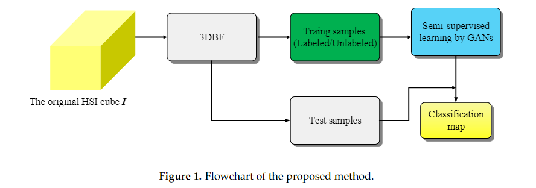
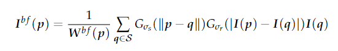
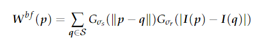
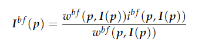
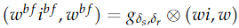
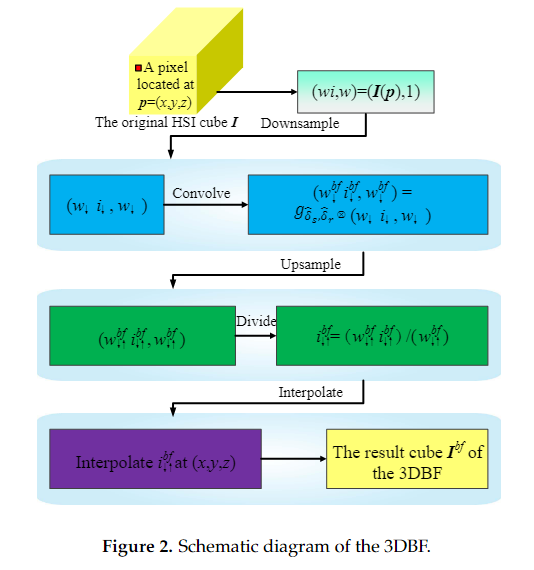
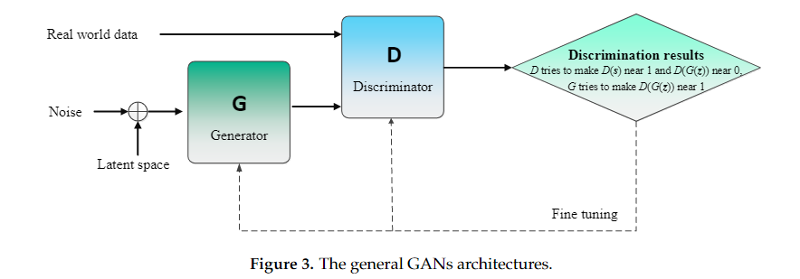
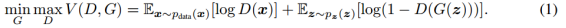
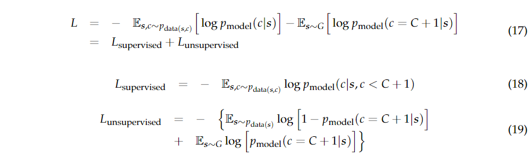

原文：《Generative Adversarial Networks-Based Semi-Supervised Learning for Hyperspectral Image Classification》

## 核心思想

1. 采用三维双边滤波器（3DBF），通过将HSI自然处理为体积数据集来提取光谱空间特征。通过3DBF将空间信息集成到提取的特征中，这有利于后续的分类步骤
2. 在半监督学习的频谱空间特征上训练GAN。GAN包含两个相互对立训练的神经网络（即生成器和鉴别器）

## 主要问题

1. 许多无监督方法，如模糊聚类、模糊C-均值方法、人工免疫算法、基于图的方法，如果先验知识太少，就无法确保集群和类之间的关系。
2. 典型的监督分类器包括支持向量机（SVM）、人工神经网络（ANN）和基于稀疏表示的分类（SRC）等，它们的性能在很大程度上取决于标记样本的数量。与标记样本的迫切需求相反，他们忽略了大量未标记样本以帮助分类。

## 半监督方法四种类型

1. 生成模型，其估计条件密度以获得未标记样本的标签。
2. 低密度分离，其目的是在存在少量样本（标记或未标记）的区域设置边界。最先进的算法之一是转导支持向量机（TSVM）。
3.  基于图的方法，该方法利用标记和未标记的样本来构建图并最小化能量函数，从而将标签分配给未标记的样品。
4.  基于包装器的方法，迭代地应用监督学习方法，并且在每次迭代中标记一定数量的未标记样本。自训练和联合训练算法是常用的基于包装器的方法。

## 本文方法

1. 通过3DBF提取光谱空间特征。与基于向量/矩阵的方法相比，3DBF提取的结构特征可以通过自然遵循HSI的3D形式并将3D立方体视为一个整体来有效地保存光谱空间信息。
2. 由GAN以半监督的方式对HSI进行分类。与监督方法相比，GAN可以利用有限的训练样本和大量的未标记样本。与非对抗性网络相比，GAN利用区分模型来训练基于博弈论的生成网络。

<!--more-->

## 整体框架

该方法的概念框架如图1所示，由两部分组成：（1）特征提取；（2）半监督学习。原始HSI立方体I的光谱空间特征可以通过3DBF提取，3DBF是一个3D滤波器，可以遵循HSI的3D特性，同时提取光谱空间特征。随后，通过充分利用有限的标记样本和足够的未标记样本，在特征空间中使用GAN进行半监督分类。分类图可以通过可视化不同样本的分类结果来实现。将空间信息纳入高光谱分类有助于提高分类器的性能，基于3D/张量的方法比基于向量/矩阵的方法更有效地提取联合频谱空间结构信息。

## 三维双向滤波器提取光谱空间特征

在本文中，将双边滤波器扩展到3DBF，用于HSI体积数据的光谱空间特征提取。

假设原始立方体为$I$，其中$mn$和$b$分别表示行数、列数和频谱数。3DBF的输出结果为$I^{bf}$，它将$I$中的每个像素替换为其相邻像素的加权平均值。其中：

$p$表示HSI立方体$I$的坐标，$p=(x,y,z),x=1,...,m,y=1, 2,...,n,z=1,2,...,b$，$q$表示以$p$为中心的邻域索引，$W^{bf}$表示相邻像素$q$的归一化项，$G_{\sigma_s}$和$G_{\sigma_r}$分别表示测量三维图像域距离的高斯滤波器（光谱空间域$R$）和强度轴上的距离（范围域$R$，$R$理解为分类的类别？这就是上面提到的双边滤波器？？）。
中间步骤见原论文，最终可以化简为：

其中函数$W^{bf}$和$i^{bf}$定义为：

在高光谱图像中，3D图像域（即空光域$S$)，体积为$xyz$，范围域$R$是样本标签$\zeta$的简单轴，根据上式，3DBF可以通过以下三个步骤来实现：

1. 在$xyz\zeta$上，用定义的高斯函数卷积$w_i$和$w$，在这步中，$w_i$和$w$分别模糊为$w^{bf}(x,y,z,\zeta)i^{bf}(x,y,z,\zeta)$和$w^{bf}(x,y,z,\zeta)$；
2. 将$w^{bf}(x,y,z,\zeta)i^{bf}(x,y,z,\zeta)$除以$i^{bf}(x,y,z,\zeta)$得到$w^{bf}(x,y,z,\zeta)$；
3. 在$(x,y,z,\zeta)$上计算$i^{bf}(x,y,z,\zeta)$的值得到滤波结果$I^{bf}(x,y,z)$

3DBF还可以通过上采样下采样来加速，示意图如下：

## 基于生成对抗网络的HSI半监督分类

### GAN简介

GAN是新提出的基于对抗性网络的深度架构，以对抗性方式训练模型以生成模拟特定分布的数据。与其他深度学习方法不同，GAN是一个围绕两个功能的架构（见图3），即生成器G，它可以将样本从随机均匀分布映射到数据分布，以及鉴别器D，它被训练来区分样本是否属于真实数据分布。在GAN中，生成器和鉴别器是基于博弈论共同学习的。生成器G和鉴别器D可以以交替的方式训练。在每个步骤中，G从可能欺骗D的随机噪声z中产生一个样本，然后向D呈现真实数据样本以及G生成的样本，以将样本分类为“真”或“伪”。随后，G因生产出能够“欺骗”D和D以进行正确分类的样本而获得奖励，两个函数都被更新，直到达到纳什均衡，迭代停止。

### 用于分类的生成对抗网络

为了建立基于GAN的新的半监督高光谱分类框架，我们将生成的样本添加到HSI数据集，并将其表示为第$(C+1)$类。分类器输出的维数相应地从$C$增加到$(C+1)$类，s来自G时的概率可以表示为$p_{model}(C=C+1|s)$，这是原始GAN的目标函数$V(D,G)$中$1−D(s)$的替代。

未标记的训练样本属于前$C$类，我们可以从那些未标记的样本中学习，通过最大化$\log{p_{model}}(C\in1,2,...,C|s)$来提高分类性能。在不失一般性的情况下，假设数据集的一半由真实数据组成，一半是生成的数据，则分类器的损失函数$L$产生

其中，$L_{supervisord}$表示数据来自真实HSI特征的标签的负对数概率，如果我们将$D(s) = 1 − p_{model}(c = C + 1|s)$带入（19）式，则$L_{unsupervisord}$等于标准GAN博弈值函数。
根据输出分布匹配（ODM）成本理论，如果对于某些特定尺度的函数$f(x)$，有$\exp[l_j(s)] = f(s)p(c=j,s),{\forall}j{\textless}C+1$和$\exp{[l_{C+1}(s)]}=f(s)p_G (s)$，则无监督损失与有监督损失是一致的。这样，通过将$L_{supervisord}$和$L_{unsupervisord}$相结合，我们可以得到总交叉熵损失L，其最优解可以通过联合最小化这两个损失函数来估计。
此外，针对遗传算法中非监督优化部分的不稳定性，文章采用了一种称为特征匹配的策略来代替传统的训练生成器G的方法，要求生成器G与真实数据的统计特征相匹配。更详细地，生成器$G$进行训练以匹配在鉴别器$D$的中间层上的输出$d(S)$的期望值。通过优化被定义为的另一种目标函数$||E_{s∼p_{data(s)}}d(s) − E_{z∼p_z(z)}d(G(z))||_{2}^{2}$，我们得到了一个不动点，其中G与训练数据的分布相匹配。基于上述分析，我们在图5中展示了GAN的半监督高光谱分类方法的视觉图示。图5中的生成器$G$和鉴别器$D$的网络参数通过优化方程（17）中的损失函数来训练。未标记数据被视为真实数据$s～p_{data}$更新方程（19），以训练生成器$G$和鉴别器$D$。此外，生成器$G$的潜在空间是从未标记数据中选择的（确切地说，潜在空间也可以通过忽略类标签从标记数据中选择），噪声遵循均匀分布，生成器$G$输出是伪数据。通过联合最小化等式（17）中的损失函数，更新生成器G的参数以欺骗鉴别器D，并相应地生成假示例。采用基于软softmax的逻辑回归分类器对GAN进行多类分类。
