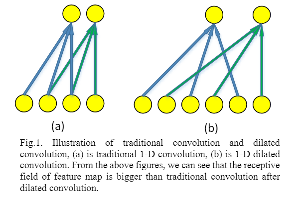
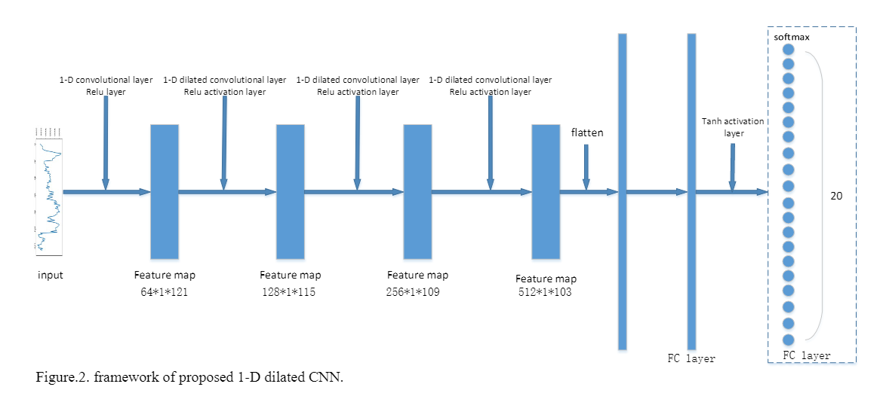
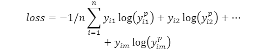

原文：《Geologic Body Classification of Hyperspectral Data Based on Dilated Convolution Neural Network at Tianshan_Area》

## 主要思路

我们采用了一种具有很强特征提取能力的经典神经网络CNN，它有助于在不需要太多人工干预的情况下进行分类任务。但受卷积层核大小的限制，除非CNN模型具有更深层次的结构，否则传统的CNN很难提取高层特征。然而，有了更深层次的架构，该模型将有更高的过度适应风险。针对这一问题，我们采用了一种新的卷积运算，称为膨胀卷积，它最初是为分割任务而提出的。分割需要结合全分辨率输出进行多尺度上下文推理，但传统的分割网络通过连续的池化和子采样层集成多尺度上下文信息，从而降低分辨率，直到获得全局预测。在池化层之后，会丢失有关特征的空间信息，这将影响分类网络的性能。在不使用最大池化层的情况下，我们设计了基于膨胀卷积的一维CNN模型，在不损失分辨率和覆盖率的情况下支持感受野的指数扩展，有效地提高了CNN在高光谱数据分类上的性能。

<!--more-->

## 本文方法

### 一维膨胀卷积

在二维图像分割中首次提出了扩张卷积算法。与传统卷积相比，扩张卷积的核上存在孔洞，孔洞的大小为膨胀率。但对于高光谱数据，我们在不使用空间信息的情况下处理一维数据。所以我们需要把二维的扩张卷积转换成一维的扩张卷积。一维卷积的公式如下。

其中$f$为输入，$g$为卷积核，当涉及1-D扩张卷积时，其变化如下:

其中$l$类似于膨胀率。当我们对输入数据进行膨胀卷积时，与传统卷积相比，感受野会扩大，而分辨率不会降低。如图1所示。

### 膨胀CNN的结构

我们设计了一个具有1个传统卷积层和3个扩张卷积层的CNN模型，每个卷积层的内核大小为$1×3$。根据内核的大小，我们将每个卷积层的膨胀速率设为3。因为我们希望我们的模型可以从原始数据中提取尽可能多的特征，所以我们没有在第一卷积层使用扩张卷积。经过四层卷积，特征图可以得到原始数据包含的所有信息，特征图的接收字段大小将扩展到$1×81$。但如果不使用膨胀卷积，感受野的大小将下降到$1×16$。在每个卷积层之后，都有一个$Relu$激活层，用于为我们的模型添加非线性特征。与传统CNN相比，我们没有在每个卷积层之后使用最大池化层，因为最大池化层会降低特征图的分辨率，从而扩大感受野。而且，这样会损失大量的信息，影响分类的性能。然后有两个完全连通层和两个激活层，用于将提取的特征映射到样本空间。第一个全连接层的大小是1024，第二层是$tanh$激活层。第二个全连接层的大小是20，这是我们需要分类的类的数量。经过softmax激活层后，模型可以给出样本属于每个类的概率，概率最高的类即为预测结果。我们选择分类交叉熵作为损失函数，广泛应用于图像的多类分类。

其中$n$为样本数量，$m$为需要分类的类数，如果样本属于$j$类，$y_{ij}$为1，否则为0，$y_{i1}^p$为样本属于$j$类的概率。训练的目标是尽量减少损失，从而提高准确率。模型结构如图2所示。
