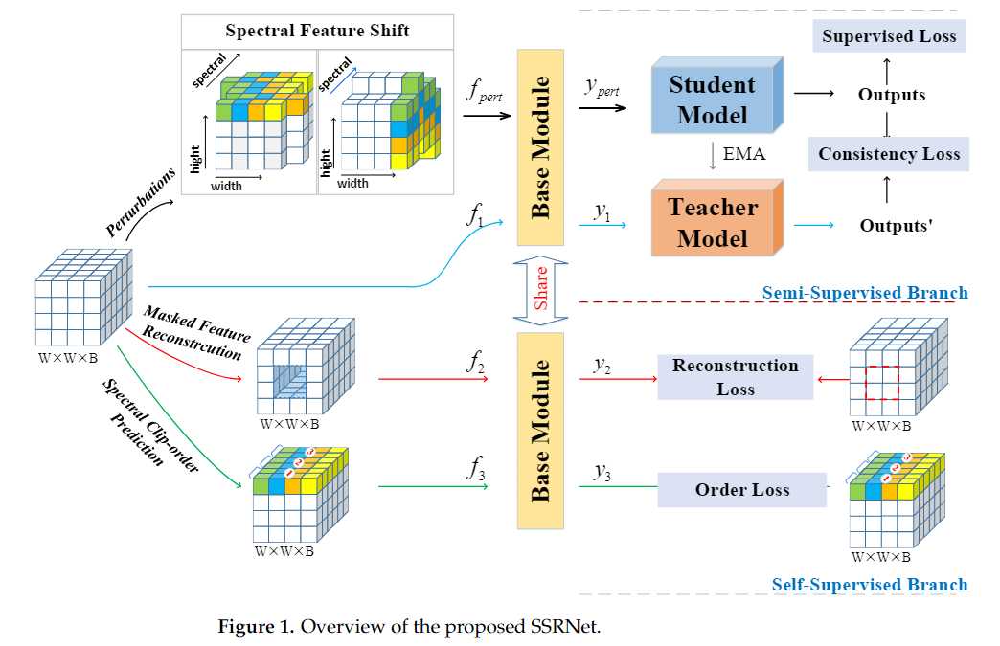
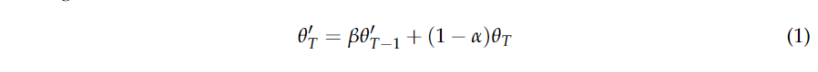
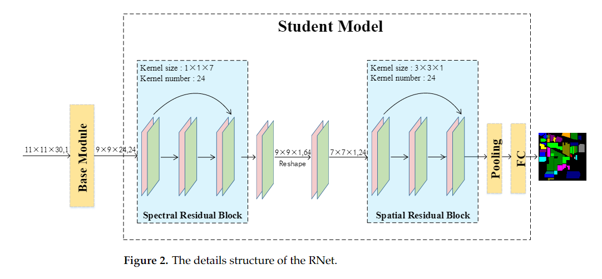
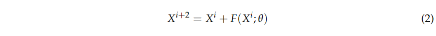
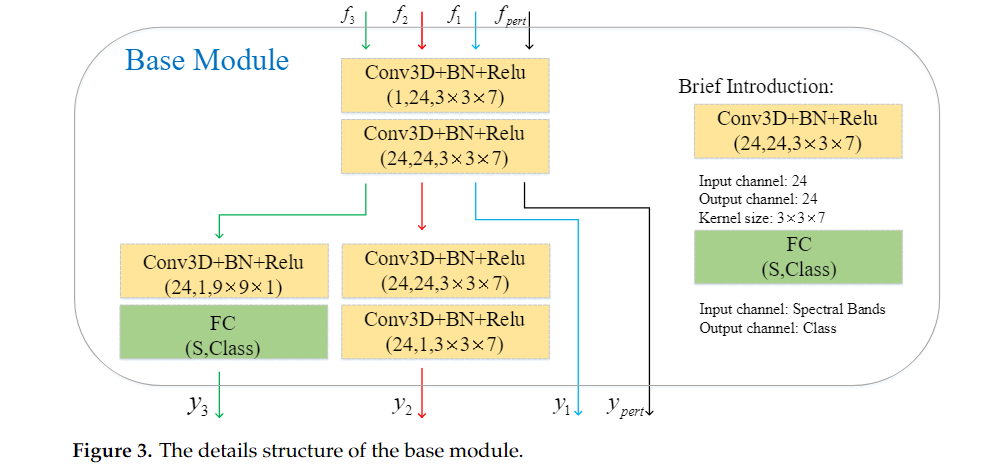
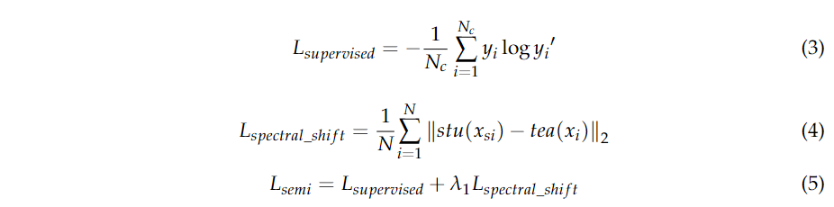
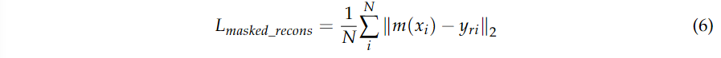
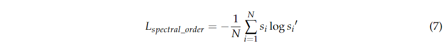
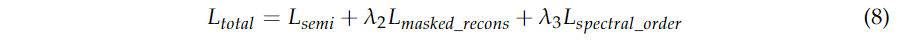

原文：《Self-Supervised Assisted Semi-Supervised Residual Network for Hyperspectral Image Classification》

## 主要问题

1. 由于HSI中标记样本的稀缺，基于dl的策略无法获得令人满意的精度。HSI的采集和标记过程复杂、耗时、成本高。因此，标记训练样本的数量受到很大限制，训练样本的不足是高效HSI分类方法的主要障碍之一。
2. 自训练需要高置信度样本及其“伪标签”来更新训练集，一旦“伪标签”不正确，性能就会变差。基于图的方法应该构建一个结构图，但由于潜在的空间谱结构信息不容易学习，因此比较麻烦。

## 解决方法

1. 通过设计统一的多任务SSRNet，将自监督学习集成到HSI分类的半监督框架中。SSRNet具有竞争性的性能，特别是在少量标记样本的情况下。
2. 提出了一种半监督数据随机扰动策略。该扰动策略是在HSI特征图上分别沿空间维度随机选择的一些光谱段的双向移动。
3. SSRNet 提出了两种类型的自监督辅助任务。这两个辅助任务，即掩蔽波段重建和光谱顺序预测，可以帮助网络学习判别特征。

## 本文方法

在半监督分支中，我们用一种随机扰动，即谱特征偏移，对mean-teacher框架进行放大。此外，我们设计了一个残差特征提取网络(RNet)来学习光谱空间特征。在自监督分支中，研究了两个辅助任务：掩蔽波段重建和光谱顺序预测，以帮助训练所提出的SSRNet。图1说明了SSRNet的轮廓。

### SSRNet的总体框架

HSI数据立方体用$D\in R^{M×N×L}$表示。$M$和$N$分别表示恒生指数的宽度和高度。$L$是光谱频带数。$D$中每个像素对应的类别标签集为$Y\in R^{1×1×C}$，其中C为土地覆盖类别数量。首先，在保持空间大小不变的前提下，利用主成分分析(PCA)降低HSI的谱维数；我们用$X\in R^{M×N×B}$表示主成分分析后的数据立方体，其中$X$是主成分分析后的输入，$B$是主成分分析后的光谱频带数，$B$在我们的框架中设为30。然后将HSI以每个像素为中心分割成重叠的3D小块，用$I\in R^{W×W×B}$表示。$I$为SSRNet的输入数据，每个3D-patch的标签由中心像素的标签决定。并将$W$，即补丁大小设为11。
图1说明了所提议的SSRNet的示意图。首先，我们利用主成分分析来降低HSI的谱维数。然后以每个像素相邻的立方体为中心，形成新的数据表示。在半监督分支中，恒指数据存在随机扰动：谱特征偏移。基本模块以扰动数据和未扰动数据作为输入。学生模型和教师模型具有统一的模型框架和独特的权重更新策略。RNet由一个基本模块、一个学生模型和一个教师模型组成。自监督分支包括两个附加任务：掩蔽波段重建和光谱顺序预测。最后，研究了多任务优化框架。

<!--more-->

### 半监督学习分支

#### Mean-Teacher

Mean-Teacher框架由两个模型扩展而来：学生模型$f_θ$和教师模型$f_θ$。对于学生模型，权值$θ$通过HSI监督损失进行优化，其方法与监督学习相同。在我们建议的SSRNet中，学生模型是Rnet。教师模型与学生共享统一的模型架构，但其权重$θ'$用来自不同训练迭代的一系列学生模型的结果的指数移动平均(EMA)来更新。EMA可用以下公式表示：

其中，$T$表示训练过程的迭代，$\beta$是平滑系数。其默认选项为0.999。

#### RNet概述

为了验证我们的半监督框架和更好地阐明我们的方法，我们设计了一个残差网络(RNet)。RNet如图2所示。RNet包括两个模块：BM和残差特征提取模块(REM)。BM处理输入特征$α$并输出由以下REM共享的特征$α'$。BM的详细信息如图3所示。REM处理输入功能$α'$和输出功能$\varphi$。最后，将$\varphi$送入分类器进行分类。

经典的细胞神经网络模型已被应用于高光谱分类，并取得了较好的效果。然而，分类精度随着卷积层的增加而减小。通过在其他层之间附加快捷连接以制造剩余块，可以成功地缓解该问题。根据HSI的空间相关性和光谱特性，设计了残差特征提取模块(REM)。剩余结构如图2所示。我们创建了两种残差特征提取模块：光谱残差模块和空间残差模块。
对于谱残差特征提取模块，输入特征的大小为$p×p×k$，具有$n$个通道。将$1×1×d$的核大小应用于两个卷积层。同时，通过填充方法将输入特征保持在$p×p$不变。频谱残差模公式如下：

其中，$x_i$表示第$i$卷积层的输入特征，$F(x_i;\theta)$表示第$(i+2)$卷积层的输出特征，$\theta$是卷积层的权重参数。

#### 数据随机扰动

随机扰动被证明对鲁棒半监督学习模型是有效的[28-31，34]。[29]中的工作将高斯噪声添加到Mean-Teacher框架的中间特征映射中。对于HSI数据，空间信息和光谱信息都是必不可少的。在我们的工作中，我们提出了一种原始数据的随机扰动：谱特征平移。
谱特征平移是指在特征地图上随机选取的一些光谱段分别沿水平和垂直方向的双向移动。谱特征平移的原理图如图1所示。因此，谱特征平移可以显著提高输入特征的多样性，使半监督学习模型更加稳健。首先，我们随机选择$\mu$光谱波段。然后，$\mu/2$波段在水平空间维度上双向偏移，其他$\mu/2$光谱波段在垂直空间维度上双向偏移。我们用$\mu$来表示光谱位移的阶数。此外，我们将在第三节中讨论$\mu$大小对HSI分类精度的影响。
在训练过程中，每个mini-batch含有标记的HSI数据和未标记的HSI数据。此外，我们采用了dropout方法来避免过拟合。dropout策略是一种简单有效的防止过拟合的技术，在训练过程中丢弃一定比例的单元[35]。在Mean-Teacher框架中，使用监督损失对标记样本进行训练。未标记的样本没有真实标签，因此它们的监督损失是未定义的。一致性正则化利用未标记的HSI数据，基于这样的假设:当输入相同的扰动形式时，模型应该输出相似的预测。在半监督分支中，利用一致性损失对标记HSI数据和未标记HSI数据进行处理。因此，半监督分支的总损失为:

其中$y_i$表示第i个训练样本的标签，$y_i'$表示预测标签，$N_c$表示每个小批中有标签的训练样本，$x_{si}$表示光谱特征移位的第$i$个训练样本，$stu(x_{si})$是学生模型的输出。其中，$x_i$代表第$i$个训练样本，$tea(x_i)$是教师模型的输出。需要注意的是，只有学生网络的训练样本会受到谱特征漂移的扰动。超参数$\lambda_1$设为1。$L_{spectral\_shift}$为谱特征漂移随机扰动的一致性损失，$L_{spectral\_shift}$为$L2$损失。$L_{supervised}$是标记数据的有监督损失，$L_{supervised}$是典型的交叉熵损失。

### 自监督学习分支

受HSI分类自监督学习的最新进展[32，36-39]的启发，我们假设半监督HSI分类方法可以从自监督学习策略中显著受益。此外，基于这一动机，我们在自监督分支中提出了两个辅助任务：掩蔽波段重建和光谱顺序预测。

#### 掩蔽波段重建

如图1所示，这种自监督辅助任务的关键思想是通过在空间维度上的几个区域随机掩蔽HSI特征$f_1$来生成特征$f_2$。然后BM利用$f_2$重构$f_1$。BM原理图如图3所示。掩模波段重构从原始HSI特征$f_1$生成自监督符号，可以简单有效地学习判别表示。掩码特征辅助重建任务的损失公式为：

其中$m(x_i)$表示第$i$个训练样本，用于沿空间维度随机屏蔽某个区域的特征，$y_{ri}$表示第$i$个训练样本的重建，$N$表示小批量的数量。
同时，采用多任务模式对SSRNet进行训练，在掩蔽波段重建的语义任务中，驱动BM从上下文中注意并聚合特征以预测丢弃的区域。通过这种方式，学习的特征自发地进行半监督HSI分类。我们用$k$来表示掩蔽的等级。此外，我们将在第三节中讨论$k$大小对HSI分类精度的影响。

#### 光谱顺序预测

如图 1 所示，这个辅助任务需要预测在随机打乱的特征图中纠正的谱特征序列。谱序预测作为一项分类任务制定的。输入是裁剪光谱顺序的HSI补丁，输出是光谱顺序的概率分布。光谱顺序预测辅助任务的损失表示是：

其中$s_i$表示正确光谱顺序的第$i$个样本标签，$s_i'$表示预测光谱顺序的第$i$个样本标签。光谱顺序预测可以利用特征的频谱顺序来学习判别谱表示。

### 总体损失

总损失由第2.2节和第2.3节的损失组成。总损失函数为：

损失函数$L_{masked\_recons}$用于掩蔽带重建，$L_{masked\_recons}$用于$L2$损失，而$L_{spectral\_order}R$是交叉熵损失。最后，由$L_{semi}$、$L_{masked\_recons}$和$L_{spectral\_order}R$组成总损耗函数L。超级参数$\lambda_2$和$\lambda_3$设置为0.0001和0.001。采用多任务框架进行优化。