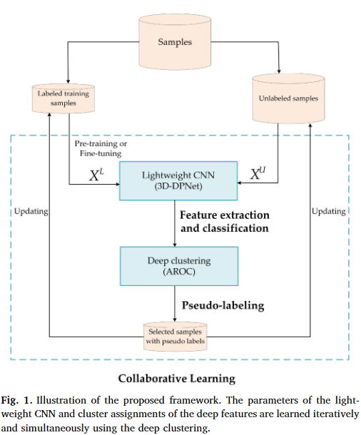
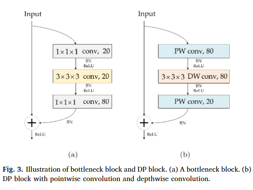
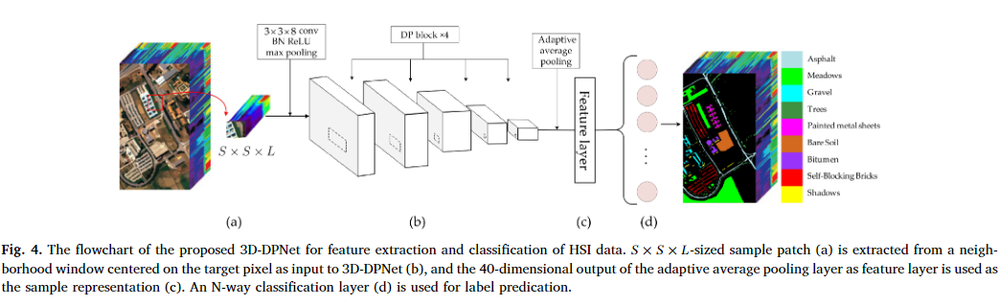
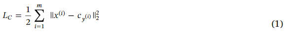
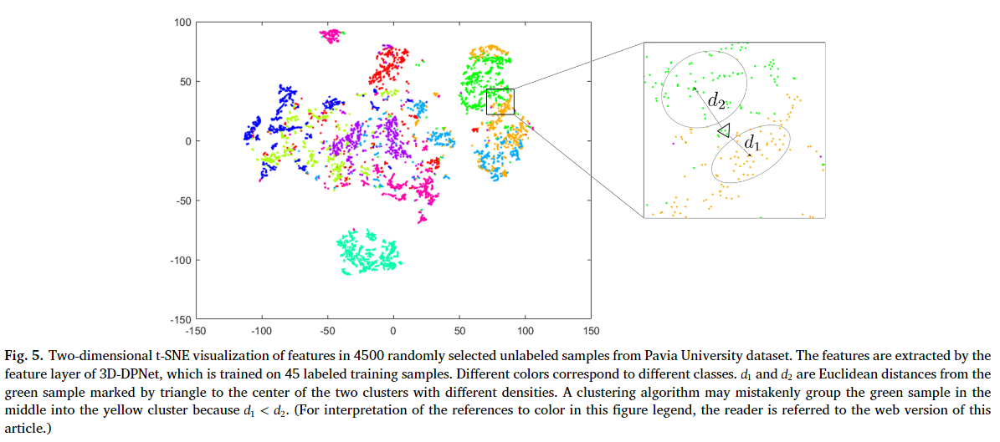
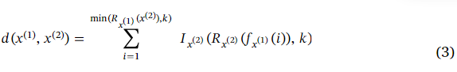
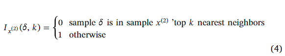
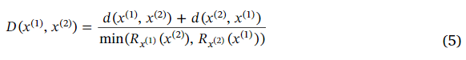
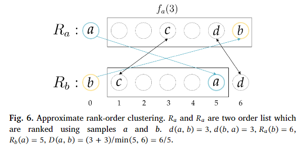
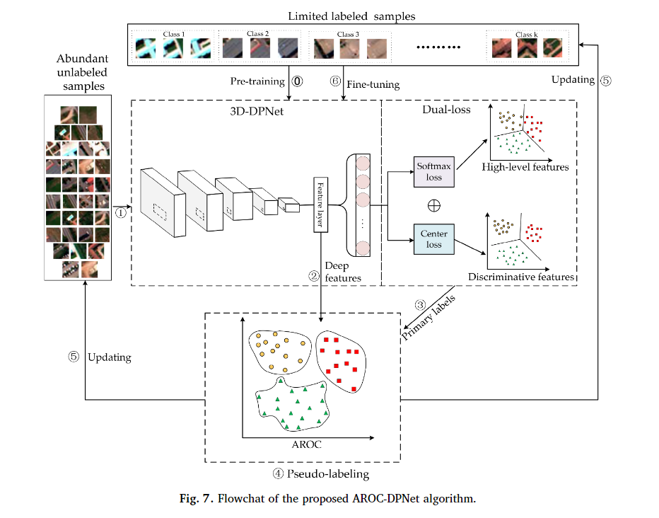

原文：《Collaborative learning of lightweight convolutional neural network and deep clustering for hyperspectral image semi-supervised classification with limited training samples》

## 主要问题

1. 为了训练一个具有良好泛化能力的深度学习模型，需要大量的数据集和足够的标记数据。然而，地面真相收集和标记工作是昂贵和耗时的。因此，对于许多特定的应用，HSI分类方法被研究为在只有有限数量的训练样本可用时能够处理高维数据。
2. 当可用的训练样本有限时，深度学习方法可能会出现过拟合。

## 本文方法

1. 将深度CNN与深度聚类相结合，设计了一种协同学习的半监督HSI分类框架，该框架可以同时迭代学习CNN的参数和深度特征的聚类分配。
2. 提出了一种用于深度分层光谱空间特征学习和分类的轻量级3D CNN。所提出的网络比经典的3D神经网络具有更少的参数，这更适合于只有非常有限的训练样本的情况。
3. 提出了一种基于近似秩序聚类(AROC)算法的伪标记方法。伪标记方法由于AROC算法具有优异的聚类性能和较低的计算复杂度，可以生成高质量的伪标签，有利于对预训练网络进行微调。

## 主要思路

* 用于半监督学习的集群标签技术是典型的生成模型。它首先用无监督聚类算法在无标记数据中识别聚类，然后对每个聚类进行标记或学习。这种技术已经证明了聚类和现有标签之间的依赖性。受这一概念的启发，我们提出了一种协同学习模型，迭代学习深度神经网络的参数和深度特征的聚类分配。

<!--more-->

## 本文框架

### 总览

框架的工作流程(如图1所示)可以概括为以下三步，我们将所有的ground truth样本分为三组：初始标记训练样本$X^L$，未标记样本$X^U$和测试样本$X^T$。
**步骤1：特征提取和分类。**首先，我们用$X^L$预训练一个轻量级3D-DPNet。通过预先训练的3D-DPNet，$X^U$被分类为主要标签。现在，$X^L$和$X^U$都有标签，可以用从预训练的3D-DPNet中得到的相应的深度特征来表征。
**步骤2：伪标签。**在步骤2中，我们使用AROC算法对预先训练的3D-DPNet生成的深度特征在所有训练样本$X^L$和$X^U$上进行聚类。对于每个聚类中的所有样本，它们将被聚类中的大多数类别分配所标示。然后，对于$X^U$中的每个样本，我们比较其聚类标签和主要标签。如果一个样本有一个匹配的结果，即两个标签相同，则认为该样本是一个可信样本，并设置其对应的伪标签。所有匹配标签的样本将在下一次迭代中被纳入训练数据集。
**步骤3：协同学习。**最后，我们使用添加的伪标记样本对预训练的3D-DPNet进行微调。重复前两步，直到迭代次数达到最大值或误差函数减小小于某个预设值。

### 基于轻量级3D-DPNet的特征提取和分类

受 Mobilenet 的启发，在本文中，我们提出了一种轻量级架构，该架构具有深度卷积和逐点卷积来进行 HSI 分类。所提出的 3D-DPNet 是一个基于深度逐点 (DP) 块的轻量级 3D CNN。如图3所示，与ResNet中的常规瓶颈块(图3(a))不同，DP块(图3(b))包含一个逐点卷积层(图中简称为PW conv)，一个具有$3×3×3$kernel ($3×3×3$DW conv)的3D深度卷积层，以及另一个逐点卷积层。前两个卷积层后面都有一个批处理归一化(BN)层和一个ReLU激活层。在第二点卷积层之后，只有一个BN层。在添加的层中，将正确路径的输出特征按元素方式添加到从快捷连接获得的特征中。在第一个逐点卷积层中，通道数增加到输入卷积通道的$t$倍。深度卷积层的通道数与第一点卷积层的通道数相同。参数$t$根据经验设置为$t=4$。对于 3D-DPNet 的 DP 块中的快捷方式，输出的通道数量和大小都与输入相同。DP块的参数比bottleneck block少。

所提出的3D-DPNet的全部细节如图4所示。该架构由成对的卷积层和最大池化层组成，然后是三个DP块层和一个自适应平均池化层，ReLU神经元跟随所有卷积层，除了最后一个。值得一提的是，自适应平均池化可以根据输入参数自适应地控制输出大小。考虑到不同传感器获得的HSI数据的频带数不同，采用自适应平均池化操作更有利于调整全连接层(即图4(c)中的特征层)的维数，从而得到更灵活的网络。最终自适应平均池的40维输出被用作我们的特征向量(用于AROC)，并被馈入一个全连接层，然后是dual-loss损失函数。

### dual-loss

为了使3D-DPNet学到的深度特征更好地用于分类和聚类，我们采用了双损失优化策略来训练3D-DPNet，其中softmax损失和所谓的中心损失相结合。中心损失在Wen等人(2016)中首次用于人脸识别，最近用于HSI分类(Guo和Zhu, 2019)，并取得了最先进的性能。它通过同时扩大类间变化和减少类内变化来增强深度学习特征的辨别能力，类内变化是通过平均每个提取的特征与相应的类中心之间的距离来定义的。中心损失定义为：

其中$x^{(i)}$表示第$i$个深特征，属于第$y^{(i)}$类，$c_{y^{(i)}}$表示第$y^{(i)}$个深特征的第$y^{(i)}$类中心，通过对第$y^{(i)}$类中的深特征进行平均。$m$是mini-batch，类中心相对于mini-batch $m$进行更新。这种损失使训练样本更接近它们对应的类中心。
$L_{dual}=L_S+\lambda L_C$
其中$L_S$和$L_C$分别表示softmax 损失和中心损失。$\lambda$是控制两种类型损失之间权衡的权重。我们采用的优化器是具有动量的随机梯度下降 (SGD)。

### 通过深度聚类AROC进行伪标记

当3D-DPNet使用有限的标记样本$X^L$完成初始训练后，大量的未标记样本$X^U$可以通过预训练模型进行分类。但由于分类错误，有些初级标签可能是错误的。我们将选择一些具有伪标签的高置信样本，这些伪标签被定义为聚类算法生成的聚类分配(Otto et al.， 2018)，并使用它们对预训练的网络进行微调。在聚类算法中，样本通常在高维空间中形成几个密度不等的聚类。这种非均匀分布使得欧几里得距离很容易失效。如图5所示，绿色样本的聚类比黄色样本的聚类稀疏。如果我们在这个例子中使用欧几里得距离，用三角形标记的绿色样本更接近黄色的簇而不是绿色的簇。

与广泛使用欧氏距离的k均值、谱聚类等传统聚类方法不同，提出了一种基于邻域结构差异度量的近似秩序聚类(AROC)算法(Otto et al.， 2018)，具有较低的运行复杂度和较好的聚类性能。AROC算法大致是一种聚类分层聚类的形式，使用基于最近邻居的距离测量。该算法的总体流程是将所有样本初始化为单独的簇，计算簇对之间的距离，合并那些计算距离低于阈值的样本，然后迭代地重新计算一组新的簇到簇距离，并根据新的距离执行合并。这需要定义一个集群到集群的距离度量。在AROC中，样本$x^{(1)}$和样本$x^{(2)}$之间共享近邻存在/不存在的距离度量由下式给出：

其中$f_{x^{(1)}}(i)$是$x^{(1)}$邻居列表中的第$i$个样本，并且$R_{x^{(2)}}(f_{x^{(1)}}(i))$给出了样本$f_{x^{(1)}}(i)$在$x^{(2)}$的邻居列表中的排序，其中最近的邻居列表是根据欧几里得距离度量生成的。

其中$I_{x^{(2)}}(\delta,k)$是指示函数。$d(x^{(1)},x^{(2)})$是非对称距离函数，样本$x^{(1)}$和$x^{(2)}$之间的对称距离可以定义为：

如图6所示，形式上，给定两个样本$a$和$b$，我们首先根据欧氏距离对数据集中前六个最近邻列表进行排序，生成两阶列表$R_a$和$R_b$。$f_a(3)$为样本$c$，与样本$a$最接近。

基于AROC对HSI数据的深层特征进行伪标记。首先，我们对图4(c)中特征层中所有训练样本的学习到的深度判别特征使用秩序距离，通过它们在彼此邻居中的阶数来测量两个样本之间的距离。为每个训练样本计算一个前k个最近邻的集合。然后按照公式(5)计算每个样本之间的成对距离。然后将距离低于阈值的所有样本对进行合并。每个聚类中的所有样本都被分配与大多数样本相同的标签。最后，高置信样本定义为AROC分配的聚类标签与3D-DPNet生成的主标签一致的样本。这些样本及其对应的伪标签被引入到下一次迭代的训练集中。

### 深度分类与深度聚类的协同学习

为了同时提升深度分类模型和深度聚类模型，我们利用协同学习的方法，提出了AROC-DPNet算法。AROCDPNet算法流程图如图7所示，包括6个步骤:在步骤0中，我们在标记好的训练样本上预训练3D-DPNet。在第一步中，我们使用预训练的3D-DPNet作为未标记样本的特征提取器。然后，在步骤2中，我们从特征层中获得所有训练样本(标记样本和未标记样本)的深度特征。在步骤3中，得到未标记样品的主标签。在步骤4中，将原始标签与AROC结果进行比较，得到未标记样品的伪标签。在步骤5中，更新标记样本和未标记样本。在步骤6中，使用伪标记样本和可用标记样本对预训练的3D-DPNet进行微调。AROC-DPNet算法在算法1中概述。

**算法：AROC-DPNet**
**Input：**少量可用的标记训练样本$\{X^L,y^{(m)}\},y^{(m)}\in\{1,2...M\}$，大量未标记样本$X^{U}$和测试样本$X^{T}$。最大迭代次数为$N$。
**Output：**标签$X^{T}$。

1. 通过式(1)和(2)在$\{X^L,y^{(m)}\}$预训练具有双重损失的 3D-DPNet。
2. 通过 3D-DPNet 分类获取样本（$X^L$和$X^U$）的深度特征$F^L$和$F^U$以及$X^U$的主标签$p^{(m)},p^{(m)}\in\{1,2...M\}$。
3. 将所有训练样本（$X^L$和$X^U$）投影到新的深度特征空间中，通过式(5)在$\{F^L,y^{(m)}\}$和$\{F^U,p^{(m)}\}$实现AROC算法，得到聚类标签$\{X^U,c^{(m)}\},c^{(m)}\in\{1,2...M\}$。
4. 比较$\{X^U,c^{(m)}\}$和$\{X^U,p^{(m)}\}$，以及那些被认为有很高置信度的匹配标签，确定他们对应的伪标签$\{X^{C_i},s^{(m)}\},X^{C_i}\subset X_{U}$。
5. 使用$\{X^{C_i},s^{(m)}\}$和$\{X^L,y^{(m)}\}$对3D-DPNet进行微调。
6. 重复步骤2-步骤5，直到$i=N$。
7. 使用 3DDPNet 最后一次迭代的参数获得$X^T$的标签。输出$X^T$的标签。
