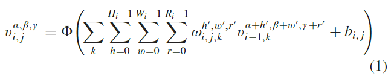
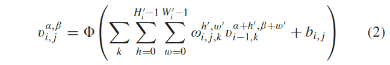
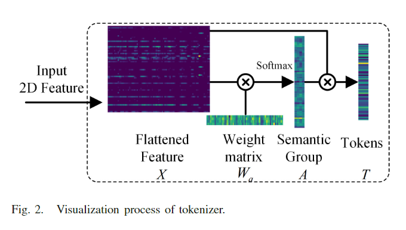
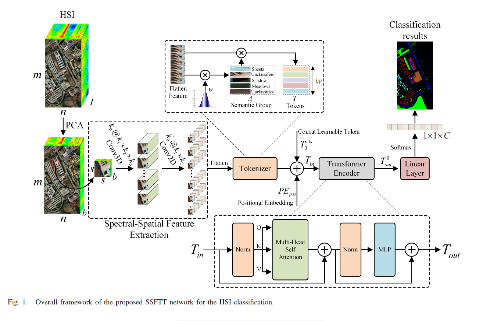
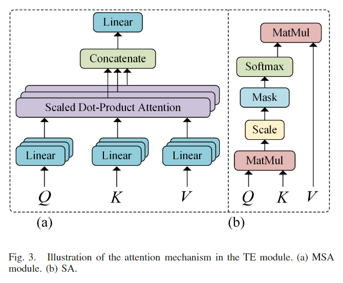
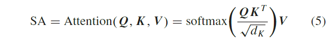
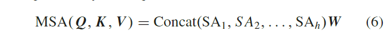
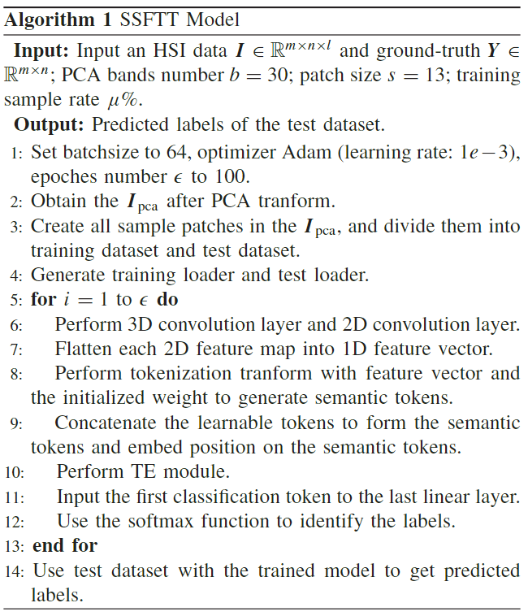

原文：《Spectral-Spatial Feature Tokenization Transformer for Hyperspectral Image Classification》

## 摘要

在高光谱图像 (HSI) 分类中，每个像素样本都分配给一个土地覆盖类别。 近年来，基于卷积神经网络（CNN）的 HSI 分类方法由于其卓越的特征表示能力而大大提高了性能。 然而，这些方法获取深层语义特征的能力有限，并且随着层数的增加，计算成本显着上升。 Transformer框架可以很好地表示高级语义特征。 在本文中，提出了一种光谱空间特征标记化Transformer（SSFTT）方法来捕获光谱空间特征和高级语义特征。 首先，构建光谱空间特征提取模块来提取低级特征。 该模块由3维卷积层和2维卷积层组成，用于提取浅层光谱和空间特征。 其次，引入高斯加权特征Transformer进行特征转换。 第三，将变换后的特征输入到Transformer编码器模块中进行特征表示和学习。 最后，使用线性层来识别第一个可学习的标记以获得样本标签。 使用三个标准数据集，实验分析证实，计算时间少于其他深度学习方法，并且分类性能优于当前几种最先进的方法。 为了重现性，这项工作的代码可以在 https://github.com/zgr6010/HSI_SSFTT 上找到。

##  本文思路

大多数方法都是基于 CNN 主干及其变体。虽然这些方法有效提高了HSI分类性能，但由于训练样本有限和网络层数增加造成的分类性能下降难以克服。 它们还具有过多的功能冗余。
最近，一种名为视觉Transformer（ViT）的新模型在图像处理领域表现良好。已经做了一些工作来将Transformer模型应用于HSI分类。然而，大部分方法都是基于光谱信息处理的改进的Transformer方法。尽管Transformer在捕获光谱特征方面表现突出，但它在捕获局部语义特征方面失去了能力，并且没有充分利用图像空间信息。
原始的Transformer[60]是基于自注意力（SA）机制的应用于自然语言处理（NLP）的模型。 模型的输入是一系列标记。 多头注意力用于绘制输入标记序列中的全局相关性。 因此，为了利用Transformer获取局部空间语义信息的能力并对相邻序列之间的关系进行建模，提出了一种用于 HSI 分类的谱空间特征标记化Transformer（SSFTT）模型。 首先，在该模型中，使用 3-D 卷积层和 2-D 卷积层来提取浅层光谱空间特征。 这有效地减少了层数增加带来的特征冗余和不准确。 其次，展平的特征由高斯加权标记器进行标记。然后，生成的令牌用作 TE 模块的输入。 最后，采用基于 softmax 的线性分类器来确定每个像素的标签。

## 本文贡献

1. 我们的 SSTFF 网络中提出了一种简单高效的分层 CNN 模块，用于提取浅层空间光谱特征。 它仅由1个 3D 卷积层和1个 2D 卷积层组成。 然后，该模块与 Transformer 结构相结合，开发出一种新的轻量级网络来替代单个 CNN 结构，以降低计算成本。
2. 提出了高斯分布加权标记化模块，将浅层空间谱特征转换为标记化语义特征。 其作用是使token所表达的深层语义特征更加符合样本的分布特征，从而使样本更加可分。
3. CNN网络与Transformer结构从浅到深的系统结合，可以充分利用HSI中的光谱空间信息，简洁高效地表达HSI的低中深语义特征，从而显着提高分类精度。

<!--more-->

## 本文方法

### 光谱空间特征提取

给出原始 HSI 数据$I\in\mathbb{R}^{m×n×l}$，其中$m×n$为空间大小，$l$为光谱带数。$I$中的每个像素都有$l$个光谱维度，并形成一个单热类别向量$Y=(y_1, y_2,...,y_C)\in\mathbb{R}^{1×1×C}$，其中$C_i$是土地覆盖类别的数量。因此，HSI 由$l$个波段组成，这些波段携带有用的光谱信息，但也会导致大尺寸，从而增加大量计算。因此，采用 PCA 来处理 HSI 数据，以减少计算量和谱维数。PCA 将能带数量从$l$减少到$b$，并保持空间维度不变。因此，PCA降维后的HSI数据表示为$I_{pca}\in\mathbb{R}^{m×n×b}$，其中$b$是PCA后的谱带数量。
接下来，对 HSI 数据$I_{pca}$执行 3-D 补丁提取。 每个 3-D 相邻块$P\in\mathbb{R}^{s×s×b}$都是从$I_{pca}$创建的，其中$s×s$表示窗口大小。 每个 patch 的中心像素位置设置为$(x_i,x_j)$，其中$0≤i<m,0≤j<n$。每个补丁的真实标签由中心像素的标签确定。当提取单个像素周围的块时，无法检索边缘像素。因此，对这些像素进行填充操作。填充的宽度是$(s -1)/2$。因此，从$I_{pca}$生成的 3D 补丁的最终数量由$m×n$给出。每个补丁覆盖从$x_i −(s−1)/2$到$x_i+(s−1)/2$的宽度，从$x_j−(s−1)/2$到$x_j+(s−1)/2$的高度，以及所有$b$光谱带。去除零标签的像素块后，所有剩余的样本块被分为训练样本块集和测试样本块集。
然后，使用两个卷积层（3D 和 2D）来提取每个样本块的光谱空间特征。每个大小为$s×s×b$的训练样本块用作 3D 卷积层的输入数据。在 3-D 卷积层中，第$i$层第$j$个特征立方体在空间位置$(\alpha,\beta,\gamma)$的计算值由下式给出：

其中$\Phi(\cdot)$是激活函数，$k$是与第$(i−1)$层中第$j$个特征立方体相关的特征立方体。$H_i,W_i$和$R_i$分别表示 3-D 卷积核的宽度、高度和通道数。在这种情况下$R_i$代表光谱维数。$\omega_{i,j,k}^{h',w',r'}$是连接到第$k$个特征立方体的位置$(h',w',r')$的权重参数，$b_{i,j}$是偏差。
在该模型中，3-D卷积层理论上由 $k_0$ 个 3-D 核组成。每个 3-D 内核的大小为$k_1×k_2×k_3$。通过 3-D 卷积，生成覆盖光谱空间信息的 $k_0$ 个 3-D 特征立方体。每个立方体的大小为$(s−k_1+1)×(s−k_2+1)×(b−k_3+1)$。特征立方体的总大小为$k_0@(s−k_1 +1)×(s−k_2+1)×(b−k_3+1)$。
重排操作后，作为下一个二维卷积层特征的输入大小为$(s−k_1+1)×(s−k_2+1)×k_0(b−k_3+1)$。在二维卷积层中，第$i$层第$j$个特征图上空间位置$(\alpha,\beta)$处的激活值$v_{i,j}^{\alpha,\beta}$定义为：

其中$H'_i$和$W'_i$分别表示二维卷积核的宽度和高度。$\omega_{i,j,k}^{h',w'}$是连接到第$k$个特征图的位置$(h',w')$的权重参数。
在该模型中，2-D 卷积生成的特征图的总大小为$k'_0@[s−2×(k_1+1)]×[s−2×(k_2+1)]$，其中$k'_0$是 2-D 卷积核的数量。每个 2-D 内核的大小为$k_1×k_2$。

### 高斯加权特征标记器

两层卷积运算提取的特征携带了光谱和空间信息，但不能充分描述地物特征。因此，特征图被进一步定义为语义标记，可以表示和处理 HSI 特征类别的高级语义概念。对于这部分，输入展平特征图被定义为$X\in\mathbb{R}^{uv×z}$，其中$u$是高度，$v$是宽度，$z$是通道数。特征标记定义为$T\in\mathbb{R}^{w×z}$，其中$w$表示标记的数量。
对于特征图$X$，$T$可以通过以下公式得到：

这里，$W_a\in\mathbb{R}^{z×w}$表示用高斯分布初始化的权重矩阵，$X\ W_a$表示它们执行 $1\ ×\ 1$ 逐点乘积。目标是将$X$映射到语义组。通过本步骤得到的语义组的大小为$A\in\mathbb{R}^{uv×w}$。然后，对$A$进行转置，使用$\rm softmax(\cdot)$来关注相对重要的语义部分。最后，$A$与$X$相乘得到$T$个语义标记。为了可视化标记器的实际形式，图 2 展示了转换过程的示例。

### Transformer编码器模块

如图 1 所示，第 II-B 节中生成的语义标记作为 TE 模块的输入，以学习高级语义特征之间的关系。该模块主要由三个子部分组成。
作为第一子部分，使用位置嵌入来标记每个语义标记的位置信息。每个标记由$[T_1,T_2,...,T_w]$表示，这些标记与可学习的分类标记$T_0^{cls}$连接，用于执行分类任务。然后，将位置信息$PE_{pos}$编码并附加到标记表示中。由此产生的语义标记嵌入序列由下式给出：

第二个也是重要的子部分是 TE。该块旨在对语义标记之间的深层关系进行建模。它包含一个多头 SA (MSA) 块 [见图 3(a)]、一个 MLP 层和两个归一化层 (LN)。在 MSA 块和 MLP 层之前设计了残差跳跃连接。

由于其核心 MSA 块，Transformer结构表现良好。该块中使用 SA 机制[见图3(b)]有效地捕获了特征序列之间的相关性。为了学习多种含义，预先定义三个可学习的权重矩阵$W_Q,W_K$和$W_V$，并将标记线性映射以形成 3-D 不变矩阵，包括查询 $Q$、键 $K$ 和值 $V$ 三个可学习的权重矩阵。使用 $Q$ 和 $K$ 计算注意力分数，并使用 softmax 函数计算分数的权重。综上所述，SA的公式如下：

其中$d_k$是$K$的维度。
MSA块在映射$Q$、$K$和$V$时涉及多组权重矩阵，使用相同的操作过程来计算多头注意力值。然后，将每个头部注意力结果连接在一起。这个过程用这个方程表示：

其中$h$是头数，$W$是参数矩阵，$W\in\mathbb{R}^{h×d_K×d_w}$，其中$d_w=w$（标记数)。
接下来，将上一步学习到的权重矩阵输入到 MLP 层。MLP 由两个全连接层组成。在这对之间有一个非线性激活函数，称为高斯误差线性单元。 MLP 层后面是 LN，它改进了梯度爆炸，减少了梯度消失问题，并实现了更快的训练。
通过 TE 模块，输入$T_{in}$和输出$T_{out}$的大小相等。分类标记向量$T_{out}^0$是顶部线性层的输入，用于最终分类。通过线性层，输入的属于某个类别的概率通过softmax函数计算。概率值最大的标签就是样本的类别。

### 实施

与骨干CNN相比，SSFTT 减少了网络层数。此外，它可以通过引入标记器和 TE 在图像补丁的语义级别上进行建模。这里选择大小为$610×340×103$的帕维亚大学数据集作为示例来说明设计的 SSFTT 模型。

经过PCA降维和块提取后，每个块的大小为$13×13×30$。在第一个3D卷积层中，每个块上有$8$个$3×3×3$立方体核，通过卷积运算生成$8$个$11×11×28$特征立方体。此步骤中使用 3-D 卷积，因为每个补丁中存储了丰富的光谱信息。将$8$个特征立方体重新排列，生成一个$11×11×224$ 的特征立方体。然后，使用$64$个$3×3$平面核进行 2-D 卷积，得到$64$个特征图，每个特征图大小为$9×9$。每个特征图被展平为一维特征向量，得到$64$个大小为$1×81$的向量。此时，得到的特征相当于本文中的$X\in\mathbb{R}^{81×64}$。
下一步，利用 Xavier 标准正态分布得到初始权重矩阵$W_a\in\mathbb{R}^{64×4}$，引导特征分布更加规则。将初始化的权重矩阵$W_a\in\mathbb{R}^{64×4}$乘以特征向量组，得到语义组$A\in\mathbb{R}^{81×4}$。然后，将 $A$ 的转置乘以 $X$ 得到最终的语义标记$T\in\mathbb{R}^{4×64}$。将全零向量连接到 $T$ 作为可学习标记，并嵌入学习位置标记以获得$T_{in}\in\mathbb{R}^{5×64}$。通过 TE 模块对$T$进行处理，表示语义特征。该模块具有相同的输入和输出大小。取出第一分类标记$T_{out}^0\in\mathbb{R}^{1×64}$的输出作为分类向量。该向量被输入到基于 softmax 的线性分类器中以获得判断的标签。所提出的SSFTT方法的总体流程如算法1所示。