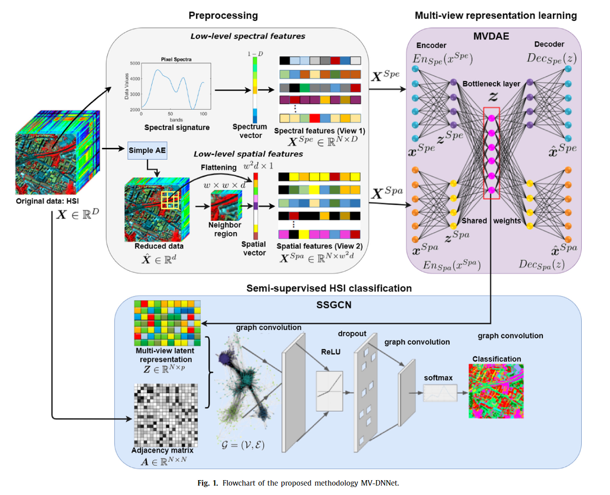
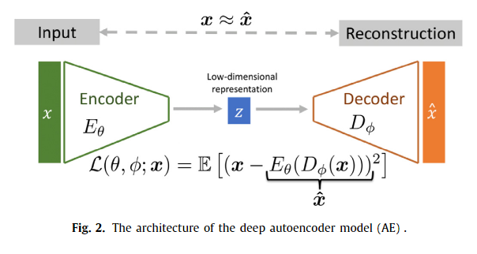
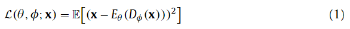
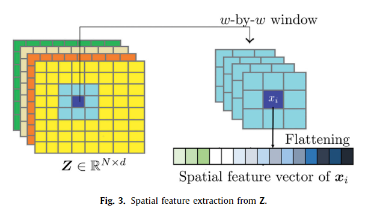
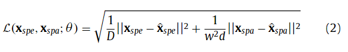
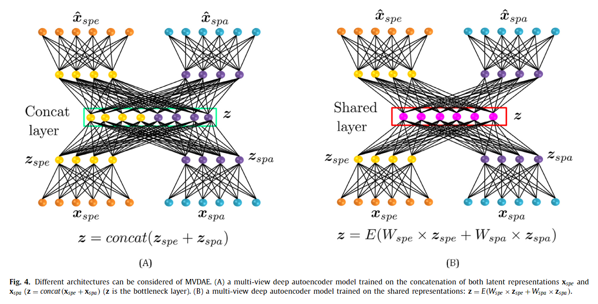

原文：《Deep neural networks-based relevant latent representation learning for hyperspectral image classification》

## 主要问题

1. 大量的光谱波段和较少的训练样本导致了维数诅咒的问题，很难得到准确的分类。
2. 大多数的频谱空间特征提取方法都是将频谱矢量与邻近区域进行拼接或平均。然而，有些特征对分类没有用处，可能有噪声，导致在采用少量标记数据时表现不佳。

## 主要方法

1. 我们提出了一种新的方法，允许通过保留光谱和空间特征来降低数据的维数，仅使用少量标记样本以改进基于多视图深度表示学习的 HSI 分类。
2. 我们提出了一种无监督多视图深度自动编码器 (MVDAE) 模型，将空间和光谱特征融合到联合潜在表示中，以改进 HSI 的分类。 所提出的 MVDAE 的目的是通过丢弃噪声并找到共享的潜在表示来仅提取有用的特征，这对于分类是有效的。
3. 我们建议开发一种半监督图卷积神经网络 (SSGCN)，以便在卷积层中考虑局部顶点特征和图拓扑，在 HSI 分类中保留光谱空间特征，并使用一组有限的标记训练样本。

## 本文方法

本节详细介绍了所提出的 MV-DNNet 方法，该方法由图 1 所示的三个阶段组成。第一阶段包括基于简单的深度自动编码器 (AE) 提取光谱和空间特征，旨在自动提取相关特征，同时保留 HSI 的空间属性。 在第二阶段，我们开发了一个多视图深度自动编码器 (MVDAE) 来组合两个视图，即光谱和空间特征。 然后，我们构建多视图潜在表示的图形。 它试图通过考虑相邻像素之间的距离来考虑空间特征。 之后，我们提出了一种半监督图卷积网络 (SSGCN)，它在卷积层中集成了图拓扑和局部顶点特征，以通过保留光谱空间特征来改进 HSI 分类。 所提出方法的主要优点是允许自动提取相关光谱和空间特征，并通过使用少量标记样本改进 HSI 分类。

<!--more-->

### 光谱和空间特征构建

在本节中，我们提出了两个并行模块来提取和构建一组光谱和空间特征。 目的是自动将这些提取的特征与多视图表示学习模型融合，以改进 HSI 的分类。获得的组合潜在表示包含可用于分类的光谱和空间特征。

#### 光谱特征$\mathbf{X}^{spe}$

在光谱特征提取中，我们考虑原始数据，即 HSI $\mathbf{X}$的纯光谱特征。通常，光谱特征表示为每个像素的一维光谱矢量$(1×D)$，其中$D$是光谱带的数量。因此，为了利用丰富的光谱信息和利用有限的先验知识，我们考虑了所有光谱波段的响应作为输入。然后我们得到一个光谱矩阵$\mathbf{X}^{spe}\in\mathbb{R}^{N\times D}$，其中$N$是像素数，$D$是光谱带数。 因此，光谱矩阵$\mathbf{X}^{spe}$位置$i$处的每一行都是像素$p_i$的光谱特征。

#### 空间特征$\mathbf{X}^{spa}$

其目的是提取每个像素邻域周围的空间信息，并考虑所有邻域。因此，首先采用简单的深度自编码器(AE)，通过保留 HSI 数据的空间结构，将高维度从$D$降至$d(D\ll D)$。我们沿的光谱$\mathbf{X}$维度使用 AE 模型，并根据重建误差仅保留几个特征。形式上，AE以原始 HSI $\mathbf{X}\in\mathbb{R}^{N\times D}$作为输入。它包括一个编码器$E_θ(\mathbf{X})$和一个解码器$D_{\phi}(\mathbf{z})$ ($\mathbf{z}$是瓶颈层)。编码器$E_\theta$非线性地将$\mathbf{X}\in \mathbb{R}^{N×D}$投影到新的潜在表示空间$\mathbf{z}=E_\theta(\mathbf{X})(\mathbf{z}\in\mathbb{R}^{N×d})$，解码器$D_\varphi$从中寻求恢复$\mathbf{X}$，即$D_\phi(E_\theta())\approx\mathbf{X}$。AE 旨在使用均方误差 (MSE) 准则（见图 2）最小化输入$\mathbf{X}$与其输出（重构输入）$\mathbf{\hat{X}}$之间的重构误差：

其中$E(.)$和$D(.)$分别由$\theta$和$\varphi$参数化。参数$(\theta,\phi)$一起学习以重建与初始输入$\mathbf{X}$相同的数据$\mathbf{\hat{X}}$。
其次，在减少的数据中的像素周围提取一个相邻区域，即潜在表示矩阵$\mathbf{z}\in\mathbb{R}^{N×d}$，它在光谱维度上只有$d$个特征$(d\ll D)$。对于每个像素，我们提取一个$s×s$个相邻像素。 设$d$是AE模型提取的特征个数，一个像素可以看作一个大小为$s×s×d$的框。最后，我们将框展平为大小为$s^2d×1$个元素的$1×D$向量。然后将所有一维向量连接到空间特征矩阵$\mathbf{X}^{spa}$中。 因此，$\mathbf{X}^{spa}\in\mathbb{R}^{N\times s^2d}$包含每个像素的空间特征，同时考虑到它们的相邻区域。 图 3 报告了空间特征提取程序的主要架构。

### 多视图深度自编码器表示学习(MVDAE)

在分类上下文中，每个像素的光谱可以包含用于区分不同种类地面类别的重要且有用的信息。 此外，利用空间信息，在相邻区域中像素的统计减少了类内方差，这可以提高分类性能。 此外，我们设计了一种多视图深度自动编码器 (MVDAE)，旨在从多个输入视图的组合中提取高级特征，即光谱和空间特征，从中可以重建这些输入视图。 它依赖于我们假设光谱和空间特征确实是互补的。 我们的目标是提取相关的多视图潜在表示来学习准确的分类模型。 MVDAE 为每个视图包含一个编码器，标记为$E_{spe}$和$E_{spa}$，用于光谱和空间特征输入。 每个编码器都是一个多层神经网络模型，可将输入视图非线性地转换为新的表示潜在空间。我们注意到$\mathbf{z}_{spe}$和$\mathbf{z}_{spa}$是由两个编码器$\mathbf{z}_{spe}=E_{spe}(\mathbf{x}_{spe})$和$\mathbf{z}_{spa}=E_{spa}(\mathbf{x}_{spa})$提取的相应潜在表示。
从两个视图$\mathbf{X}^{spe}$和$\mathbf{X}^{spa}$的编码中提取潜在表示$\mathbf{z}$，然后将这个潜在多视图潜在表示$\mathbf{z}$输入到两个解码器$D_{spe}$和$D_{spa}$，每个解码器都旨在重建两个视图，$\hat{\mathbf{x}}_{spe}=D_{spe}(\mathbf{z})$和。$\hat{\mathbf{x}}_{spa}=D_{spa}(\mathbf{z})$。解码器是非线性神经网络，包括一到三个隐藏层。 MVDAE 的学习准则是两个视图的重建误差准则之和，我们使用 MSE：

MDAVE 的目的是使用特定的合并层从两个编码数据$\mathbf{z}_{spe}$ 和$\mathbf{z}_{spa}$中找到共享表示，该合并层实际上实现为密集层$\mathbf{z}=E(W_{spe}×\mathbf{z}_{spe}+W_{spa}×\mathbf{z}_{spa})$。这试图找到一个共同的空间，即两个视图之间的共享表示：光谱和空间特征矩阵。这是该方案中一个微妙的区别，它引入了如何定义潜在表示的约束(见图4)。

