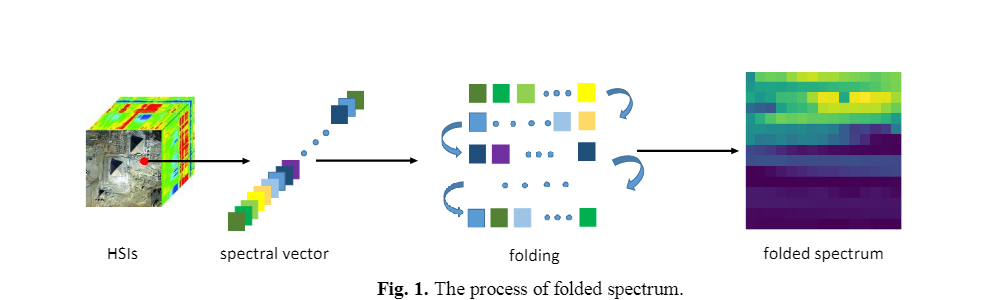
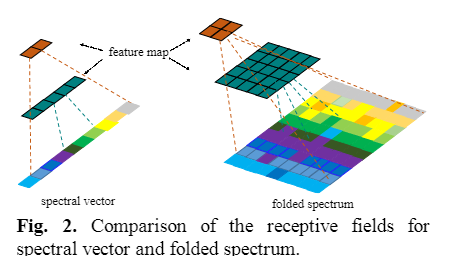
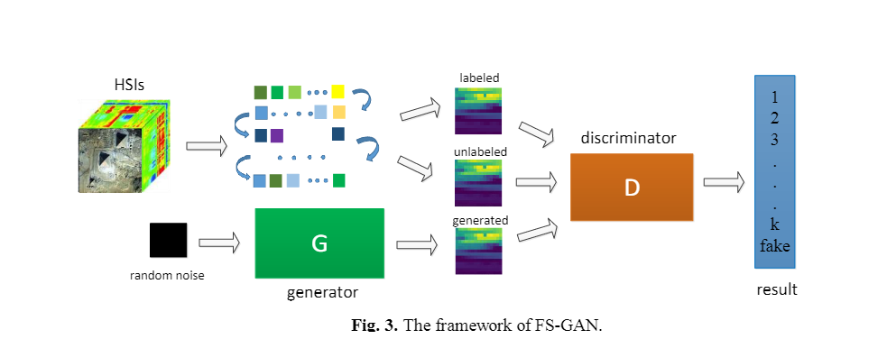
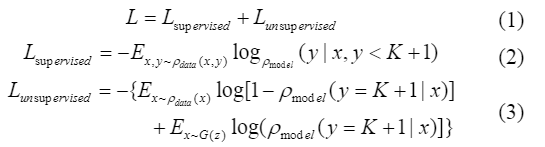
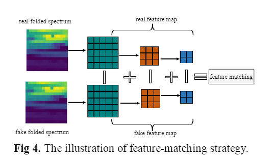
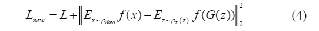

原文：《Generative Adversarial Network with Folded Spectrum for Hyperspectral Image Classification》

## 摘要

本文提出了一种新的基于生成对抗网络(GAN)和折叠谱(FS-GAN)的半监督方法。具体来说，将原始光谱向量折叠为二维正方形光谱作为GAN的输入，可以生成光谱纹理，并在相邻和非相邻光谱波段上提供更大的感受野，用于深度特征提取。然后将生成的假折叠谱、标记和未标记的真实折叠谱输入到鉴别器中进行半监督学习。采用特征匹配策略防止模型崩溃。

## 本文工作

1. 提出了一种新的基于半监督GAN的HSI分类算法，该算法结合了折叠谱和端到端半监督GAN模型。折叠谱可以挖掘谱域中的纹理信息，而端到端半监督GAN模型提供了最好的未标记样本。
2. 采用特征匹配策略来稳定GAN的训练过程

<!--more-->

## 本文方法

### 折叠光谱

#### 思路

空间相关性已在传统和基于 DL 的 HSI 算法中得到了充分的利用，但研究人员较少考虑谱域中的大量信息。此外，使用 CNN 作为基本模型的基于 DL 的算法利用卷积核作为特征提取的函数，因此它们的模型主要关注固定感受野中的特征。我们设计了一种折叠谱策略，可以直接将一维谱向量转换为二维图像，然后充分利用卷积核在谱域中提取特征的能力。

#### 方法

折叠光谱有两个优点：

1. 折叠光谱可以从具有正方形形状的折叠光谱中提取光谱域中的纹理特征。选择折叠光谱曲线而不是仅仅重塑的原因是，重塑会破坏光谱向量的拓扑结构，而折叠光谱可以增强折叠光谱的边缘连续性。

如图1所示，长度为225的光谱向量可以转换为15*15的折叠光谱。这样，可以像HSI的空间纹理特征一样，清晰地找到2D折叠频谱中的光谱纹理特征。然后，我们可以使用这些特征来辅助HSI分类。此外，我们选择正方形以获得折叠光谱的最佳形状。**由于正方形在高度和宽度上都比其他矩形具有相等和充分的纹理信息，因此具有更多的光谱纹理特征**，当光谱向量的长度不能折叠成正方形时，我们选择以相反的顺序从最后一个波段扩展光谱向量。遵循这一规则，我们确保正方形折叠频谱可以进入生成对抗网络，而不会丢失频谱信息并破坏频谱向量拓扑。

2. 与原始谱向量相比，更多的不连续谱带现在位于相邻位置。当通过卷积核从折叠的光谱中提取特征时，这些远带将位于相同的感受野中。

如图2所示，我们比较了1D谱向量和2D折叠谱之间的感受野差异。一维光谱矢量中的感受野只能覆盖一小范围的光谱，而二维折叠光谱可以覆盖整个正方形。因此，通过采用折叠光谱，借助于更大的感受野，可以发现更多的光谱信息。

### 折叠频谱生成对抗网络（FS-GAN）

#### 思路

传统的GAN由两个子模型组成：生成器和鉴别器。这两个模型使用极小极大博弈来学习生成分布，并进一步匹配真实数据分布。生成器通过变换噪声变量来产生样本，并且鉴别器区分样本是来自真实数据还是生成器。通过交替训练生成器和鉴别器，生成器将输出真实的样本并且无法区分生成数据和真实数据。

受GAN的启发，我们设计了一种折叠频谱（FS-GAN），它可以实现HSI端到端半监督分类。FS-GAN的发生器和鉴别器都是从CNN修改而来的，以适应折叠频谱的设计。可以总结出FS-GAN的两个主要改进。首先，FS-GAN不再使用1D神经网络，而是应用2D神经网络来生成和区分折叠频谱。其次，我们设计了一个端到端的模型，没有预训练和微调过程。基于上述改进，可以在更简单的网络结构中提高分类性能。

#### 方法

图三为FS-GAN框架，我们可以看到生成器接收到噪声$\rho_z(z)$作为输入，而鉴别器接收标记和未标记的 HSI 折叠谱，结合生成器提供的生成折叠谱作为输入。鉴别器的最后一层不再是只区分测试样本真伪的二进制分类器。相反，我们选择$K+1$分类器，其中$K$是类的数量，另一类是假样本的类。只要我们将折叠谱输入到模型中，就可以实现来自分类器的$K+1$的逻辑向量${l_1,...,l_{k+1}}$。FS-GAN的损失函数$L$包括两部分，监督损失$L_{supervised}$由预测类$\rho_{model}(x,y)$和有标签折叠谱$\rho_{data}(x,y)$交叉熵得到，无监督损失$L_{unsupervised}$是根据未标记的$\rho_{data}(x)$和生成的折叠谱$G(z)$分别分为K个真类和一个假类的概率$\rho_{model}$设计的。
在此基础上，FS-GAN的损失函数为：

半监督GAN的训练过程不稳定，容易分解。为了解决这些问题，我们采用了特征匹配策略，而不是简单地最大化鉴别器的输出。这种特征匹配策略将通过设置生成器中的不动点来使生成的数据与真实数据分布匹配。固定点是根据真实数据计算的，因此可以准确地描述真实数据的分布。如图 4 所示，我们选择隐藏层$f(x)$的输出作为不动点，这意味着判别器不会过度训练，FS-GAN 模型会变得稳定。

FS-GAN的更新损失函数如下：

