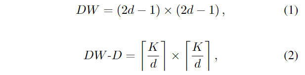
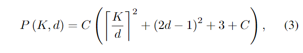
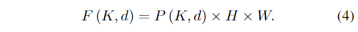
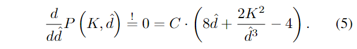
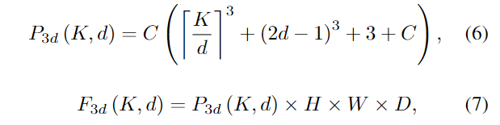
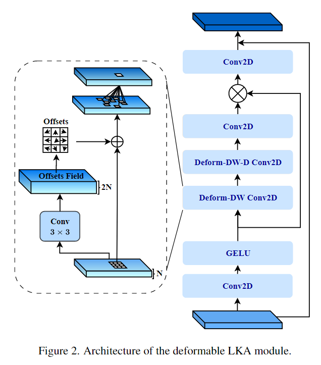
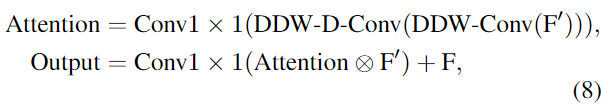
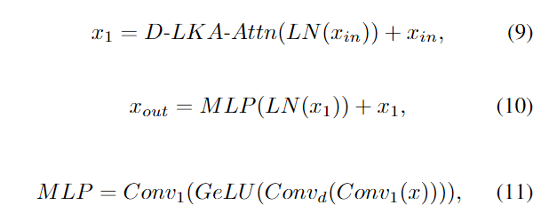
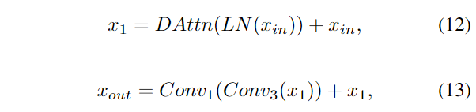

原文：《Beyond Self-Attention: Deformable Large Kernel Attention for Medical Image Segmentation》

## 本文贡献

1. 为了解决上述挑战，我们提出了 DeformableLKA 模块 (❶) 形式的解决方案，它作为我们网络设计中的基本构建块。该模块被明确设计为有效处理上下文信息，同时保留局部特征。
2. 我们的架构中两个方面之间的平衡增强了其实现精确语义分割的能力。值得注意的是，我们的模型引入了基于数据的感受野的动态适应，这与传统卷积运算中的传统固定滤波器掩模不同。这种自适应方法使我们能够克服与静态方法相关的固有限制。这种创新方法扩展到 D-LKA 网络架构 (❷) 的 2D 和 3D 版本的开发。对于 3D 模型，D-LKA 机制经过定制以适应 3D 环境，从而实现不同体积切片之间的无缝信息交换。
3. (❸) 最后，我们的贡献进一步强调了它的计算效率。我们通过完全依赖 D-LKA 概念的设计实现了这一目标，从而在各种细分基准上取得了卓越的性能，从而使我们的方法成为一种新的 SOTA 方法。

## 主要方法

在本节中，我们首先概述该方法。首先，我们回顾一下由 Guo 等人 [23] 提出的大核注意力（LKA）的概念。然后，我们介绍了我们对可变形 LKA 模块的创新探索。在此基础上，我们引入了用于分割任务的 2D 和 3D 网络架构。

### 大核注意力（LKA）

大卷积核提供与自注意力机制类似的感受野。通过使用深度卷积、深度扩张卷积和 $1×1$ 卷积，可以用更少的参数和计算来构造大的卷积核。对于 $H×W$ 维输入和通道 $C$，构造 $K × K$ 核的深度卷积和深度膨胀卷积的核大小方程为：

内核大小为 $K$，膨胀率为 $d$。参数数量 $P(K,d)$ 和浮点运算（FLOPs）$F(K,d)$ 的计算公式如下：

FLOPs 的数量随着输入图像的大小线性增长。参数数量随着通道数量和内核大小呈二次方增加。然而，由于两者通常都很小，因此它们不是限制因素。
为使核大小 $K$ 固定时的参数个数最少，可将式 3 对膨胀率 $d$ 的导数设为零：

例如，当内核大小为 $K=21$ 时，结果 $d≈3.37$。将公式扩展到三维情况很简单，对于大小为 $H×W×D$ 和通道 $C$ 的输入，则参数数量 $P_{3d}(K,d)$ 和 FLOPs $F_{3d}(K,d)$ 的方程为：

内核大小为 $K$ 和膨胀率为 $d$。

<!--more-->

### 可变形大核注意力

利用大核（Large kernel）进行医学图像分割的概念通过加入可变形卷积（Deformable Convolutions）得到了扩展 [20]。可变形卷积可以通过整数偏移调整采样网格以实现自由变形。附加的卷积层从特征图中学习变形，从而创建偏移场。根据特征本身学习变形，得到自适应卷积核。这种灵活的内核形状可以改善病变或器官变形的表示，从而增强物体边界的清晰度。负责计算偏移量的卷积层遵循其相应卷积层的内核大小和膨胀。双线性插值用于计算图像网格上未找到的偏移的像素值。

如图2所示，D-LKA模块可以表述为：

其中，输入特征用 $F\in\mathbb{R}^{C×H×W}$ 表示，$F'=GELU(Conv(F))$。注意力分量 $\in\mathbb{R}^{C×H×W}$ 表示为注意力图，每个值表示相应特征的相对重要性。运算符 $\otimes$ 表示逐元素乘积运算。值得注意的是，LKA 与传统的注意力方法不同，它不需要额外的标准化函数，例如 sigmoid 或 Softmax。根据 [56]，这些归一化函数往往会忽略高频信息，从而降低基于自注意力的方法的性能。
在该方法的 2D 版本中，卷积层被可变形卷积替代，因为可变形卷积提高了捕获具有不规则形状和大小特征的对象的能力。此类对象常见于医学图像数据中，使得这种增强尤其重要。
然而，将可变形 LKA 的概念扩展到 3D 领域存在一定的挑战。主要约束来自偏移生成所需的附加卷积层。与 2D 情况相反，由于输入和输出通道的性质，该层无法以深度方式执行。在 3D 环境中，输入通道对应于特征，输出通道扩大到 $3·k×k×k$，内核大小为 $k$。大内核的复杂性导致通道数沿第三维扩展，导致参数和 FLOPs 大幅增加。因此，针对 3D 场景实施了一种替代方法。在深度卷积之后，现有的 LKA 框架中引入了单独的可变形卷积层。这种战略设计调整旨在减轻扩展至三个维度所带来的挑战。

### 2D D-LKA Net

2D D-LKA 块的结构包括 LayerNorm、可变形 LKA 和多层感知器 (MLP)。残差连接的集成确保了有效的特征传播，甚至跨更深的层。这种排列可以在数学上表示为：

输入特征 $x_{in}$ 、层归一化 $LN$、可变形 LKA 注意力 $D-LKA-Attn$、深度卷积 $Conv_d$、线性层 $Conv_1$ 和 GeLU 激活函数 $GeLU$。

### 3D D-LKA Net

图 1 所示的 3D 网络架构采用编码器-解码器设计进行分层构建。最初，补丁嵌入层将输入图像尺寸从 $(H×W×D)$ 减小到 $(\frac{H}{4}×\frac{W}{4}×\frac{D}{2})$ 在编码器内，采用了三级 D-LKA 的序列，每个级包含三个 D-LKA 块。在每个阶段之后，下采样步骤将空间分辨率降低一半，同时通道尺寸加倍。中央瓶颈包括另一组两个 D-LKA 块。解码器结构与编码器结构对称。为了在减少通道数的同时使特征分辨率加倍，使用转置卷积。每个解码器级采用三个 D-LKA 块来促进远程特征依赖性。最终的分割输出由 $3×3×3$ 卷积层产生，随后是 $1×1×1$ 卷积层，以满足特定类别的通道要求。为了在输入图像和分割输出之间建立直接连接，使用卷积形成跳跃连接。附加的跳跃连接基于简单的加法来执行来自其他阶段的特征的融合。最终的分割图是通过 $3×3×3$ 和 $1×1×1$ 卷积层的组合产生的。
3D D-LKA 块包括层归一化，然后是 D-LKA 注意力，并应用残差连接。后续部分采用 $3×3×3$ 卷积层，然后是 $1×1×1$ 卷积层，两者都伴有残差连接。整个过程可以总结如下：

输入特征 $x_{in}$、层归一化 $LN$、可变形 LKA $DAttn$、卷积层 $Conv_1$ 和输出特征 $x_{out}$。$Conv_3$是一个前馈网络，具有两个卷积层和激活函数。